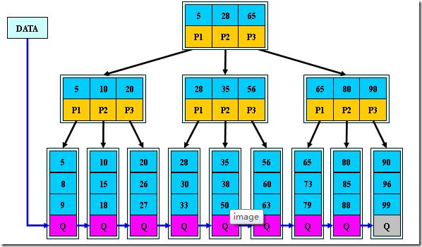

+++
title="B类树"
tags=["算法","B类树"]
date="2020-03-13T06:47:00+08:00"
summary = 'B类树'
toc=false
+++

B-树
----

B-树（balance tree）和b+树应用在数据库索引，可以认为是m叉的多路平衡查找树，但是从理论上讲，二叉树查找速度和比较次数都是最小的，为什么不用二叉树呢？

因为我们要考虑磁盘IO的影响，它相对于内存来说是很慢的。数据库索引是存储在磁盘上的，当数据量大时，就不能把整个索引全部加载到内存了，只能逐一加载每一个磁盘页（对应索引树的节点）。所以我们要减少IO次数，对于树来说，IO次数就是树的高度，而“矮胖”就是b树的特征之一，它的每个节点最多包含m个孩子，m称为b树的阶，m的大小取决于磁盘页的大小。

### 定义

M阶B树定义

1.	根节点至少有两个子女
2.	每个中间节点都包含k-1个元素和k个孩子，其中`m/2<=k<=m`
3.	每个叶子节点都包含k-1元素，其中`m/2<=k<=m`
4.	所有的叶子节点都位于同一层
5.	每个节点的元素从小到大排列，节点当中k-1个元素正好是k个孩子包含的元素的值域分划

### 特性

1.	关键字集合分布在整棵树中
2.	任何一个关键字出现且只出现在一个结点中
3.	搜索有可能在非叶子结点结束
4.	其搜索性能等价于在关键字全集内做一次二分查找
5.	自动层次控制

B+树
----

B+树是B-树的变体，也是一种多路搜索树

### 定义

定义基本与B-树同,不同点如下:

1.	非叶子结点的子树指针与关键字个数相同
2.	非叶子结点的子树指针P[i]，指向关键字值属于([K[i], K[i+1])的子树（B-树是开区间）
3.	所有叶子结点增加一个链指针
4.	所有关键字都在叶子结点出现

### 特性

1.	所有关键字都出现在叶子结点的链表中(稠密索引),且链表中的关键字恰好是有序的
2.	不可能在非叶子结点命中
3.	非叶子结点相当于是叶子结点的索引(稀疏索引),叶子结点相当于是存储(关键字)数据的数据层
4.	更适合文件索引系统

### B-树和B+树对比

这都是由于B+树和B具有这不同的存储结构所造成的区别，以一个m阶树为例。

1.	关键字的数量不同;B+树中分支结点有m个关键字,其叶子结点也有m个,其关键字只是起到了一个索引的作用,但是B树虽然也有m个子结点,但是其只拥有m-1个关键字
2.	存储的位置不同;B+树中的数据都存储在叶子结点上,也就是其所有叶子结点的数据组合起来就是完整的数据,但是B树的数据存储在每一个结点中,并不仅仅存储在叶子结点上
3.	分支结点的构造不同;B+树的分支结点仅仅存储着关键字信息和儿子的指针(这里的指针指的是磁盘块的偏移量),也就是说内部结点仅仅包含着索引信息
4.	查询不同;B树在找到具体的数值以后,则结束.而B+树则需要通过索引找到叶子结点中的数据才结束,也就是说B+树的搜索过程中走了一条从根结点到叶子结点的路径

B\*树
-----

B*树是B+树的变体，也是一种多路搜索树

### 定义

定义基本与B+树同,不同点如下:

1.	非根和非叶子节点再增加指向向兄弟节点的指针

总结
----

1.	B-树:多路搜索树,每个结点存储M/2到M个关键字,非叶子结点存储指向关键字范围的子结点.所有关键字在整颗树中出现,且只出现一次,非叶子结点可以命中
2.	B+树:在B-树基础上,为叶子结点增加链表指针,所有关键字都在叶子结点中出现,非叶子结点作为叶子结点的索引;B+树总是到叶子结点才命中
3.	B*树:在B+树基础上,为非叶子结点也增加链表指针,将结点的最低利用率从1/2提高到2/3

参考
----

1.	[B树B-树和B+树的总结](https://www.jianshu.com/p/92d15df75027)
2.	[B树相关](https://www.cnblogs.com/yanghuahui/p/3483047.html)

