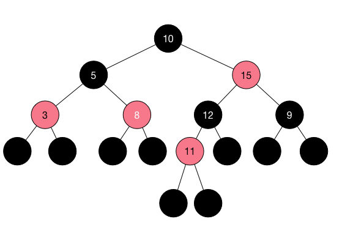
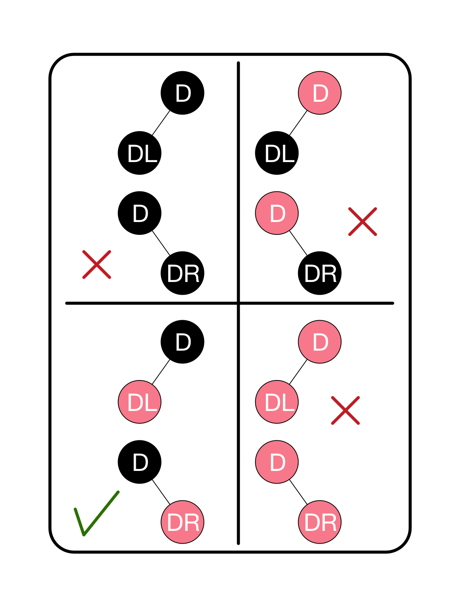
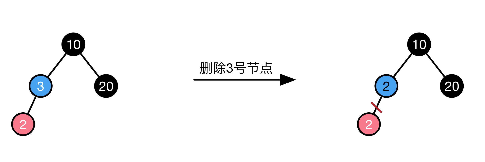

+++
title="红黑树详情"
tags=["算法","红黑树"]
categories=["算法"]
date="2020-03-13T06:30:00+08:00"
summary = '红黑树详情'
toc=false
+++

### 红黑树定义

R-B Tree，红黑树，它是一种特殊的二叉查找树，有以下性质:

-	每个节点或是红色或者是黑色
-	根节点是黑色
-	每个叶子节点是黑色(叶子节点是指为空的叶子节点)
-	如果一个节点是红色的，则它的子节点必须是黑色的
-	从一个节点到该节点的叶子节点的所有路径包含相同的黑色节点数目(确保红黑树是接近平衡的)

#### 红黑树的优势

-	效率高，增、删、查的时间复杂度是log(N)
-	和二叉排序树对比，拥有动态平衡的特性
-	和二叉平衡树对比，每次增加或删除的调整次数更少，效率更高

### 红黑树增加节点

-	按照二叉搜索树找到对应插入位置
-	将新节点置为红色(为什么默认是红色？性质五)
-	从新节点开始向上调整，使得新加节点后符合红黑树要求

#### 二叉树查找树增加节点

-	二叉查找树先确定新增节点是否存在
-	已存在，则直接返回
-	不存在，则在对应位置插入新的值

#### 红黑树增加节点情况分析

红黑树的插入情况分为以下五种：

-	初始化的根节点插入:直接将节点红色置黑，符合红黑树性质，完成。
-	父节点是黑色节点:无需调整，符合红黑树性质，完成。
-	父节点是红色,叔叔节点是红色:由于性质五已经满足，因此通过更改父、叔节点为黑色，祖父节点为红色，即符合性质四，祖父节点的变化可能会影响整个红黑树，因此需要向上递归调整。
-	父节点是红色,叔叔节点为空或者是黑色:通过选择和变化颜色调整(性质五都符合因此通过颜色变化使得满足红黑树所有性质)

#### 具体步骤分析

前三种情况简单，略过。

第四和第五实质是通过选择+改变颜色来调整树，使得符合红黑树性质。上图所示，情况四为插入节点3是父节点2的右节点，节点3的叔叔节点为空，视为黑色叔叔节点，并且3的父节点2是祖父节点6左节点。通过插入节点3的左旋转，使得情况四变为情况五，情况五通过右旋并改变对应颜色使得树符合红黑树性质，完成调整过程。(情况四的实质是节点3的左右旋转)。其他情况如图所示，都是镜像对称，通过类似选择和改变颜色得到调整。

### 红黑树删除节点

-	按照二叉搜索树找到对应删除节点
-	根据节点的颜色，进行判断如何操作删除节点

#### 二叉查找树删除节点

有关二叉查找树的删除见如下文章

#### 红黑树删除节点情况分析

按照红黑树的删除策略，我们需要首先找到需要删除的节点，删除节点的情况具体如下两种

-	单个叶子节点
-	只有左子树或只有右子树的节点

#### 具体步骤分析

[二叉查找树删除](https://www.cnblogs.com/weiweng/p/12486322.html)

#### 删除只有左子树(右子树)的节点

该情况只需要将子树的值赋值给待删除节点，然后删除子树就行

#### 删除叶子节点

##### 红色叶子节点

如果该叶子节点为红色，则直接删除即可，不会影响红黑树的性质

##### 黑色叶子节点

1.	红兄，通过RR或LL操作，转换为情况二处理
2.	黑兄远红侄，通过RR或LL操作，以及变化颜色后直接删除节点(原理，将红色节点迁移到待删除分支)
3.	黑兄近红侄，通过R或L型操作，转为情况二处理
4.	黑兄黑侄红父，将兄弟节点变为红色，可直接删除节点
5.	黑兄黑侄黑父，将兄弟节点变为红色，可直接删除节点，但分支少了一个黑色，因此需要将父节点视为删除节点，向上调整

### 红黑树应用

### 具体应用剖析

