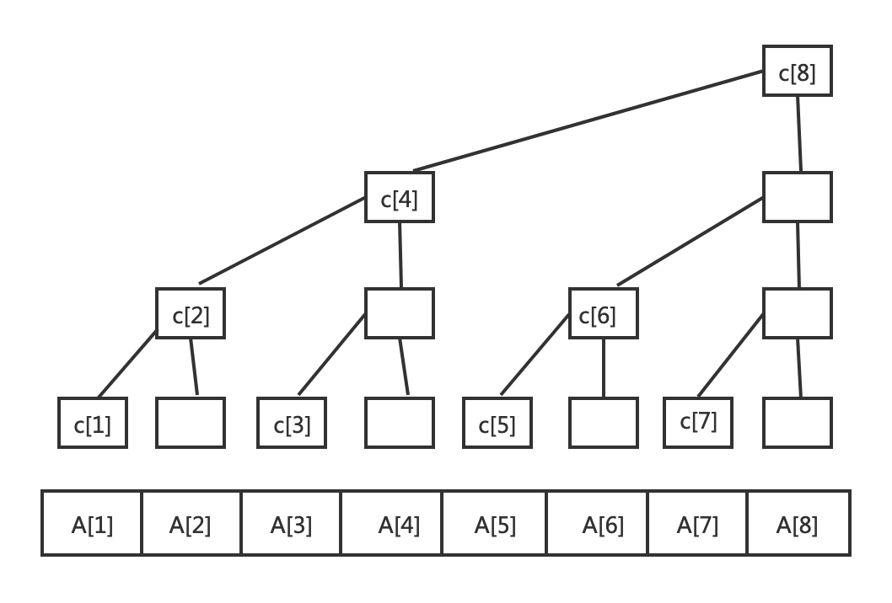

+++
title="树状数组BIT"
tags=["算法","BIT"]
date="2020-03-31T04:08:00+08:00"
summary = '树状数组BIT'
toc=false
+++

树状数组BIT
-----------

现多用于计算前缀和，区间和，可在`O(logN)`时间内得到任意前缀和 。并且支持在`O(logN)`时间内动态单点修改  \`\``c C1=A1 C2=A1+A2 C3=A3 C4=A1+A2+A3+A4 C5=A5 C6=A5+A6 C7=A7 C8=A1+A2+A3+A4+A5+A6+A7+A8

```
其中 `C[i] = A[i - 2k+1] + A[i - 2k+2] + ... + A[i];   //k为i的二进制中从最低位到高位连续零的长度`

例如`i = 8(1000)时候，k = 3`，可自行验证。

## 应用
针对一个数组A，有A0到An个元素，经过W次修改，每次修改一个元素的值，如何快速求其中任意区间内的和问题?

### 如何求和？


以7为例，sum求和0-7的计算方法，C的下标数值如何确定，即7开始不断的取lowbit(具体实现见代码lbt)

## 实现
```

go package main

import "fmt"

type Bit struct {

```
BitTree []int
```

\} // 该函数也可写成 x&(-x) //函数意义:求x中从最低位开始剔除一个1的数值，例如6(110)，剔除最低位1转为4(100)需要减2(10),即lbt(6)=2 func (b *Bit) lbt(x int) int {

```
return x - (x & (x - 1))
```

\}

func (b *Bit) Update(x int, v int) {

```
for i := x+1; i < len(b.BitTree); i += b.lbt(i) {
    b.BitTree[i] += v
}
```

\}

func (b *Bit) GetSum(x int) int {

```
sum := 0
for i := x+1; i > 0; i -= b.lbt(i) {
    sum += b.BitTree[i]
}
return sum
```

\}

func Init(a []int) Bit {

```
b := Bit{BitTree: make([]int, len(a)+1)}
for i := 0; i < len(a); i++ {
    b.Update(i, a[i])
}
return b
```

\}

func main(){

```
a := []int{1,1,1,1}
b := Init(a)
fmt.Println(b)
```

\} \`\`\`

参考
----

-	[树状数组（B.I.T）知乎](https://zhuanlan.zhihu.com/p/46528130)
-	[树状数组详解](https://www.cnblogs.com/xenny/p/9739600.html)

