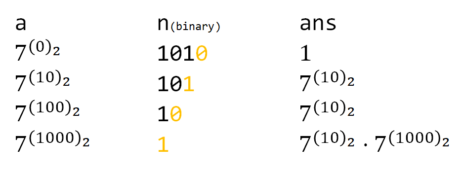

+++
title="快速幂"
tags=["算法","快速幂"]
categories=["算法"]
date="2020-07-04T02:36:00+08:00"
summary = '快速幂'
toc=false
+++

1.定义
======

是一种简单而有效的小算法，它可以以O(log<sup>N</sup>)的时间复杂度计算乘方。

2.递归快速幂
============


2.1实现
-------

```go
func Qpow(a int, n int) int {
	if n == 0 {
		return 1
	} else if n%2 == 1 {
		return Qpow(a, n-1) * a
	} else {
		tmp := Qpow(a, n/2)
		return tmp * tmp
	}
}
```

2.2问题
-------

数据大时的溢出问题

3.非递归快速幂
==============



将n的二进制形式拆解，对应相关位置1则乘上对应的数值，得到结果

3.1实现
-------

```go
func Qpow2(a int, n int) int {
	ans := 1
	for n != 0 {
		if n&1 > 0 {
			ans *= a
		}
		a *= a
		n >>= 1
	}
	return ans
}

```

3.2注意
-------

数据大时的溢出问题

4.快速幂的拓展
==============

上面所述的都是整数的快速幂，但其实，在算 a<sup>n</sup>时，只要a的数据类型支持乘法且满足结合律，快速幂的算法都是有效的。矩阵、高精度整数，都可以照搬这个思路。

4.1模板
-------

```c
//泛型的非递归快速幂
template <typename T>
T qpow(T a, ll n)
{
    T ans(1); // 这里可能要根据构造函数修改
    while (n)
    {
        if (n & 1)
            ans = ans * a; // 这里就最好别用自乘了，不然重载完*还要重载*=，有点麻烦。
        n >>= 1;
        a = a * a;
    }
    return ans;
}
```

5.参考
======

1.	[知乎·快速幂](https://zhuanlan.zhihu.com/p/95902286)

