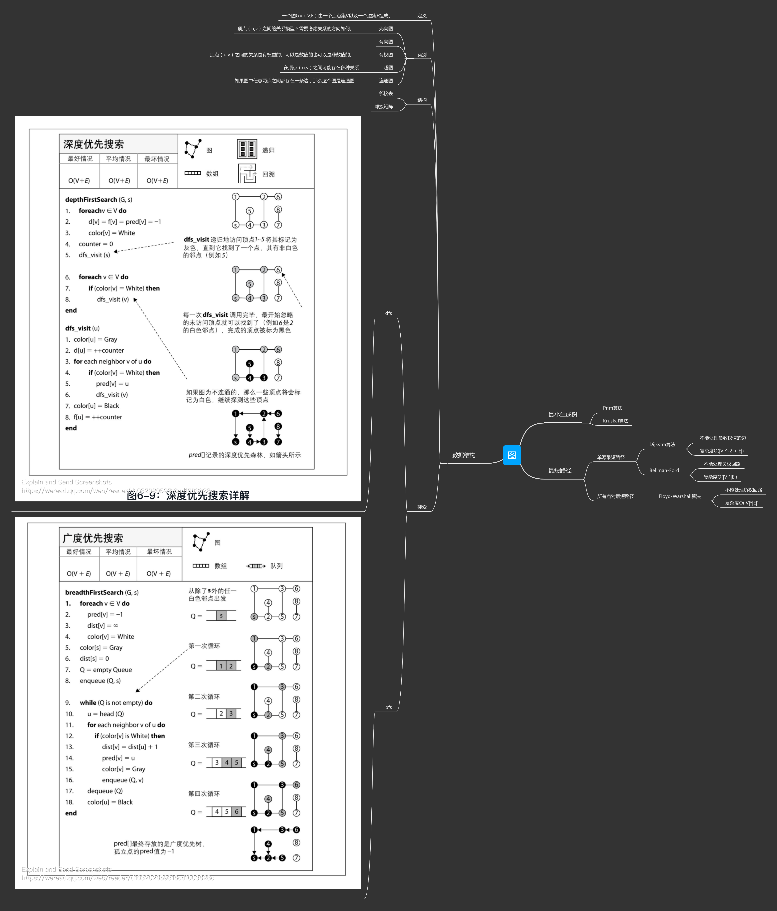

+++
title="图及其相关算法"
tags=["图","算法"]
date="2020-08-19T04:07:00+08:00"
summary = '图及其相关算法'
toc=false
+++

图
==



最短路径
========

Dijkstra流程
------------

-	设定辅助数组D，其中D[i]表示节点i距离源点s的最短距离
-	设定辅助数组F，其中F[i]表示节点i使用最短距离到达源点s的上一个节点
-	集合S，表示已确定可达最短路径的节点集合，集合T，表示未确定最短路径的节点集合，其中V=S+T (V为图中全部节点的集合)
-	源点s加入集合S
-	基于集合S内的节点，寻找T集合的节点中，拥有最小路径权重的可达节点y
-	节点y加入集合S，T集合中剔除节点y，更新T集合中其他节点的路径权重，即数组D，以及数据F
-	重复上述步骤，直到T集合为空
-	结束算法

代码
----

```go
package code

import (
	"container/heap"
	"fmt"
	"math"
)

type Graph struct {
	Nv int
	G  [][]int
}

type Edge struct {
	Start int
	End   int
	Value int
}

type PriorityQueue []*Edge

func (pq PriorityQueue) Len() int { return len(pq) }

func (pq PriorityQueue) Less(i, j int) bool {
	return pq[i].Value < pq[j].Value
}

func (pq PriorityQueue) Swap(i, j int) {
	pq[i], pq[j] = pq[j], pq[i]
}

func (pq *PriorityQueue) Push(x interface{}) {
	item := x.(*Edge)
	*pq = append(*pq, item)
}

func (pq *PriorityQueue) Pop() interface{} {
	old := *pq
	n := len(old)
	item := old[n-1]
	*pq = old[0 : n-1]
	return item
}

func Dijkstra(g *Graph, s int) ([]int, []int) {
	var p PriorityQueue = make([]*Edge, 0, g.Nv)
	dis := make([]int, g.Nv)
	from := make([]int, g.Nv)
	mark := make([]bool, g.Nv)
	p.Push(&Edge{Start: s, End: s, Value: 0})
	for k := 0; k < g.Nv; k++ {
		dis[k] = math.MaxInt64
	}
	dis[s] = 0
	count := 0
	t := s
	part := false
	for {
		if len(p) > 0 {
			t = heap.Pop(&p).(*Edge).End
		} else {
			part = true
			break
		}
		if mark[t] {
			continue
		}

		count++
		for i := 0; i < g.Nv; i++ {
			if g.G[t][i] == 0 {
				continue
			}
			if dis[i]-dis[t] > g.G[i][t] {
				dis[i] = dis[t] + g.G[i][t]
				from[i] = t
			}
			if !mark[i] {
				heap.Push(&p, &Edge{Start: t, End: i, Value: g.G[t][i]})
			}
		}
		if count > g.Nv {
			break
		}
	}
	if part {
		fmt.Printf("图中有独立节点")
	}
	return dis, from
}
//test
import "testing"

func TestDijkstra(t *testing.T) {
	g := Graph{
		4,
		[][]int{
			{0, 1, 3, 5},
			{1, 0, 1, 0},
			{3, 1, 0, 1},
			{5, 0, 1, 0},
		},
	}
	t.Log(Dijkstra(&g, 1))
}
```

BellmanFord流程
---------------

-	设定辅助数组D，其中D[i]表示节点i距离源点s的最短距离
-	设定辅助数组F，其中F[i]表示节点i使用最短距离到达源点s的上一个节点
-	点和边的两层循环，每次选择点i，遍历所有边，确定节点i能够使用的最短路径

代码
----

```go
package code

import (
	"math"
)

type Egraph struct {
	Nv    int
	Ne    int
	Edges []Edge
}

type Edge struct {
	Start int
	End   int
	Value int
}

func BellmanFord(g *Egraph, s int) ([]int, []int, bool) {
	dis := make([]int, g.Nv)
	form := make([]int, g.Nv)
	for t := 0; t < len(dis); t++ {
		dis[t] = math.MaxInt64
	}
	dis[s] = 0
	flag := false
	for k := 0; k < g.Nv; k++ {
		for j := 0; j < g.Ne; j++ {
			f, t := g.Edges[j].Start, g.Edges[j].End
			if dis[t]-dis[f] > g.Edges[j].Value {
				dis[t] = dis[f] + g.Edges[j].Value
				form[t] = f
			}
		}
	}
	for j := 0; j < g.Ne; j++ {
		f, t := g.Edges[j].Start, g.Edges[j].End
		if dis[t]-dis[f] > g.Edges[j].Value {
			flag = true
			break
		}
	}
	return dis, form, flag
}

//test
func TestBellmanFord(t *testing.T) {
	g := Egraph{
		4, 10,
		[]Edge{
			{0, 1, 1},
			{1, 0, 1},

			{1, 2, 1},
			{2, 1, 1},

			{0, 2, 3},
			{2, 0, 3},

			{2, 3, 1},
			{3, 2, 1},
			{0, 3, 5},
			{3, 0, 5},
		},
	}
	t.Log(BellmanFord(&g, 2))
}
```

FloydWarshall流程
-----------------

-	设定辅助数组D，其中D[i]表示节点i距离源点s的最短距离
-	暴力破解，基于节点个数的三次循环，寻找最短路径

代码
----

```go
package code

import (
	"math"
)

type Graph struct {
	Nv int
	G  [][]int
}

func FloydWarshall(g *Graph) [][]int {
	dis := make([][]int, g.Nv)
	for i := 0; i < g.Nv; i++ {
		dis[i] = make([]int, g.Nv)
		for j := 0; j < g.Nv; j++ {
			if i!=j && g.G[i][j] == 0 {
				dis[i][j] = math.MaxInt64
			} else {
				dis[i][j] = g.G[i][j]
			}
		}
	}
	for i := 0; i < g.Nv; i++ {
		for j := 0; j < g.Nv; j++ {
			for k := 0; k < g.Nv; k++ {
				if dis[i][j]-dis[i][k] > dis[k][j] {
					dis[i][j] = dis[i][k] + dis[k][j]
				}
			}
		}
	}
	return dis
}

// test
package code

func TestFloydWarshall(t *testing.T) {
	g := Graph{
		4,
		[][]int{
			{0, 1, 3, 5},
			{1, 0, 1, 0},
			{3, 1, 0, 1},
			{5, 0, 1, 0},
		},
	}
	t.Log(FloydWarshall(&g))
}
```

最小生成树
==========

Prim算法流程
------------

-	选点算法，随意选择一个节点s开始
-	将s相关联边集合收入E中
-	在E中选择，权重最小的边e
-	基于边e的另一个节点p，重复以上步骤
-	节点完全覆盖后，算法截止

	代码
	----

	```go
	package prim
	import "container/heap"

	type Egraph struct {
		Nv    int
		Ne    int
		Edges []Edge
	}

	type Graph struct {
		Nv int
		G  [][]int
	}

	type Edge struct {
		Start int
		End   int
		Value int
	}

	type PriorityQueue []*Edge

	func (pq PriorityQueue) Len() int { return len(pq) }

	func (pq PriorityQueue) Less(i, j int) bool {
		return pq[i].Value < pq[j].Value
	}

	func (pq PriorityQueue) Swap(i, j int) {
		pq[i], pq[j] = pq[j], pq[i]
	}

	func (pq *PriorityQueue) Push(x interface{}) {
		item := x.(*Edge)
		*pq = append(*pq, item)
	}

	func (pq *PriorityQueue) Pop() interface{} {
		old := *pq
		n := len(old)
		item := old[n-1]
		*pq = old[0 : n-1]
		return item
	}

	func Prim(g *Graph) []Edge {
		var p PriorityQueue = make([]*Edge, 0, 10)
		mark := make(map[int]bool, g.Nv)
		s := 0
		mark[s] = true
		ret := make([]Edge, 0)
		for {
			for i := 0; i < g.Nv; i++ {
				if !mark[i] && g.G[s][i] != 0 {
					heap.Push(&p, &Edge{Start: s, End: i, Value: g.G[s][i]})
				}
			}
			if len(p) == 0 {
				break
			}
			k := heap.Pop(&p).(*Edge)
			for len(p) > 0 && mark[k.End] {
				k = heap.Pop(&p).(*Edge)
			}
			if !mark[k.End] {
				ret = append(ret, *k)
			}
			mark[k.End] = true
			s = k.End
		}
		return ret
	}

	//test

	import "testing"

	func TestPrim(t *testing.T) {
		g := Graph{
			4,
			[][]int{
				{0, 1, 3, 5},
				{1, 0, 1, 0},
				{3, 1, 0, 1},
				{5, 0, 1, 0},
			},
		}
		t.Log(Prim(&g))
	}
	```

Kruskal算法流程
---------------

-	选边算法，将所有图中边放入集合E中
-	选择权重最小边e，将e加入最小生成树边集合R，集合E中移除e
-	重复上一步，选择的最小边，不能和已选边集合的节点形成连通
-	所有节点覆盖后，结束

代码
----

```go
package code

import "container/heap"

type Graph struct {
	Nv int
	G  [][]int
}

type Edge struct {
	Start int
	End   int
	Value int
}

type PriorityQueue []*Edge

func (pq PriorityQueue) Len() int { return len(pq) }

func (pq PriorityQueue) Less(i, j int) bool {
	return pq[i].Value < pq[j].Value
}

func (pq PriorityQueue) Swap(i, j int) {
	pq[i], pq[j] = pq[j], pq[i]
}

func (pq *PriorityQueue) Push(x interface{}) {
	item := x.(*Edge)
	*pq = append(*pq, item)
}

func (pq *PriorityQueue) Pop() interface{} {
	old := *pq
	n := len(old)
	item := old[n-1]
	*pq = old[0 : n-1]
	return item
}

type UnionSet []int

func NewUnionSet(k int) UnionSet {
	u := make(UnionSet, k)
	for i := 0; i < k; i++ {
		u[i] = i
	}
	return u
}

func (u *UnionSet) Union(i, j int) {
	t := u.Find(i)
	k := u.Find(j)
	if t != k {
		(*u)[k] = t
	}
}

func (u *UnionSet) Find(i int) int {
	if (*u)[i] != i {
		(*u)[i] = u.Find((*u)[i])
	}
	return (*u)[i]
}

func (u *UnionSet) IsSameFather(i, j int) bool {
	return u.Find(i) == u.Find(j)
}

func Kruskal(g *Graph) []Edge {
	var p PriorityQueue = make([]*Edge, 0, 10)
	ret := make([]Edge, 0)
	for i := 0; i < g.Nv; i++ {
		for j := 0; j <= i; j++ {
			if g.G[i][j] != 0 {
				heap.Push(&p, &Edge{Start: i, End: j, Value: g.G[i][j]})
			}
		}
	}
	uSet := NewUnionSet(g.Nv)
	k := heap.Pop(&p).(*Edge)
	uSet.Union(k.Start, k.End)
	ret = append(ret, *k)
	for {
		if len(p) == 0 {
			break
		}
		k = heap.Pop(&p).(*Edge)
		if uSet.IsSameFather(k.Start, k.End) {
			continue
		}
		ret = append(ret, *k)
		uSet.Union(k.Start, k.End)
		if len(ret) == g.Nv-1 {
			break
		}
	}
	return ret
}

//test
func TestKruskal(t *testing.T) {
	g := Graph{
		4,
		[][]int{
			{0, 1, 3, 5},
			{1, 0, 1, 0},
			{3, 1, 0, 1},
			{5, 0, 1, 0},
		},
	}
	t.Log(Kruskal(&g))
}
```

参考
====

-	[戴克斯特拉算法](https://zh.wikipedia.org/wiki/%E6%88%B4%E5%85%8B%E6%96%AF%E7%89%B9%E6%8B%89%E7%AE%97%E6%B3%95)
-	[贝尔曼-福特算法](https://zh.wikipedia.org/wiki/%E8%B4%9D%E5%B0%94%E6%9B%BC-%E7%A6%8F%E7%89%B9%E7%AE%97%E6%B3%95)
-	[最小生成树之Kruskal算法](https://blog.csdn.net/luomingjun12315/article/details/47700237)

