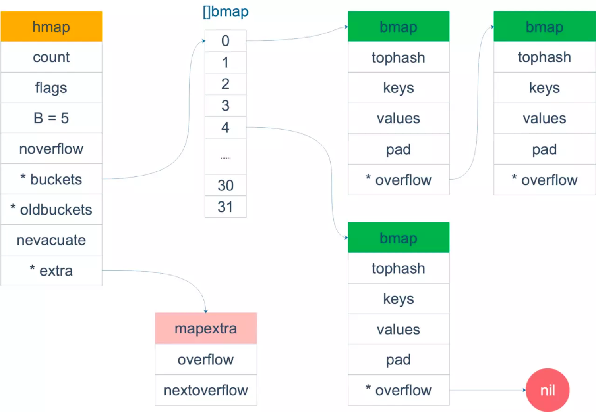
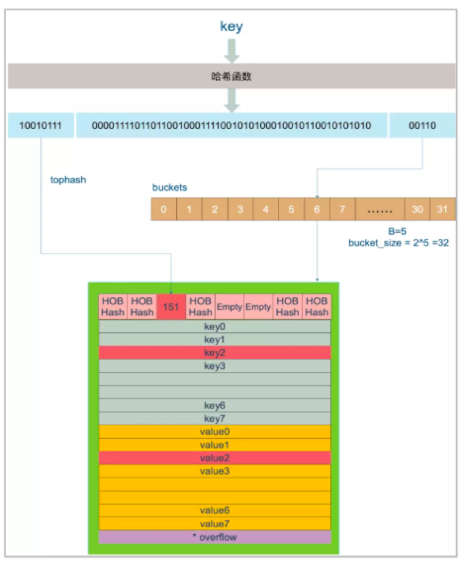

+++
title="Golang|map"
tags=["golang","map"]
categories=["golang"]
date="2020-03-13T06:38:00+08:00"
summary = 'map'
toc=false
+++

### map

由<key,value>对组成的抽象数据结构，并且同一个key只出现一次

### 实现对比

方法 | hash | 搜索树 -|-|- 复杂度 | O(1) | O(logN) 顺序 | 乱序 | 有序 痛点 | 碰撞问题 | 平衡问题

### 源码位置

```go
//main.go
package main

func main() {
	m := make(map[int]int)
	m[2] = 2
}
```

上面代码通过以下指令查看汇编语句 `go tool compile -S main.go`

map源码位置 src/runtime/hashmap.go (go1.9.2版本)

### 源码分析

#### 数据结构

```go
type hmap struct {
	//计数,map包含key个数
	count int
	//标志位,包含是否写、是否遍历，老迭代器还是新迭代器遍历以及是否同大小增长
	flags uint8
	//map里桶的个数的指数
	B uint8
	//溢出桶的个数(数值过大是会随机计数大致统计)
	noverflow uint16
	//key的hash种子
	hash0 uint32

	//指向当前桶数组的指针
	buckets unsafe.Pointer
	//指向老桶数组的指针
	oldbuckets unsafe.Pointer
	//已迁移的地址，改地址以前的桶都已经迁移(扩容相关)
	nevacuate uintptr

	//特殊用途
	extra *mapextra
}

//当map的键和值都不是指针并且类型为内置类型时，会将桶标记为不包含指针类型，从而减少GC扫描
//但是桶的结构体中包含overflow指针，因此上述map会将桶的overflow指针放在如下结构体中
type mapextra struct {
	//大小为2的数组，值为指向数组的指针
	//0号指向当前桶数组的地址
	//1号指向老桶数组的地址
	overflow [2]*[]*bmap
	//指向预分配的桶的地址，具体功用还未理解，带填坑
	nextOverflow *bmap
}

//具体桶的结构体
type bmap struct {
	//大小为8的数组，作用是快速索引key以及记录迁移状态
	topbits [8]uint8
	//键值存储位置
	keys   [8]keytype
	values [8]valuetype
	//对其字节
	pad uintptr
	//溢出桶指针
	overflow uintptr
}

//bmap的key和value都是大小为8的数组，并且先key后value的排列
//目的是减少因为字节对齐产生的pad

```



#### map创建

```go
func makemap(t *maptype, hint int64, h *hmap, bucket unsafe.Pointer) *hmap {
	//key的合法判断、大小判断、设定的常量判断等操作
	...
	// B初始值为0 
	B := uint8(0)
	//hint大于8并且hint/2^B超过转载因子则增加B
	for ; overLoadFactor(hint, B); B++ { } //桶地址赋值，如果B=0，则会在mapassign阶段分配一个桶
	buckets := bucket
	var extra *mapextra
	if B != 0 {
		var nextOverflow *bmap
		//根据B大小分配桶数组的地址空间，以及预分配一些桶的空间
		buckets, nextOverflow = makeBucketArray(t, B)
		if nextOverflow != nil {
			extra = new(mapextra)
			extra.nextOverflow = nextOverflow
		}
	}

	// 初始化hmap的其他数值 
	if h == nil {
		h = (*hmap)(newobject(t.hmap))
	}
	h.count = 0
	h.B = B
	h.extra = extra
	h.flags = 0
	h.hash0 = fastrand()
	h.buckets = buckets
	h.oldbuckets = nil
	h.nevacuate = 0
	h.noverflow = 0

	return h
}
```

#### map读取

map的读取函数很多但核心都一样，下面重点分析mapaccess2函数



```go
func mapaccess2(t *maptype, h *hmap, key unsafe.Pointer) (unsafe.Pointer, bool) {
	//不知道干啥的，好像已经不适用了
	...

	//map为nil或者大小等于0则返回value类型的0值
	if h == nil || h.count == 0 {
		return unsafe.Pointer(&zeroVal[0]), false
	}
	//标志位判断是否有协程在写map，有的话抛错误
	if h.flags&hashWriting != 0 {
		throw("concurrent map read and map write")
	}
	//拿到key的hash函数
	alg := t.key.alg
	//通过map的hash种子和key的hash函数算出哈希值
	hash := alg.hash(key, uintptr(h.hash0)) //获取桶的掩码值,即B=5则m=11111
	m := uintptr(1)<<h.B - 1
	//通过掩码m获取hash值最后B位数值，得到key所在的桶数组的下标地址
	b := (*bmap)(unsafe.Pointer(uintptr(h.buckets) + (hash&m)*uintptr(t.bucketsize)))
	//查看是否有老桶数组，有的话表示map正在扩容
	if c := h.oldbuckets; c != nil {
		//如果不是等大小扩容，则说明是真正的增加桶个数的扩容
		//通常是翻倍增加，因此m右移一位即，老桶的掩码值
		if !h.sameSizeGrow() {
			m >>= 1
		}
		//通过老桶数组的掩码值计算老桶数组中key对应的桶地址
		oldb := (*bmap)(unsafe.Pointer(uintptr(c) + (hash&m)*uintptr(t.bucketsize)))
		//判断是否已经搬迁，如果没有搬迁，则用老桶地址来寻找
		//怎么判断是否搬迁？看桶的第一个tophash是否在1-3之间，1-3为桶的特殊标记
		//一次搬迁一个桶及其溢出桶，只有搬迁后才会设置特殊标记
		if !evacuated(oldb) {
			b = oldb
		}
	}
	//取hash值前8位作为tophash值和桶的tonghash数组对比进行快速定位查找
	top := uint8(hash >> (sys.PtrSize*8 - 8))
	//top取值小于4的,需要加4,因为0-3是tophash的特殊标记
	if top < minTopHash {
		top += minTopHash
	}
	for {
		//遍历桶的8个位置
		for i := uintptr(0); i < bucketCnt; i++ {
			//通过tophash快速判断
			if b.tophash[i] != top {
				continue
			}
			//tophash值相同的，则把key拿出来
			k := add(unsafe.Pointer(b), dataOffset+i*uintptr(t.keysize))
			//如果key存的是指针 
			if t.indirectkey {
				//取出值来
				k = *((*unsafe.Pointer)(k))
			}
			//计算key和k的值是否相等，tophash一样的不一定key一样哈
			if alg.equal(key, k) {
				//一样的话，拿对应的值
				v := add(unsafe.Pointer(b), dataOffset+bucketCnt*uintptr(t.keysize)+i*uintptr(t.valuesize))
				//值存的是指针，则通过指针获取正在的值
				if t.indirectvalue {
					v = *((*unsafe.Pointer)(v))
				}
				return v, true
			}
		}
		//8个都没有则看是否有溢出桶
		b = b.overflow(t)
		if b == nil {
			//没有溢出桶，返回value类型的0值
			return unsafe.Pointer(&zeroVal[0]), false
		}
	}
}
```

#### map赋值

```go
func mapassign(t *maptype, h *hmap, key unsafe.Pointer) unsafe.Pointer {
	//map为nil 抛panic
	if h == nil {
		panic(plainError("assignment to entry in nil map"))
	}
	//好像是废弃的代码
	...

	//判断是否有写的协程在操作
	if h.flags&hashWriting != 0 {
		throw("concurrent map writes")
	}
	alg := t.key.alg
	hash := alg.hash(key, uintptr(h.hash0))

	//map的标志位设置写状态
	h.flags |= hashWriting

	//如果桶数组为nil则分配1个
	if h.buckets == nil {
		h.buckets = newarray(t.bucket, 1)
	}

again:
	//拿到key对应的桶数组地址
	bucket := hash & (uintptr(1)<<h.B - 1)
	//如果map处于扩容状态则尝试搬迁当前桶
	if h.growing() {
		//桶的搬迁工作，一次尝试搬迁两个桶，具体后续分析
		growWork(t, h, bucket)
	}
	//以下部分和map的查找逻辑一样
	b := (*bmap)(unsafe.Pointer(uintptr(h.buckets) + bucket*uintptr(t.bucketsize)))
	top := uint8(hash >> (sys.PtrSize*8 - 8))
	if top < minTopHash {
		top += minTopHash
	}

	var inserti *uint8
	var insertk unsafe.Pointer
	var val unsafe.Pointer
	for {
		for i := uintptr(0); i < bucketCnt; i++ {
			if b.tophash[i] != top {
			//tophash不相等，则尝试看这个地址是否是空的
				if b.tophash[i] == empty && inserti == nil {
					//这个位置是空的并且inserti的指针为空，则先让inserti指向这个位置
					//如果map中没有当前key则可以用这个空位置存储key
					inserti = &b.tophash[i]
					insertk = add(unsafe.Pointer(b), dataOffset+i*uintptr(t.keysize))
					val = add(unsafe.Pointer(b), dataOffset+bucketCnt*uintptr(t.keysize)+i*uintptr(t.valuesize))
				}
				continue
			}
			//tophash一样，则通过equal看找到的k是否是key
			k := add(unsafe.Pointer(b), dataOffset+i*uintptr(t.keysize))
			if t.indirectkey {
				k = *((*unsafe.Pointer)(k))
			}
			if !alg.equal(key, k) {
				continue
			}
			//走到这一步，确定map中已经有key了，则需要更新key的值
			//needkeyupdate判断是否需要重写key，不知道为什么会有重写key的操作?留坑
			if t.needkeyupdate {
				typedmemmove(t.key, k, key)
			}
			//val作为值的地址拿出来，跳转到结束阶段
			val = add(unsafe.Pointer(b), dataOffset+bucketCnt*uintptr(t.keysize)+i*uintptr(t.valuesize))
			goto done
		}
		//这个桶里面没找打，则看看是否有溢出桶
		ovf := b.overflow(t)
		if ovf == nil {
			//没有就跳出for，说明map里没有包含key
			break
		}
		b = ovf
	}

	//map不在扩容状态，则判断是否需要扩容
	//扩容准则1.是否超过转载因子 2.是否冗余溢出桶太多(原本很多key的map删除很多key之后的情况)
	if !h.growing() && (overLoadFactor(int64(h.count), h.B) || tooManyOverflowBuckets(h.noverflow, h.B)) {
		//扩容前操作，后面会分析，就是分配新的地址空间为扩容的搬迁做准备
		hashGrow(t, h)
		//重新走上面流程
		goto again // Growing the table invalidates everything, so try again
	}

	//上面的扩容流程之后的在此寻找，其实会进行两次搬迁操作后定位key
	//map里没有key的话就会给inserti一个新的地址
	//这里inserti等于nil则说明map没有达到扩容阈值，而桶和它的溢出桶的8个位置已经用完了，则需要再加一个溢出桶
	if inserti == nil {
		//申请一个新的溢出桶
		newb := h.newoverflow(t, b)
		//既然是新的，当然用第一位了
		inserti = &newb.tophash[0]
		insertk = add(unsafe.Pointer(newb), dataOffset)
		val = add(insertk, bucketCnt*uintptr(t.keysize))
	}

	//到这里，说明key不存在map里，则新建对应的key和value
	//key是指针，则申请一个key类型的数据
	//insertk指向该数据的地址
	if t.indirectkey {
		kmem := newobject(t.key)
		*(*unsafe.Pointer)(insertk) = kmem
		insertk = kmem
	}
	//同理value一样
	if t.indirectvalue {
		vmem := newobject(t.elem)
		*(*unsafe.Pointer)(val) = vmem
	}
	//拷贝key的值
	typedmemmove(t.key, insertk, key)
	//设置tophash
	*inserti = top
	//map的大小加一
	h.count++

done:
	//判断写标记位是否存在，如果被清除了，说明并发写的情况
	//直接抛错误
	if h.flags&hashWriting == 0 {
		throw("concurrent map writes")
	}
	//清除写标志位
	h.flags &^= hashWriting
	//
	if t.indirectvalue {
		val = *((*unsafe.Pointer)(val))
	}
	//返回val的地址，具体赋值是编译器的额外汇编指令处理
	return val
}
```

#### map删除

```go
func mapdelete(t *maptype, h *hmap, key unsafe.Pointer) {
	//好像又是不要的部分代码
	...

	//map为nil或者带下为0则直接返回了
	if h == nil || h.count == 0 {
		return
	}
	//有协程在写，则抛异常，delete也是视为对map的写操作
	if h.flags&hashWriting != 0 {
		throw("concurrent map writes")
	}

	alg := t.key.alg
	hash := alg.hash(key, uintptr(h.hash0))

	//设置写标记位
	h.flags |= hashWriting

	bucket := hash & (uintptr(1)<<h.B - 1)
	//如果是搬迁状态则尝试搬迁这个桶
	if h.growing() {
		growWork(t, h, bucket)
	}
	//以下阶段经典的找key阶段
	b := (*bmap)(unsafe.Pointer(uintptr(h.buckets) + bucket*uintptr(t.bucketsize)))
	top := uint8(hash >> (sys.PtrSize*8 - 8))
	if top < minTopHash {
		top += minTopHash
	}
	for {
		for i := uintptr(0); i < bucketCnt; i++ {
			if b.tophash[i] != top {
				continue
			}
			k := add(unsafe.Pointer(b), dataOffset+i*uintptr(t.keysize))
			k2 := k
			if t.indirectkey {
				k2 = *((*unsafe.Pointer)(k2))
			}
			if !alg.equal(key, k2) {
				continue
			}
			if t.indirectkey {
				*(*unsafe.Pointer)(k) = nil
			} else {
				typedmemclr(t.key, k)
			}
			v := unsafe.Pointer(uintptr(unsafe.Pointer(b)) + dataOffset + bucketCnt*uintptr(t.keysize) + i*uintptr(t.valuesize))
			if t.indirectvalue {
				*(*unsafe.Pointer)(v) = nil
			} else {
				typedmemclr(t.elem, v)
			}
			//对应tophash置空
			b.tophash[i] = empty
			//大小减一
			h.count--
			//调整结束阶段
			goto done
		}
		b = b.overflow(t)
		if b == nil {
			goto done
		}
	}

done:
	//判断以下是否并发写
	if h.flags&hashWriting == 0 {
		throw("concurrent map writes")
	}
	//清空写标志位
	h.flags &^= hashWriting
}
```

#### map扩容

```go
func hashGrow(t *maptype, h *hmap) {
	bigger := uint8(1)
	if !overLoadFactor(int64(h.count), h.B) {
		//不是因为超过装载因子而扩容，则bigger置0
		bigger = 0
		//设置同大小扩容标志位
		h.flags |= sameSizeGrow
	}
	//当前桶数组地址复制到老桶数组地址
	oldbuckets := h.buckets
	//申请新地址空间
	newbuckets, nextOverflow := makeBucketArray(t, h.B+bigger)

	//当前flags清空两个标志位
	flags := h.flags &^ (iterator | oldIterator)
	//如果map有迭代器在读
	if h.flags&iterator != 0 {
		//flags的老迭代器标志位置1
		flags |= oldIterator
	}
	//设置map的新属性值
	h.B += bigger
	h.flags = flags
	h.oldbuckets = oldbuckets
	h.buckets = newbuckets
	h.nevacuate = 0
	h.noverflow = 0

	if h.extra != nil && h.extra.overflow[0] != nil {
		if h.extra.overflow[1] != nil {
			throw("overflow is not nil")
		}
		h.extra.overflow[1] = h.extra.overflow[0]
		h.extra.overflow[0] = nil
	}
	if nextOverflow != nil {
		if h.extra == nil {
			h.extra = new(mapextra)
		}
		h.extra.nextOverflow = nextOverflow
	}
}

func (h *hmap) growing() bool {
	return h.oldbuckets != nil
}

func growWork(t *maptype, h *hmap, bucket uintptr) {
	//搬迁bucket桶
	//和老桶掩码运算，确保搬迁老的桶下标
	evacuate(t, h, bucket&h.oldbucketmask())

	//没有搬迁完，则在搬一个，这次搬最小未搬迁的桶
	if h.growing() {
		evacuate(t, h, h.nevacuate)
	}
}

func evacuate(t *maptype, h *hmap, oldbucket uintptr) {
	//获取老桶数组中oldbucket的桶地址
	b := (*bmap)(add(h.oldbuckets, oldbucket*uintptr(t.bucketsize))) //增长的大小，例如原先map的B=4，扩容后B=5则newbit=2^4
	//用于计算新搬迁桶地址以及相关标志位
	newbit := h.noldbuckets()
	alg := t.key.alg
	//判断是否搬迁了
	if !evacuated(b) {
		var (
			x, y   *bmap
			xi, yi int
			xk, yk unsafe.Pointer
			xv, yv unsafe.Pointer
		)
		//x指向新桶数组中的老位置
		x = (*bmap)(add(h.buckets, oldbucket*uintptr(t.bucketsize)))
		xi = 0
		xk = add(unsafe.Pointer(x), dataOffset)
		xv = add(xk, bucketCnt*uintptr(t.keysize))
		if !h.sameSizeGrow() {
			//真正扩容增长，y指向新桶数组的新位置
			//和老位置的区别就是差newbit的个数
			//按照取桶地址的方法，新B比老B多1位，也就是新的地址下标比老的下标多看hash值左边一位
			y = (*bmap)(add(h.buckets, (oldbucket+newbit)*uintptr(t.bucketsize)))
			yi = 0
			yk = add(unsafe.Pointer(y), dataOffset)
			yv = add(yk, bucketCnt*uintptr(t.keysize))
		}
		//开始遍历b，进行搬迁
		for ; b != nil; b = b.overflow(t) {
			k := add(unsafe.Pointer(b), dataOffset)
			v := add(k, bucketCnt*uintptr(t.keysize))
			for i := 0; i < bucketCnt; i, k, v = i+1, add(k, uintptr(t.keysize)), add(v, uintptr(t.valuesize)) {
				top := b.tophash[i]
				if top == empty {
					//标定搬迁空状态
					b.tophash[i] = evacuatedEmpty
					continue
				}
				//理论上不会出现小于minTopHash的值
				if top < minTopHash {
					throw("bad map state")
				}
				k2 := k
				if t.indirectkey {
					k2 = *((*unsafe.Pointer)(k2))
				}
				useX := true
				if !h.sameSizeGrow() {
					//计算hash值
					hash := alg.hash(k2, uintptr(h.hash0))
					//有迭代器访问的时候，这个和迭代器的遍历规则有关联，所以这里会判断
					if h.flags&iterator != 0 {
						//自己和自己对比，不一致，说明key是浮点NANs
						if !t.reflexivekey && !alg.equal(k2, k2) {
							//看旧桶的top值最后一位
							if top&1 != 0 {
								//hash值在新B位置0，即将这个key放到新桶数组中的老位置
								hash |= newbit
							} else {
								//放到新位置
								hash &^= newbit
							}
							//记录新的top值
							top = uint8(hash >> (sys.PtrSize*8 - 8))
							//top修正
							if top < minTopHash {
								top += minTopHash
							}
						}
					}
					//判断是是否是0即是否在新桶数组的老位置
					useX = hash&newbit == 0
				}
				if useX {
					//老桶中的key的tophash标记位迁移到x，即新桶数组的老位置
					b.tophash[i] = evacuatedX
					//xi等于8了，说明这个桶装满了，需要溢出桶
					if xi == bucketCnt {
						newx := h.newoverflow(t, x)
						x = newx
						xi = 0
						xk = add(unsafe.Pointer(x), dataOffset)
						xv = add(xk, bucketCnt*uintptr(t.keysize))
					}
					//设定新的tophash
					x.tophash[xi] = top
					if t.indirectkey {
						*(*unsafe.Pointer)(xk) = k2
					} else {
						typedmemmove(t.key, xk, k)
					}
					if t.indirectvalue {
						*(*unsafe.Pointer)(xv) = *(*unsafe.Pointer)(v)
					} else {
						typedmemmove(t.elem, xv, v)
					}
					//下一个
					xi++
					xk = add(xk, uintptr(t.keysize))
					xv = add(xv, uintptr(t.valuesize))
				} else {
					//同上，只是把key放在新桶数组中的新位置
					b.tophash[i] = evacuatedY
					if yi == bucketCnt {
						newy := h.newoverflow(t, y)
						y = newy
						yi = 0
						yk = add(unsafe.Pointer(y), dataOffset)
						yv = add(yk, bucketCnt*uintptr(t.keysize))
					}
					y.tophash[yi] = top
					if t.indirectkey {
						*(*unsafe.Pointer)(yk) = k2
					} else {
						typedmemmove(t.key, yk, k)
					}
					if t.indirectvalue {
						*(*unsafe.Pointer)(yv) = *(*unsafe.Pointer)(v)
					} else {
						typedmemmove(t.elem, yv, v)
					}
					yi++
					yk = add(yk, uintptr(t.keysize))
					yv = add(yv, uintptr(t.valuesize))
				}
			}
		}
		//判断是否老桶数组还有迭代器在访问
		if h.flags&oldIterator == 0 {
			//没有，则处理一下，帮助gc
			b = (*bmap)(add(h.oldbuckets, oldbucket*uintptr(t.bucketsize)))
			if t.bucket.kind&kindNoPointers == 0 {
				memclrHasPointers(add(unsafe.Pointer(b), dataOffset), uintptr(t.bucketsize)-dataOffset)
			} else {
				memclrNoHeapPointers(add(unsafe.Pointer(b), dataOffset), uintptr(t.bucketsize)-dataOffset)
			}
		}
	}

	//刚好，上面处理的桶是最小未处理桶
	if oldbucket == h.nevacuate {
		//最小未处理桶往后走一位
		h.nevacuate = oldbucket + 1
		//尝试往后判断1024次，看看当前的最小未处理桶是否已经处理了，以及是否有连续的已经处理的桶
		//有的话，就更新这个最小未处理桶下标，让这个数值精确
		stop := h.nevacuate + 1024
		if stop > newbit {
			stop = newbit
		}
		for h.nevacuate != stop && bucketEvacuated(t, h, h.nevacuate) {
			h.nevacuate++
		}
		//已经处理完了
		if h.nevacuate == newbit {
			//oldbuckets指向空
			h.oldbuckets = nil
			//指向空，让gc处理
			if h.extra != nil {
				h.extra.overflow[1] = nil
			}
			//标志位清空
			h.flags &^= sameSizeGrow
		}
	}
}
```

#### map遍历

```go
//for range遍历的时候，先调用这个函数初始化一下迭代器
func mapiterinit(t *maptype, h *hmap, it *hiter) {
	it.key = nil
	it.value = nil
	it.t = nil
	it.h = nil
	it.buckets = nil
	it.bptr = nil
	it.overflow[0] = nil
	it.overflow[1] = nil

	//废弃代码?
	...
	//map空，或大小为0返回
	if h == nil || h.count == 0 {
		it.key = nil
		it.value = nil
		return
	}

	//检测
	if unsafe.Sizeof(hiter{})/sys.PtrSize != 12 {
		throw("hash_iter size incorrect") 
	}
	it.t = t
	it.h = h

	//记录当前map的B值
	it.B = h.B
	//记录当前桶数组地址
	it.buckets = h.buckets
	if t.bucket.kind&kindNoPointers != 0 {
		//map不包含指针，则溢出桶地址在overflow中
		h.createOverflow()
		it.overflow = h.extra.overflow
	}

	//随机一个开始桶下标,以及桶内开始的下标
	//所以map的遍历结果是变化的
	r := uintptr(fastrand())
	if h.B > 31-bucketCntBits {
		r += uintptr(fastrand()) << 31
	}
	it.startBucket = r & (uintptr(1)<<h.B - 1)
	it.offset = uint8(r >> h.B & (bucketCnt - 1))

	it.bucket = it.startBucket
	//判断是否已经走了一圈的标记
	it.wrapped = false
	it.bptr = nil

	//不太懂，留坑，好像是允许多个迭代器同时遍历map
	if old := h.flags; old&(iterator|oldIterator) != iterator|oldIterator {
		atomic.Or8(&h.flags, iterator|oldIterator)
	}
	//遍历第一个元素
	mapiternext(it)
}

func mapiternext(it *hiter) {
	h := it.h
	//废弃代码？
	...
	//不允许同时读写
	if h.flags&hashWriting != 0 {
		throw("concurrent map iteration and map write")
	}
	t := it.t
	//记录当前遍历桶下标
	bucket := it.bucket
	//记录当前遍历桶地址
	b := it.bptr
	//记录桶内下标
	i := it.i
	//记录是否要检测新桶
	checkBucket := it.checkBucket
	alg := t.key.alg

next:
	if b == nil {
		//刚开始，或者结束了
		//走了一圈了，bucket又等于开始的下标，则表示已经遍历结束了
		if bucket == it.startBucket && it.wrapped {
			it.key = nil
			it.value = nil
			return
		}
		if h.growing() && it.B == h.B {
			//当前map已经处在扩容阶段，但迭代器记录的B和map现在的B一样
			//说明，迭代器是扩容阶段初始化的
			oldbucket := bucket & it.h.oldbucketmask()
			//b为老桶数组的相关地址
			b = (*bmap)(add(h.oldbuckets, oldbucket*uintptr(t.bucketsize)))
			//看是否已经搬迁了
			if !evacuated(b) {
				//还没有搬迁，则我们要遍历的数据还在老桶数组对应下标的桶内
				//但老桶的数据不一定全是新桶数组的一样下标，需要判断这个值以后是不是会在我们当前遍历桶下标
				//因此，记录需要检测的下标
				checkBucket = bucket
			} else {
				//已经搬迁了，则遍历新桶数组对应的bucket下标桶数据
				b = (*bmap)(add(it.buckets, bucket*uintptr(t.bucketsize)))
				checkBucket = noCheck
			}
		} else {
			//情况1.迭代器是扩容前初始化的，处理直接遍历老桶数组，因为迭代器标准位的存在，老桶数组不会被清空
			//情况2.map没有扩容，正常遍历桶数组
			b = (*bmap)(add(it.buckets, bucket*uintptr(t.bucketsize)))
			//上面情况都不会存在需要检测的桶
			checkBucket = noCheck
		}
		//bucket下一个，后续遍历准备
		bucket++
		//到头了，从0开始，并且循环标记为true
		if bucket == uintptr(1)<<it.B {
			bucket = 0
			it.wrapped = true
		}
		//桶内遍历个数置0
		i = 0
	}
	for ; i < bucketCnt; i++ {
		//offi 桶内随机开始下标的快速定位
		offi := (i + it.offset) & (bucketCnt - 1)
		k := add(unsafe.Pointer(b), dataOffset+uintptr(offi)*uintptr(t.keysize))
		v := add(unsafe.Pointer(b), dataOffset+bucketCnt*uintptr(t.keysize)+uintptr(offi)*uintptr(t.valuesize))
		//tophash为空，则跳过
		if b.tophash[offi] != empty && b.tophash[offi] != evacuatedEmpty {
			if checkBucket != noCheck && !h.sameSizeGrow() {
				//是扩大一倍增长的，并且需要检测桶
				k2 := k
				if t.indirectkey {
					k2 = *((*unsafe.Pointer)(k2))
				}
				if t.reflexivekey || alg.equal(k2, k2) {
					//是正常key，但hash取得的桶下标不是目前需要的，则跳过
					//说明这个key以后会去新的下标桶
					hash := alg.hash(k2, uintptr(h.hash0))
					if hash&(uintptr(1)<<it.B-1) != checkBucket {
						continue
					}
				} else {
					//特殊值nan的处理，我们是看tophash的最后一位，是否是1，来决定搬迁去向的
					//因此，这个这次也这么判断，看这个key是否会在checkBucket下标的桶
					if checkBucket>>(it.B-1) != uintptr(b.tophash[offi]&1) {
						continue
					}
				}
			}
			//如果tophash不是特殊标记
			if b.tophash[offi] != evacuatedX && b.tophash[offi] != evacuatedY {
				//黄金数据，直接返回
				if t.indirectkey {
					k = *((*unsafe.Pointer)(k))
				}
				it.key = k
				if t.indirectvalue {
					v = *((*unsafe.Pointer)(v))
				}
				it.value = v
			} else {
				//有特殊标记，则说明这个被搬迁了
				//因为map只有读互斥，所以我们需要去找一下这个key
				//看是不是还存在
				k2 := k
				if t.indirectkey {
					k2 = *((*unsafe.Pointer)(k2))
				}
				if t.reflexivekey || alg.equal(k2, k2) {
					rk, rv := mapaccessK(t, h, k2)
					if rk == nil {
						continue // key has been deleted
					}
					it.key = rk
					it.value = rv
				} else {
					//特殊的NANs的键值，不可能找到的，因此直接返回
					it.key = k2
					if t.indirectvalue {
						v = *((*unsafe.Pointer)(v))
					}
					it.value = v
				}
			}
			//找到一个数据了，相关字段写入迭代器，方便下一次迭代
			it.bucket = bucket
			if it.bptr != b { 
				it.bptr = b
			}
			it.i = i + 1
			it.checkBucket = checkBucket
			return
		}
	}
	//这个桶没有数据，看看溢出桶
	b = b.overflow(t)
	i = 0
	goto next
}
```

### 参考

1.	[深度解密Go语言之map](https://juejin.im/post/5ce4dd5ae51d4558936a9fde?utm_source=gold_browser_extension)
2.	[map解析](https://github.com/cch123/golang-notes/blob/master/map.md)

