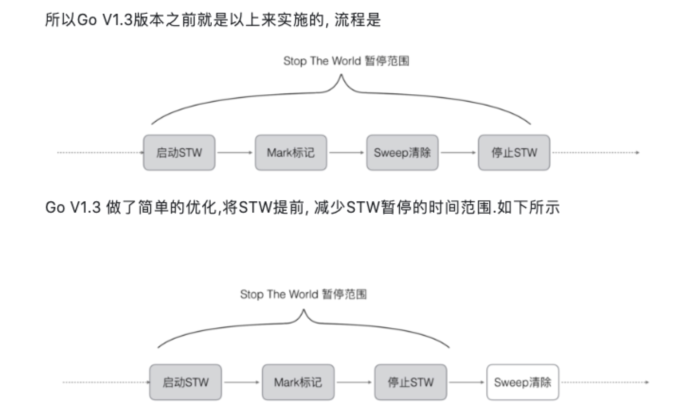
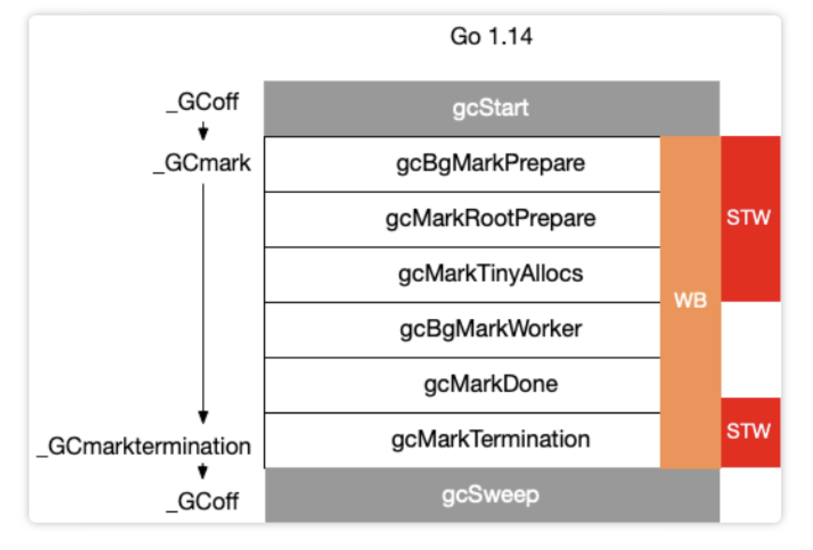

+++
title="Golang|垃圾回收"
date="2020-04-07T10:56:00+08:00"
toc=false
+++

垃圾回收
--------

垃圾回收(Garbage Collection，简称GC)是编程语言中提供的内存管理功能。

通过引入了语言层面的自动内存管理，也就是语言的使用者只用关注内存的申请而不必关心内存的释放，内存释放由虚拟机（virtual machine）或运行时（runtime）来自动进行管理。这种对不再使用的内存资源进行自动回收的功能就被称为垃圾回收。

### 关键字解释

#### 根对象

-	全局变量：程序在编译期就能确定的那些存在于程序整个生命周期的变量。
-	执行栈：每个 goroutine 都包含自己的执行栈，这些执行栈上包含栈上的变量及指向分配的堆内存区块的指针。
-	寄存器：寄存器的值可能表示一个指针，参与计算的这些指针可能指向某些赋值器分配的堆内存区块。

### 算法

-	引用计数（reference counting）
-	标记-清扫（mark & sweep）
-	节点复制（Copying Garbage Collection）
-	分代收集（Generational Garbage Collection）

### 引用计数

#### 流程

引用计数通过在对象上增加自己被引用的次数，被其他对象引用时加1，引用自己的对象被回收时减1，引用数为0的对象即为可以被回收的对象。

#### 优点

方式简单，回收速度快

#### 缺点

-	需要额外的空间存放计数
-	无法处理循环引用
-	频繁更新引用计数降低了性能

### 标记清除

#### 流程

1.	该方法分为两步，标记从根变量开始迭代得遍历所有被引用的对象，对能够通过应用遍历访问到的对象都进行标记为「被引用」
2.	标记完成后进行清除操作，对没有标记过的内存进行回收（回收同时可能伴有碎片整理操作）

#### 优点

避免了引用计数算法的缺点(不能处理循环引用，需要维护指针)

#### 缺点

每次启动垃圾回收都会暂停当前所有的正常代码执行，回收是系统响应能力大大降低

### 节点复制

#### 流程

复制收集的方式只需要对对象进行一次扫描。准备一个「新的空间」，从根开始，对对象进行扫，如果存在对这个对象的引用，就把它复制到「新空间中」。一次扫描结束之后，所有存在于「新空间」的对象就是所有的非垃圾对象。

#### 优点

具有有「局部性」的优点，在复制收集的过程中，会按照对象被引用的顺序将对象复制到新空间中。于是，关系较近的对象被放在距离较近的内存空间的可能性会提高，这叫做局部性。局部性高的情况下，内存缓存会更有效地运作，程序的性能会提高。

#### 缺点

内存得不到充分利用，总有一半的内存空间处于浪费状态

### 分代收集

#### 流程

基于追踪的垃圾回收算法（标记-清扫、节点复制）一个主要问题是在生命周期较长的对象上浪费时间（长生命周期的对象是不需要频繁扫描的）。同时内存分配存在这么一个事实 “most object die young”。

基于这两点，分代垃圾回收算法将对象按生命周期长短存放到堆上的两个（或者更多）区域，这些区域就是分代（generation）。对于新生代的区域的垃圾回收频率要明显高于老年代区域。

分配对象的时候从新生代里面分配，如果后面发现对象的生命周期较长，则将其移到老年代，这个过程叫做 promote。随着不断 promote，最后新生代的大小在整个堆的占用比例不会特别大。收集的时候集中主要精力在新生代就会相对来说效率更高，STW 时间也会更短。

#### 优点

性能更优

#### 缺点

实现复杂

go的垃圾回收历史
----------------

-	v1.1 STW
-	v1.3 Mark STW, Sweep 并行
-	v1.5 三色标记法
-	v1.8 混合写屏障 hybrid write barrier

### go1.3 之前的标记-清除(mark and sweep)算法

#### 流程

1.	第一步，暂停程序业务逻辑, 找出不可达的对象，然后做上标记。操作非常简单，但是有一点需要额外注意：mark and sweep算法在执行的时候，需要STW。这段时间程序会卡在那里。
2.	第二步, 开始标记，程序找出它所有可达的对象，并做上标记。
3.	第三步, 标记完了之后，然后开始清除未标记的对象。
4.	第四步, 停止暂停，让程序继续跑。然后循环重复这个过程，直到process程序生命周期结束。

#### 问题

-	STW，stop the world；让程序暂停，程序出现卡顿 (严重问题)。
-	标记需要扫描整个heap
-	清除数据会产生heap碎片

### go1.5 三色并发标记

#### 流程

1.	首先把所有的对象都放到白色的集合中
2.	从根节点开始遍历对象，遍历到的白色对象从白色集合中放到灰色集合中
3.	遍历灰色集合中的对象，把灰色对象引用的白色集合的对象放入到灰色集合中，同时把遍历过的灰色集合中的对象放到黑色的集合中
4.	循环步骤3，知道灰色集合中没有对象
5.	步骤4结束后，白色集合中的对象就是不可达对象，也就是垃圾，进行回收

三色标记的一个明显好处是能够让用户程序和 mark 并发的进行，具体可以参考论文：《On-the-fly garbage collection: an exercise in cooperation.》。Golang 的 GC 实现也是基于这篇论文

#### 问题

-	STW，三色并发标记法来说, 一定要依赖STW的. 因为如果不暂停程序, 程序的逻辑改变对象引用关系, 这种动作如果在标记阶段做了修改，会影响标记结果的正确性

### 强三色和弱三色

强三色不变式:不存在黑色对象引用到白色对象的指针。 弱三色不变式:所有被黑色对象引用的白色对象都处于灰色保护状态。(黑色对象到引用的白色对象路径上存在灰色对象)

### 写屏障技术

Go在进行三色标记的时候并没有STW，也就是说，此时的对象还是可以进行修改，这样就存在已扫描结束的黑色节点有引用白色的节点，导致被引用节点的扫描不到，被误认为垃圾进行回收了，为了解决上述问题，我们引入屏障。

垃圾收集中的屏障技术更像是一个钩子方法，它是在用户程序读取对象、创建新对象以及更新对象指针时执行的一段代码，根据操作类型的不同，我们可以将它们分成读屏障（Read barrier）和写屏障（Write barrier）两种，因为读屏障需要在读操作中加入代码片段，对用户程序的性能影响很大，所以编程语言往往都会采用写屏障保证三色标记的稳定性。

#### 插入写屏障

##### 方法

在A对象引用B对象的时候，B对象被标记为灰色。(将B挂在A下游，B必须被标记为灰色)

##### 问题

栈空间的特点是容量小,但是要求相应速度快,因为函数调用弹出频繁使用, **所以“插入屏障”机制,在栈空间的对象操作中不使用**. 而仅仅使用在堆空间对象的操作中.

因为栈不使用屏障机制,当全部三色标记扫描之后,栈上有可能依然存在白色对象被引用的情况. 所以要对栈重新进行三色标记扫描, 但这次为了对象不丢失, 要对本次标记扫描启动STW暂停. 直到栈空间的三色标记结束.

#### 删除写屏障

##### 方法

被删除的对象，如果为灰色或者白色，那么被标记为灰色。

##### 问题

这种方式的回收精度低，一个对象即使被删除了最后一个指向它的指针也依旧可以活过这一轮，需要在下一轮GC中被清理掉

回收精度低，GC开始时STW扫描堆栈来记录初始快照，这个过程会保护开始时刻的所有存活对象。

### go 1.8加入混合写屏障的三色标记清除

#### 混合写屏障规则

##### 方法

1.	GC开始将栈上的对象全部扫描并标记为黑色(之后不再进行第二次重复扫描，无需STW)。
2.	GC期间，任何在栈上创建的新对象，均为黑色。
3.	被删除的对象标记为灰色。
4.	被添加的对象标记为灰色。

##### 问题

**屏障技术是不在栈上应用的，因为要保证栈的运行效率**

### 总结

GO的GC是并行GC, 也就是GC的大部分处理和普通的go代码是同时运行的, 这让GO的GC流程比较复杂。

在GC过程中会有两种后台任务(G), 一种是标记用的后台任务, 一种是清扫用的后台任务.

-	标记用的后台任务会在需要时启动, 可以同时工作的后台任务数量大约是P的数量的25%, 也就是go所讲的让25%的cpu用在GC上的根据.
-	清扫用的后台任务在程序启动时会启动一个, 进入清扫阶段时唤醒.

当前版本的 Go 以 STW 为界限，可以将 GC 划分为五个阶段：

| 阶段              | 说明                                                 | 赋值器状态 |
|:-----------------:|:----------------------------------------------------:|:----------:|
|      GCMark       |    标记准备阶段，为并发标记做准备工作，启动写屏障    |    STW     |
|      GCMark       |      扫描标记阶段，与赋值器并发执行，写屏障开启      |    并发    |
| GCMarkTermination | 标记终止阶段，保证一个周期内标记任务完成，停止写屏障 |    STW     |
|       GCoff       | 内存清扫阶段，将需要回收的内存归还到堆中，写屏障关闭 |    并发    |
|       GCoff       | 内存归还阶段，将过多的内存归还给操作系统，写屏障关闭 |    并发    |

垃圾回收触发时机
----------------

### 主动触发

通过调用 runtime.GC 来触发 GC，此调用阻塞式地等待当前 GC 运行完毕。

### 被动触发

-	使用系统监控，当超过==2分钟==没有产生任何 GC 时，强制触发 GC。
-	内存阈值触发，在当次GC标记结束后,会更新下一次触发gc的heap大小,下次GC进入之后会进行heap大小的比较,如果符合条件就进行GC

Q&A
---

### 如果内存分配速度超过了标记清除的速度怎么办？

目前的 Go 实现中，当 GC 触发后，会首先进入并发标记的阶段。并发标记会设置一个标志，并在 mallocgc 调用时进行检查。当存在新的内存分配时，会暂停分配内存过快的那些 goroutine，并将其转去执行一些辅助标记的工作，从而达到放缓继续分配、辅助 GC 的标记工作的目的。

### GC 关注的指标有哪些？

Go 的 GC 被设计为成比例触发、大部分工作与赋值器并发、不分代、无内存移动且会主动向操作系统归还申请的内存。因此最主要关注的、能够影响赋值器的性能指标有：

-	CPU 利用率：回收算法会在多大程度上拖慢程序？有时候，这个是通过回收占用的 CPU 时间与其它 CPU 时间的百分比来描述的。
-	GC 停顿时间：回收器会造成多长时间的停顿？目前的 GC 中需要考虑 STW 和 Mark Assist 两个部分可能造成的停顿。
-	GC 停顿频率：回收器造成的停顿频率是怎样的？目前的 GC 中需要考虑 STW 和 Mark Assist 两个部分可能造成的停顿。
-	GC 可扩展性：当堆内存变大时，垃圾回收器的性能如何？但大部分的程序可能并不一定关心这个问题。

### Go 的 GC 如何调优？

#### 什么情况下需要GC调优？

GC 的调优是在特定场景下产生的，并非所有程序都需要针对 GC 进行调优。只有那些对执行延迟非常敏感、当 GC 的开销成为程序性能瓶颈的程序，才需要针对 GC 进行性能调优。

总的来说，我们可以在现在的开发中处理的有以下几种情况：

-	对停顿敏感：GC 过程中产生的长时间停顿、或由于需要执行 GC 而没有执行用户代码，导致需要立即执行的用户代码执行滞后。
-	对资源消耗敏感：对于频繁分配内存的应用而言，频繁分配内存增加 GC 的工作量，原本可以充分利用 CPU 的应用不得不频繁地执行垃圾回收，影响用户代码对 CPU 的利用率，进而影响用户代码的执行效率。

#### GC调优的核心

GC 调优的核心思想也就是充分的围绕上面的两点来展开：优化内存的申请速度，尽可能的少申请内存，复用已申请的内存。

三个关键字：**控制**、**减少**、**复用**

#### GC调优的具体技巧

-	控制内存分配的速度，限制 goroutine 的数量，从而提高赋值器对 CPU 的利用率。
-	减少并复用内存，例如使用 sync.Pool 来复用需要频繁创建临时对象，例如提前分配足够的内存来降低多余的拷贝。
-	需要时，增大 GOGC 的值，降低 GC 的运行频率。

参考
----

-	[GO GC 垃圾回收机制](https://segmentfault.com/a/1190000018161588)
-	[深入理解Go-垃圾回收机制](https://segmentfault.com/a/1190000020086769)
-	[Golang 垃圾回收机制](https://www.cnblogs.com/hezhixiong/p/9577199.html)
-	[深入理解 Go 语言的垃圾回收](https://juejin.im/entry/5e716055f265da573e674381?utm_source=gold_browser_extension#comment)
-	[Golang垃圾回收 屏障技术](https://zhuanlan.zhihu.com/p/74853110)
-	[Golang三色标记、混合写屏障GC模式图文全分析](https://studygolang.com/articles/27243?fr=sidebar)
-	[Go GC 20 问](https://mp.weixin.qq.com/s/o2oMMh0PF5ZSoYD0XOBY2Q)
-	[[典藏版]Golang三色标记、混合写屏障GC模式图文全分析](https://mp.weixin.qq.com/s/jICwyKDv8V6bPCqwg8Hzag)

