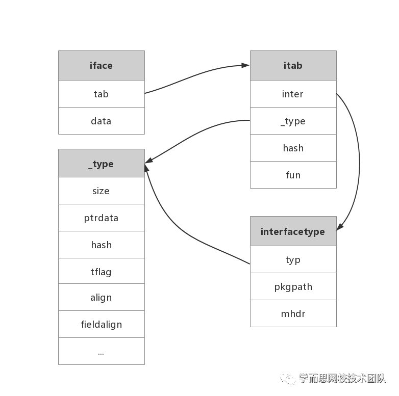
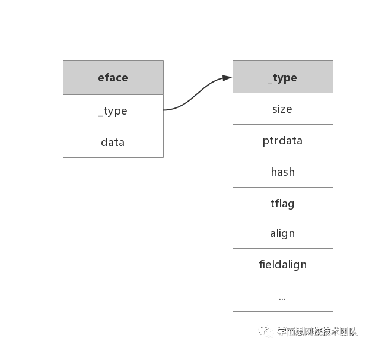

+++
title="Golang|interface"
date="2020-08-31T09:26:00+08:00"
toc=false
+++

## 接口类型

接口是一种抽象类型，它没有暴露所含数据的布局或者内部结构，当然也没有哪些数据的基本操作，所提供的仅仅是一些方法。当你拿到一个接口类型的变量，你无从知道它是什么，但你能知道它能做什么，或者更精确地讲，仅仅是它提供了哪些方法。

## 接口定义

Go 语言提供了 interface 关键字，接口中只能定义需要实现的方法，不能包含任何的变量

Go 语言中的接口类型会根据是否包含一组方法而分成两种不同的实现，分别为包含一组方法的 iface 结构体和不包含任何方法的 eface 结构体

# iface

```go
//runtime/runtime2.go
type iface struct {
 tab  *itab
 data unsafe.Pointer
 //unsafe.Pointer类型是一种特殊类型的指针，它可以存储任何变量的地址（类似C语言的void*）
}

//runtime/runtime2.go
type itab struct {
 inter *interfacetype
 _type *_type
 hash  uint32 // copy of _type.hash. Used for type switches.
 _     [4]byte
 fun   [1]uintptr // variable sized. fun[0]==0 means _type does not implement inter.
}

//runtime/type.go
type interfacetype struct {
 typ     _type
 pkgpath name
 mhdr    []imethod
}
```

itab 用于表示具体类型和接口类型关系

- `inter` 是接口类型定义信息
- `_type` 是具体类型的信息
- `hash`是`_type.hash`的拷贝，在类型转换时，快速判断目标类型和接口中类型是否一致
- `fun`是实现方法地址列表，虽然 fun 固定长度为 1 的数组，但是这其实是一个柔型数组，保存元素的数量是不确定的，如有多个方法，则会按照字典顺序排序

interfacetype 是描述接口定义的信息

- `_type` 接口的类型信息
- `pkgpath` 是定义接口的包名
- `mhdr` 是接口中定义的函数表，按字典序排序



# eface

```go
//runtime/runtime2.go
type eface struct {
 _type *_type
 data  unsafe.Pointer
}
```



# 参考

- [Interface 实现原理分析](https://blog.csdn.net/ITqingliang/article/details/104647565/)
