+++
title="Golang|分布式事务管理DTM"
date="2022-12-17T11:18:00+08:00"
toc=false
+++

学习新东西，先是灵魂3问————是什么、解决什么问题、有什么好处？

首先，DTM是什么？DTM是一款开源的分布式事务管理器，解决跨数据库、跨服务、跨语言栈更新数据的一致性问题。

其次，解决什么问题？DTM起源于实际项目中的问题，一般在涉及订单支付的服务，会将所有业务相关逻辑放到一个大的本地事务，这会导致大量耦合，业务复杂度大幅提升，同时go语言的微服务化过程中，需要将原先的事务拆分成分布式事务。目前市场上的开源项目，只有java有成熟的分布式事务解决方案，golang没有，因此有了DTM项目。

最后，有什么好处？这里总结如下大概有三点优势

- 可以提供非常简单易用的接口，拆分具体业务接入分布式事务，普通几年开发经验的工程师就能够胜任
- 我们可以对多语言栈进行了支持，这个特性对于小公司切换语言栈，以及大公司采用多语言栈，具有重大意义
- DTM提供一项核心技术子事务屏障，可以大大降低开发者处理子事务乱序的处理难度

接下来从原理入手，到具体架构，以及几种常用的分布式协议实现，最后几个典型使用案例，让我们对DTM有一个大致的了解。

### 分布式事务基础

#### 事务的理解

把多条语句作为一个整体进行操作的功能，被称为数据库事务。事务具有四个性质，原子性、一致性、隔离性、持久性。

- Atomicity（原子性）：一个事务中的所有操作，要么全部完成，要么全部不完成，不会结束在中间某个环节。事务在执行过程中发生错误，会被恢复到事务开始前的状态，就像这个事务从来没有执行过一样。
- Consistency（一致性）：在事务开始之前和事务结束以后，数据库的完整性没有被破坏。完整性包括外键约束、应用定义的等约束不会被破坏。
- Isolation（隔离性）：数据库允许多个并发事务同时对其数据进行读写和修改的能力，隔离性可以防止多个事务并发执行时由于交叉执行而导致数据的不一致。
- Durability（持久性）：事务处理结束后，对数据的修改就是永久的，即便系统故障也不会丢失。

主流的数据库例如Mysql、Postgres等，都支持ACID事务，其内部会采用MVCC（多版本并发控制）技术，实现高性能、高并发的本地事务。

#### CAP理论

分布式事务涉及多个节点，是一个典型的分布式系统，与单机系统有非常大的差别。一个分布式系统最多只能同时满足一致性（Consistency）、可用性（Availability）和分区容错性（Partition tolerance）这三项中的两项，这被称为CAP理论。

C 一致性
    分布式系统中，数据一般会存在不同节点的副本中，如果对第一个节点的数据成功进行了更新操作，而第二个节点上的数据却没有得到相应更新，这时候读取第二个节点的数据依然是更新前的数据，即脏数据，这就是分布式系统数据不一致的情况。

A 可用性
    在集群中一部分节点故障后，集群整体是否还能响应客户端的读写请求。

P 分区容错性
    以实际效果而言，分区相当于对通信的时限要求。系统如果不能在时限内达成数据一致性，就意味着发生了分区的情况，必须就当前操作在 C 和 A 之间做出选择。提高分区容忍性的办法就是一个数据项复制到多个节点上，那么出现分区之后，这一数据项仍然能在其他区中读取，容忍性就提高了。然而，把数据复制到多个节点，就会带来一致性的问题，就是多个节点上面的数据可能是不一致的。

对于多数大型互联网应用的场景，主机众多、部署分散，而且现在的集群规模越来越大，所以节点故障、网络故障是常态，而且要保证服务可用性达到N个9，即保证P和A，舍弃C。

#### BASE理论

BASE是Basically Available（基本可用）、Soft state（软状态）和Eventually consistent（最终一致性）三个短语的简写，BASE是对CAP中一致性和可用性权衡的结果，其来源于对大规模互联网系统分布式实践的结论，是基于CAP定理逐步演化而来的，其核心思想是即使无法做到强一致性（Strong consistency），但每个应用都可以根据自身的业务特点，采用适当的方式来使系统达到最终一致性（Eventual consistency）。

基本可用是指分布式系统在出现不可预知故障的时候，允许损失部分可用性——但请注意，这绝不等价于系统不可用。

弱状态也称为软状态，和硬状态相对，是指允许系统中的数据存在中间状态，并认为该中间状态的存在不会影响系统的整体可用性，即允许系统在不同节点的数据副本之间进行数据同步的过程存在延时。

最终一致性强调的是系统中所有的数据副本，在经过一段时间的同步后，最终能够达到一个一致的状态。因此，最终一致性的本质是需要系统保证最终数据能够达到一致，而不需要实时保证系统数据的强一致性

总的来说，BASE理论面向的是大型高可用可扩展的分布式系统，提出通过牺牲强一致性来获得可用性，并允许数据在一段时间内是不一致的，但最终达到一致状态。

### DTM架构

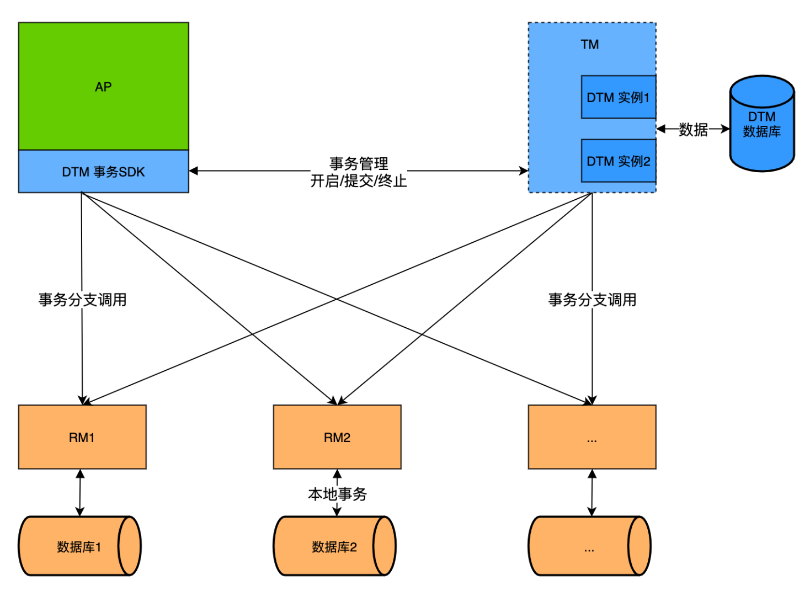

RM-资源管理器：RM是一个应用服务，负责管理全局事务中的本地事务，他通常会连接到一个数据库，负责相关数据的修改、提交、回滚、补偿等操作。

AP-应用程序：AP是一个应用服务，负责全局事务的编排，他会注册全局事务，注册子事务，调用RM接口。

TM-事务管理器：TM就是DTM服务，负责全局事务的管理，每个全局事务都注册到TM，每个事务分支也注册到TM。TM会协调所有的RM，将同一个全局事务的不同分支，全部提交或全部回滚。

### 常见的事务模式

#### SAGA

SAGA事务模式是DTM中最常用的模式，主要是因为SAGA模式简单易用，工作量少，并且能够解决绝大部分业务的需求。其核心思想是将长事务拆分为多个短事务，由Saga事务协调器协调，如果每个短事务都成功提交完成，那么全局事务就正常完成，如果某个步骤失败，则根据相反顺序一次调用补偿操作。

例如我们要进行一个类似于银行跨行转账的业务，将A中的30元转给B，根据Saga事务的原理，我们将整个全局事务，切分为以下服务：

- 转出（TransOut）服务，这里转出将会进行操作A-30
- 转出补偿（TransOutCompensate）服务，回滚上面的转出操作，即A+30
- 转入（TransIn）服务，转入将会进行B+30
- 转入补偿（TransInCompensate）服务，回滚上面的转入操作，即B-30

整个SAGA事务的逻辑是：执行转出成功=>执行转入成功=>全局事务完成

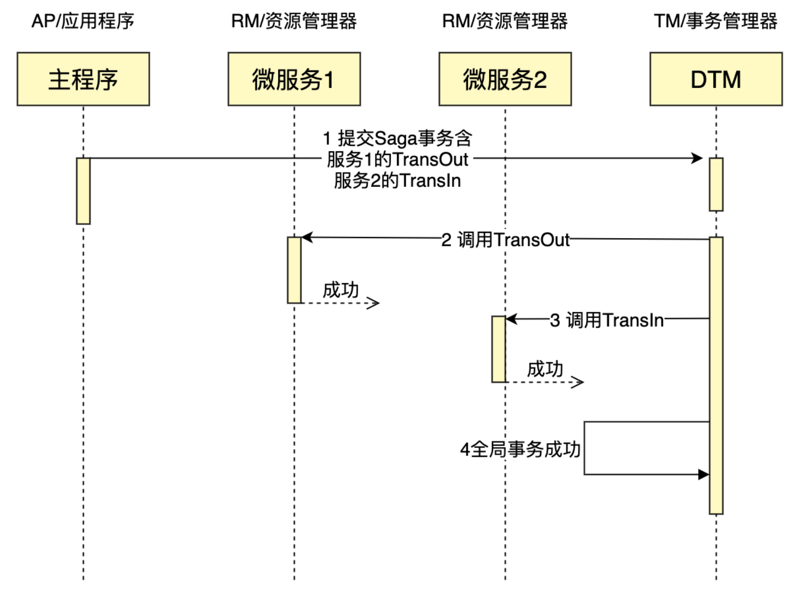

```go
req := &gin.H{"amount": 30} // 微服务的请求Body
// DtmServer为DTM服务的地址
saga := dtmcli.NewSaga(DtmServer, shortuuid.New()).
  // 添加一个TransOut的子事务，正向操作为url: qsBusi+"/TransOut"， 逆向操作为url: qsBusi+"/TransOutCompensate"
  Add(qsBusi+"/TransOut", qsBusi+"/TransOutCompensate", req).
  // 添加一个TransIn的子事务，正向操作为url: qsBusi+"/TransIn"， 逆向操作为url: qsBusi+"/TransInCompensate"
  Add(qsBusi+"/TransIn", qsBusi+"/TransInCompensate", req)
// 提交saga事务，dtm会完成所有的子事务/回滚所有的子事务
err := saga.Submit()
```

如果有正向操作失败，例如账户余额不足或者账户被冻结，那么dtm会调用各分支的补偿操作，进行回滚，最后事务成功回滚。

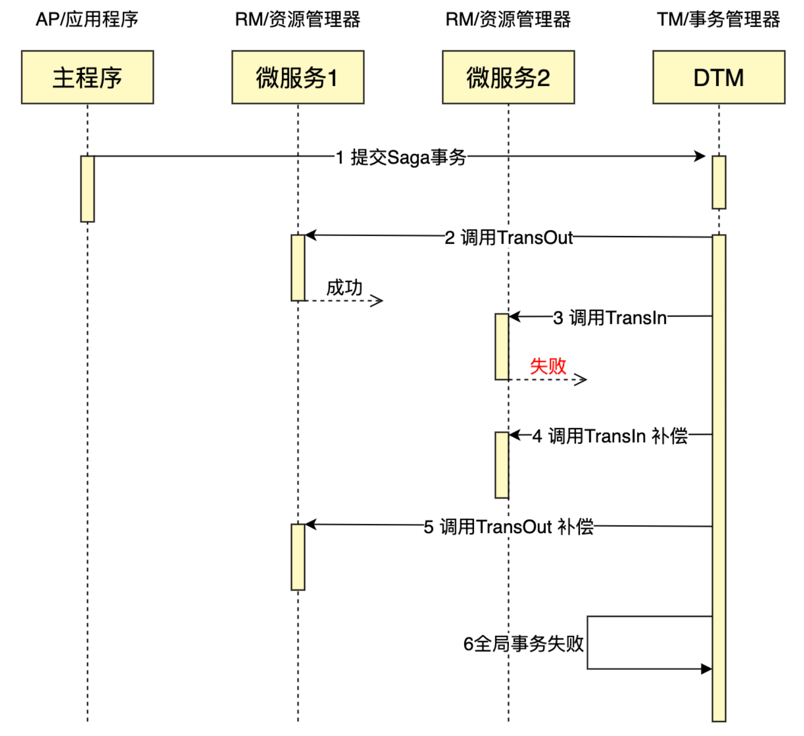

TransIn返回失败，那么这个时候是否还需要调用TransIn的补偿操作？

DTM 的做法是，统一进行一次调用，这种的设计考虑点: XA, TCC 等事务模式是必须要的，SAGA 为了保持简单和统一，设计为总是调用补偿。

业务上的失败与异常是需要做严格区分的，例如前面的余额不足，是业务上的失败，必须回滚，重试毫无意义。分布式事务中，有很多模式的某些阶段，要求最终成功。例如dtm的补偿操作，是要求最终成功的，只要还没成功，就会不断进行重试，直到成功。

##### 总结

使用saga模式，需要提供业务的处理接口以及对应的补偿接口。

#### 二阶消息

考虑这样的业务场景，我们需要跨行从A转给B 30元，我们先进行可能失败的转出操作TransOut，即进行A扣减30元。如果A因余额不足扣减失败，那么转账直接失败，返回错误；如果扣减成功，那么进行下一步转入操作，因为转入操作没有余额不足的问题，可以假定转入操作一定会成功。

```go
msg := dtmcli.NewMsg(DtmServer, gid).
	Add(busi.Busi+"/TransIn", &TransReq{Amount: 30})
err := msg.DoAndSubmitDB(busi.Busi+"/QueryPreparedB", db, func(tx *sql.Tx) error {
	return busi.SagaAdjustBalance(tx, busi.TransOutUID, -req.Amount, "SUCCESS")
})
```

这部分代码中

- 首先生成一个DTM的msg全局事务，传递dtm的服务器地址和全局事务id
- 给msg添加一个分支业务逻辑，这里的业务逻辑为余额转入操作TransIn，然后带上这个服务需要传递的数据，金额30元
- 然后调用msg的DoAndSubmitDB，这个函数保证业务成功执行和msg全局事务提交，要么同时成功，要么同时失败

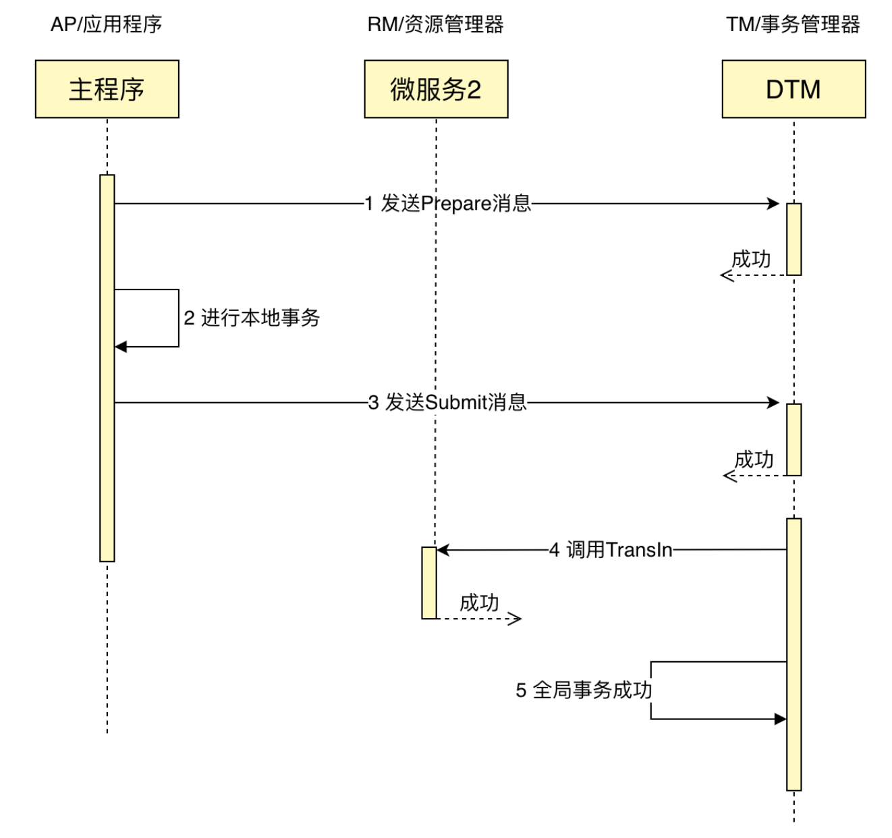

##### 考虑提交后业务系统宕机

在分布式系统中，各类的宕机和网络异常都是需要考虑的，考虑提交后业务系统宕机的情况，则DTM的处理方式如下

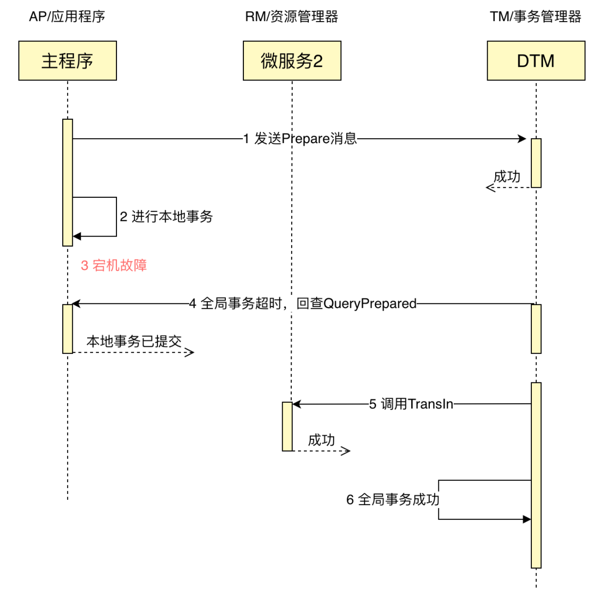

如果在本地事务提交之后，在发送Submit前，出现了进程Crash或者机器宕机会怎么样？这个时候DTM会在一定超时时间之后，取出只Prepare但未Submit的msg事务，调用msg事务指定的回查服务。通过回查服务，查看本地事务执行情况，如果本地事务执行完成，则继续推进分布式事务，否则标记全局事务失败，结束该全局事务。

其中涉及到回查服务逻辑，官方已经提供相关代码，不需要手动编写，只需要按照如下代码进行调用即可：
```go
app.GET(BusiAPI+"/QueryPreparedB", dtmutil.WrapHandler2(func(c *gin.Context) interface{} {
    return MustBarrierFromGin(c).QueryPrepared(dbGet())
}))
```

##### 考虑提交前业务系统宕机

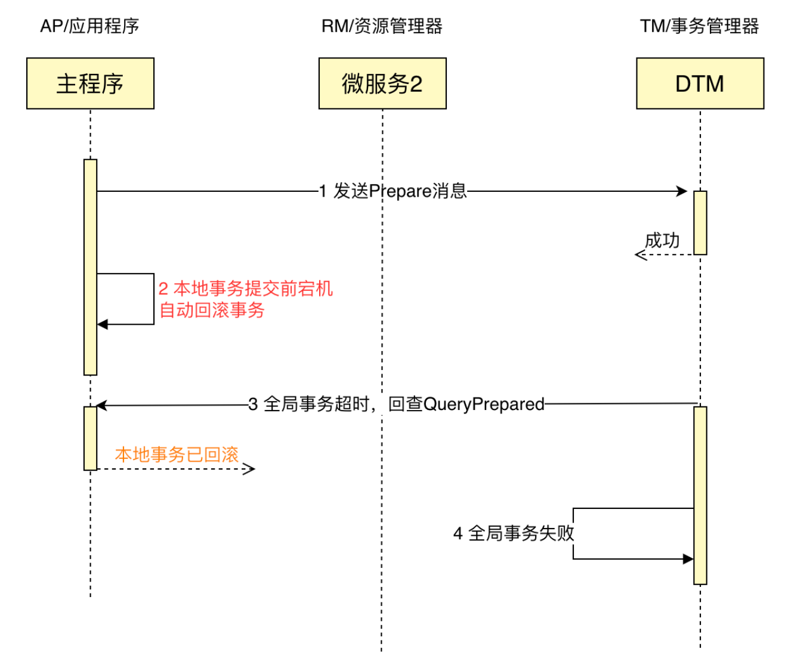

如果在dtm收到Prepare调用后，AP在事务提交前，遇见故障宕机，那么数据库会检测到AP的连接断开，自动回滚本地事务。

后续dtm轮询取出已经超时的，只Prepare但没有Submit的全局事务，进行回查。回查服务发现本地事务已回滚，返回结果给dtm。dtm收到已回滚的结果后，将全局事务标记为失败，并结束该全局事务。

##### 总结

使用二阶消息模式，需要做到两部，一是定义好本地业务逻辑，指定下一步处理的服务，二是定义QueryPrepared处理服务，复制粘贴例子代码。

#### TCC

TCC是Try、Confirm、Cancel三个词语的缩写

Try 阶段：尝试执行，完成所有业务检查（一致性）, 预留必须业务资源（准隔离性）

Confirm 阶段：如果所有分支的Try都成功了，则走到Confirm阶段。Confirm真正执行业务，不作任何业务检查，只使用 Try 阶段预留的业务资源

Cancel 阶段：如果所有分支的Try有一个失败了，则走到Cancel阶段。Cancel释放 Try 阶段预留的业务资源。

一个类似于银行跨行转账的业务，转出（TransOut）和转入（TransIn）分别在不同的微服务里，一个成功完成的TCC事务典型的时序图如下

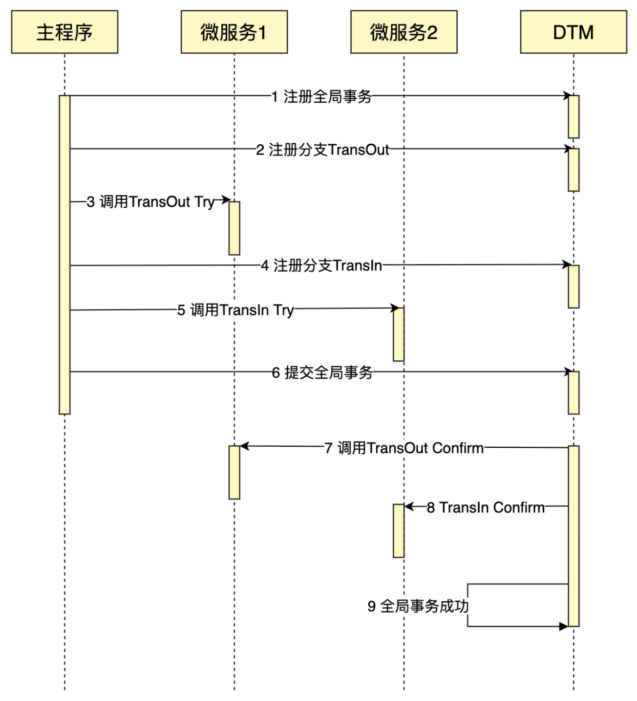

如果tccFunc返回错误，TccGlobalTransaction会终止全局事务，然后返回给调用者。dtm收到终止请求，则会调用所有注册子事务的二阶段Cancel。

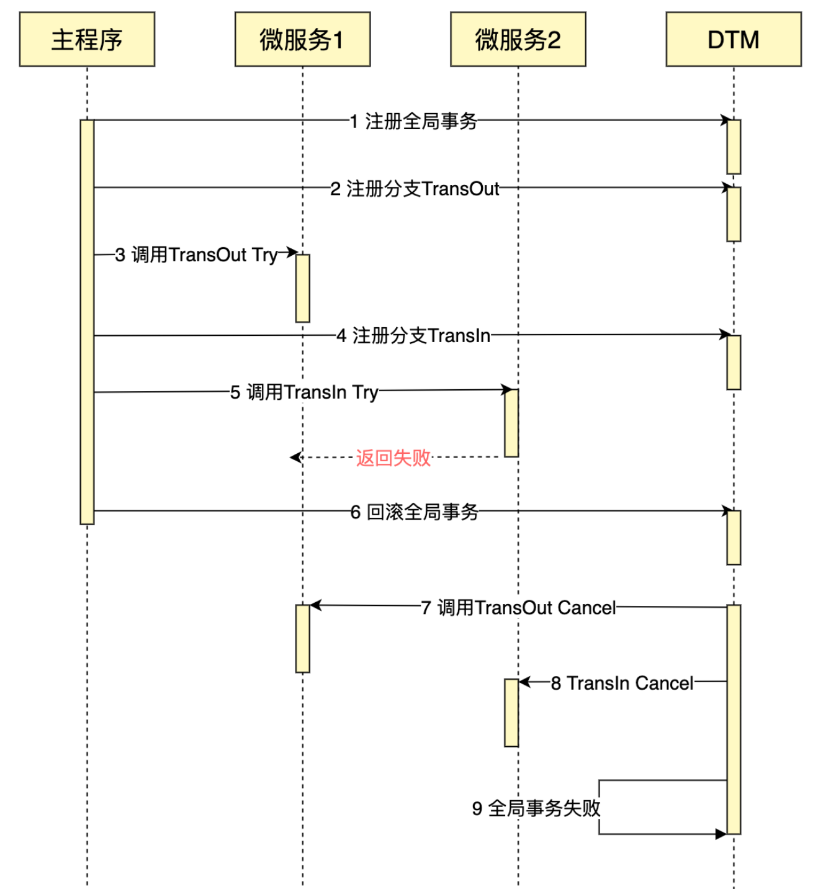

TCC 的事务编排放在了应用端上，就是事务一共包含多少个分支，每个分支的顺序什么样，这些信息不会像 SAGA 那样，都发送给dtm服务器之后，再去调用实际的事务分支。当应用出现 crash 或退出，编排信息丢失，那么整个全局事务，就没有办法往前重试，只能够进行回滚。如果全局事务持续时间很长，例如一分钟以上，那么当应用进行正常的发布升级时，也会导致全局事务回滚，影响业务。因此 TCC 会更适合短事务。

那么是否可以把TCC的事务编排都保存到服务器，保证应用重启也不受到影响呢？理论上这种做法是可以解决这个问题的，但是存储到服务器会比在应用端更不灵活，无法获取到每个分支的中间结果，无法做嵌套等等。

dtm的tcc模式同时支持子事务的嵌套。

#### XA

XA是由X/Open组织提出的分布式事务的规范，XA规范主要定义了(全局)事务管理器(TM)和(局部)资源管理器(RM)之间的接口。本地的数据库如mysql在XA中扮演的是RM角色

XA一共分为两阶段：

第一阶段（prepare）：即所有的参与者RM准备执行事务并锁住需要的资源。参与者ready时，向TM报告已准备就绪。

第二阶段 (commit/rollback)：当事务管理者(TM)确认所有参与者(RM)都ready后，向所有参与者发送commit命令。

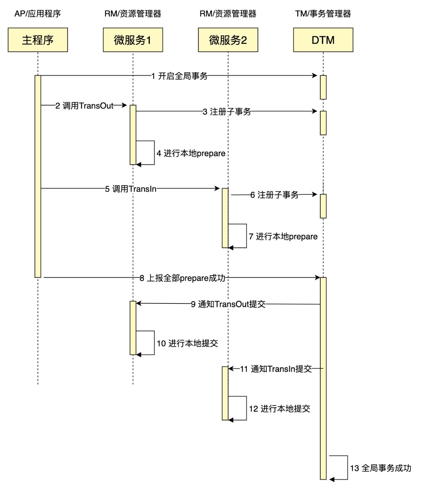

如果有一阶段prepare操作失败，那么dtm会调用各子事务的xa rollback，进行回滚，最后事务成功回滚。

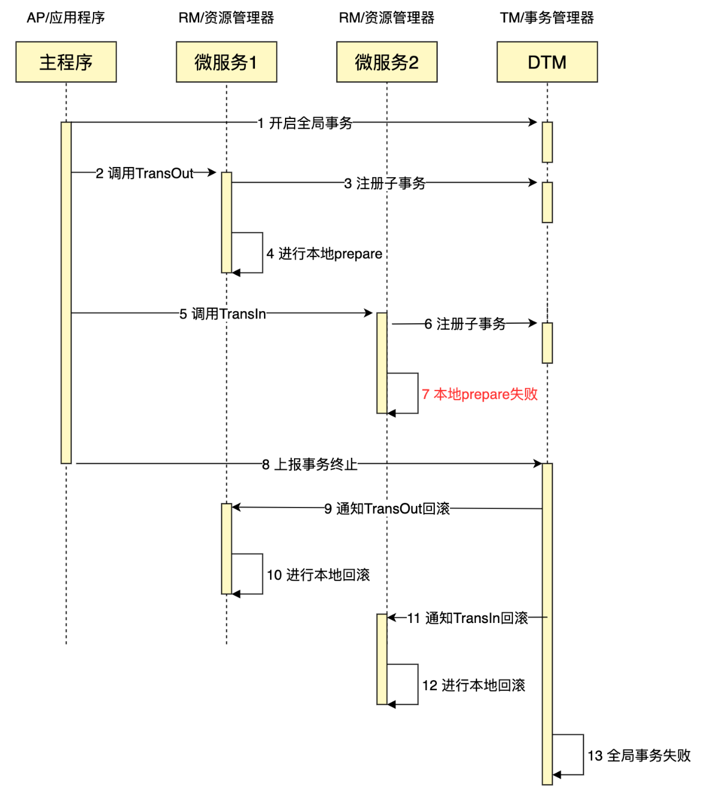

XA模式，开发较容易，回滚之类的操作，由底层数据库自动完成，但对资源进行了长时间的锁定，并发度低，不适合高并发的业务。

##### 和tcc对比

- XA有一个预提交的过程，在两阶段提交的过程中，有一个协调者在中间起到很重要的作用，当所有的事务都执行成功，会把执行成功的状态通知协调者，这个阶段是第一阶段，协调者监听到所有的事务执行成功后，执行第二阶段的commit，也就是说XA的两阶段提交是在第二阶段才执行commit，而TCC的不同就在于其在第一阶段就commit了，没有预提交的过程，

- 高并发场景，TCC优势很大，因为其在第一阶段就把事务提交了，不需要在后面像XA一样继续持有数据库的锁，影响并发的性能，因为TCC的第二阶段是一个确认（Confirm）的阶段，也就是说只需要调用各个子系统里的confirm逻辑，把原来没有更新到数据库的那些 “缓存” 数据更新到数据库，因为这个时候已经把更改的数据缓存起来了，只是还没更新到数据库，所以在执行confirm逻辑的时候，并不会持有数据库的锁

#### 对比

二阶段消息模式: 适合不需要回滚的场景

saga模式: 适合需要回滚的场景

tcc事务模式: 适合一致性要求较高的场景

xa事务模式: 适合并发要求不高，没有数据库行锁争抢的场景

### 异常与子事务屏障

分布式系统最大的敌人可能就是NPC了，在这里它是Network Delay, Process Pause, Clock Drift的首字母缩写。我们先看看具体的NPC问题是什么：

Network Delay，网络延迟。虽然网络在多数情况下工作的还可以，虽然TCP保证传输顺序和不会丢失，但它无法消除网络延迟问题。

Process Pause，进程暂停。有很多种原因可以导致进程暂停：比如编程语言中的GC（垃圾回收机制）会暂停所有正在运行的线程；再比如，我们有时会暂停云服务器，从而可以在不重启的情况下将云服务器从一台主机迁移到另一台主机。我们无法确定性预测进程暂停的时长，你以为持续几百毫秒已经很长了，但实际上持续数分钟之久进程暂停并不罕见。

Clock Drift，时钟漂移。现实生活中我们通常认为时间是平稳流逝，单调递增的，但在计算机中不是。计算机使用时钟硬件计时，通常是石英钟，计时精度有限，同时受机器温度影响。为了在一定程度上同步网络上多个机器之间的时间，通常使用NTP协议将本地设备的时间与专门的时间服务器对齐，这样做的一个直接结果是设备的本地时间可能会突然向前或向后跳跃。

分布式事务既然是分布式的系统，自然也有NPC问题。因为没有涉及时间戳，带来的困扰主要是NP。

#### 异常分类

以分布式事务中的TCC作为例子，看看NP带来的影响。

一般情况下，一个TCC回滚时的执行顺序是，先执行完Try，再执行Cancel，但是由于N，则有可能Try的网络延迟大，导致先执行Cancel，再执行Try。

这种情况就引入了分布式事务中的两个难题：

- 空补偿： Cancel执行时，Try未执行，事务分支的Cancel操作需要判断出Try未执行，这时需要忽略Cancel中的业务数据更新，直接返回

- 悬挂： Try执行时，Cancel已执行完成，事务分支的Try操作需要判断出Cancel已执行，这时需要忽略Try中的业务数据更新，直接返回

分布式事务还有一类需要处理的常见问题，就是重复请求

- 幂等： 由于任何一个请求都可能出现网络异常，出现重复请求，所有的分布式事务分支操作，都需要保证幂等性

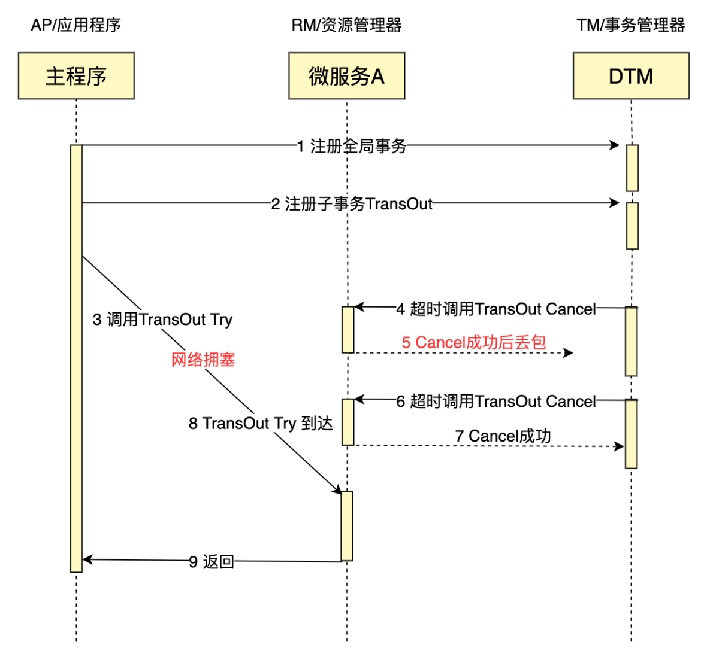

业务处理请求4的时候，Cancel在Try之前执行，需要处理空回滚

业务处理请求6的时候，Cancel重复执行，需要幂等

业务处理请求8的时候，Try在Cancel后执行，需要处理悬挂

#### 子事务屏障

在dtm中，首创了子事务屏障技术，使用该技术，能够非常便捷的解决异常问题，极大的降低了分布式事务的使用门槛

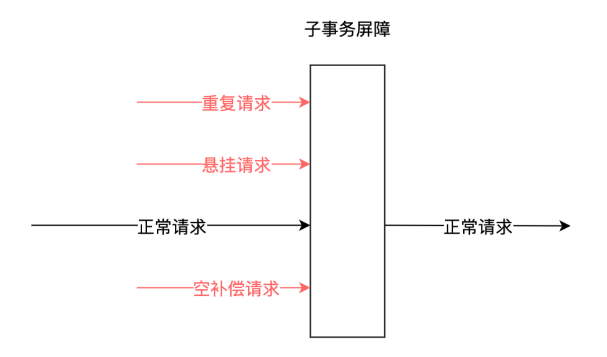

所有这些请求，到了子事务屏障后：不正常的请求，会被过滤；正常请求，通过屏障。开发者使用子事务屏障之后，前面所说的各种异常全部被妥善处理，业务开发人员只需要关注实际的业务逻辑，负担大大降低。

#### 原理

子事务屏障技术的原理是，在本地数据库，建立分支操作状态表dtm_barrier，唯一键为全局事务id-分支id-分支操作（try|confirm|cancel）

- 开启本地事务
- 对于当前操作op(try|confirm|cancel)，insert ignore一条数据gid-branchid-op，如果插入不成功，提交事务返回成功（常见的幂等控制方法）
- 如果当前操作是cancel，那么在insert ignore一条数据gid-branchid-try，如果插入成功（注意是成功），则提交事务返回成功
- 调用屏障内的业务逻辑，如果业务返回成功，则提交事务返回成功；如果业务返回失败，则回滚事务返回失败

在此机制下，解决了乱序相关的问题

- 空补偿控制--如果Try没有执行，直接执行了Cancel，那么3中Cancel插入gid-branchid-try会成功，不走屏障内的逻辑，保证了空补偿控制
- 幂等控制--2中任何一个操作都无法重复插入唯一键，保证了不会重复执行
- 防悬挂控制--Try在Cancel之后执行，那么Cancel会在3中插入gid-branchid-try，导致Try在2中不成功，就不执行屏障内的逻辑，保证了防悬挂控制

对于SAGA、二阶段消息，也是类似的机制。

### 最终成功

dtm里多种事务模式中，都出现了操作最终成功的要求，最终成功并不是说要保证100%的成功，它允许暂时性失败：包括网络故障，系统宕机，系统bug；但是一旦暂时性的问题解决之后，在业务恢复之后，需要返回成功。最终成功的另一个说法是，该操作能够最终成功，即通过不断重试，最后会返回成功。

### 典型应用

#### 秒杀

现有的秒杀架构，为了支持高并发，通常把库存放在Redis中，收到订单请求时，在Redis中进行库存扣减。这种的设计，导致创建订单和库存扣减不是原子操作，如果两个操作中间，遇到进程crash等问题，就会导致数据不一致。

明确业务场景，把秒杀系统的核心要点提取出来，为以下几点：

- 用户进行秒杀，会在某个时间点发送大量的请求到后端，请求量会大大高于库存数量
- 后端需要保证库存扣减和订单创建是最终严格一致的，即使中间发生进程crash，最终数据不会受到影响

上述的场景下，绝大部分扣减库的描述请求，都会失败，时序图如下

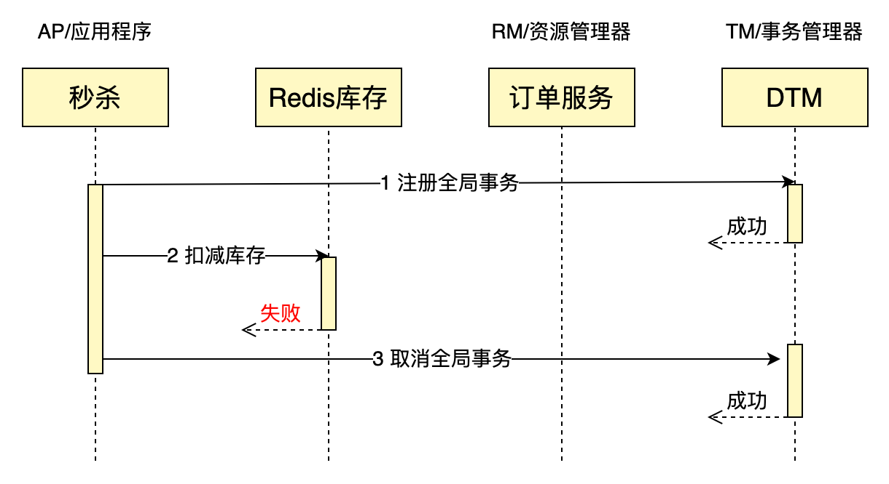

在这个架构中，使用了分布式事务框架dtm。上述的时序图中，扣减库存是在Redis中进行的，与dtm相关的注册全局事务和取消全局事务也是在Redis中处理的，全程依赖Redis，与数据库无关，因此能够支持极高的并发，从后面的测试数据中可以看到，该架构可以轻易处理每秒上万单的秒杀请求。

虽然大部分请求因为扣减库存失败而结束，但是会有一定数量的请求，扣减库存成功，这种情况的时序图如下

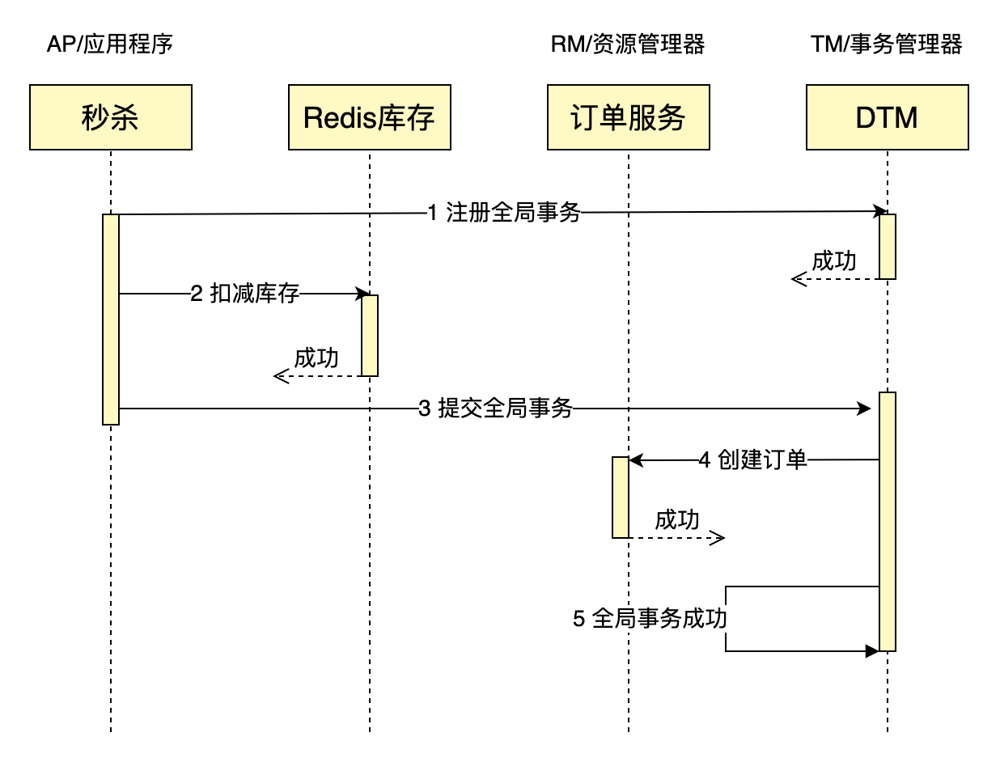

如果在Redis中扣减库存后，在提交全局事务前，发生进程crash，就会导致两个操作没有同时完成，这种情况整个的时序图如下

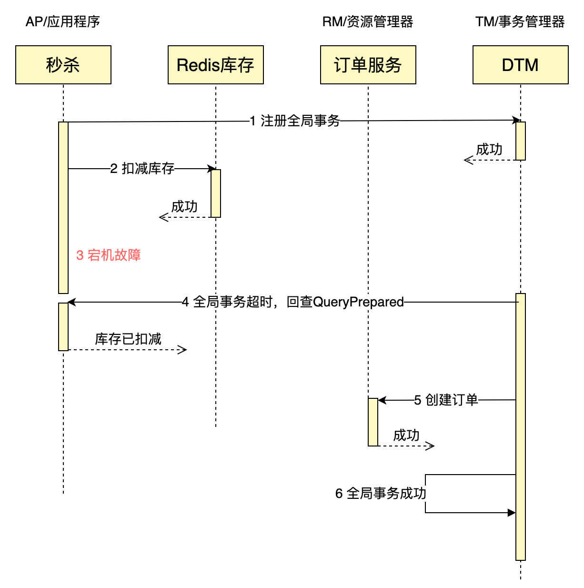

一旦发生这类进程crash，导致两个操作过程中断，那么dtm服务器会轮询超时未完成的事务，如果出现已Prepare、未Submit的全局任务，那么他会调用反查接口，询问应用，库存扣减是否成功扣减。如果已扣减，则将全局事务提交，并进行后续的调用；如果未扣减，则将全局事务标记为失败，不再处理。

保证原子操作的原理，以及发生各种情况dtm的处理策略，可以参考二阶段消息模型。

#### 缓存一致性

### 参考

- [DTM开源项目文档](https://dtm.pub/)
- [分布式事务最经典的七种解决方案](https://segmentfault.com/a/1190000040321750)
