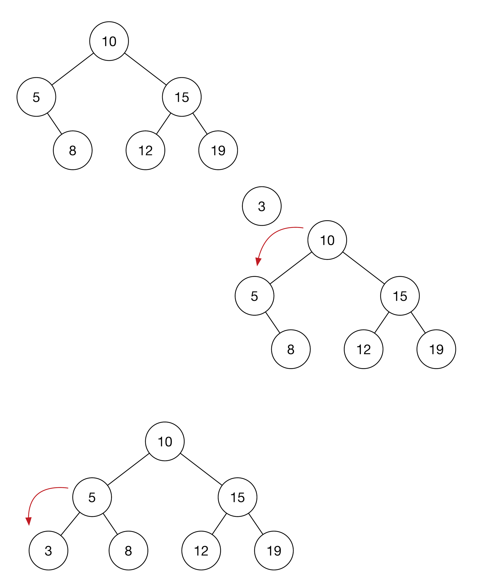

+++
title="二叉排序树详情"
tags=["算法","二叉排序树"]
categories=["算法"]
date="2020-03-13T06:33:00+08:00"
summary = '二叉排序树详情'
toc=false
+++

二叉排序树定义
--------------

二叉排序树，又叫二叉查找树，它或者是一棵空树；或者是具有以下性质的二叉树：

1.	若它的左子树不空，则左子树上所有节点的值均小于它的根节点的值；
2.	若它的右子树不空，则右子树上所有节点的值均大于它的根节点的值；
3.	它的左右子树也分别为二叉排序树。


二叉排序树操作
--------------

```c
package bst

type BST struct {
	value int
	left  *BST
	right *BST
}

func InitBST(v int) *BST {
	bstNode := BST{
		value: v,
		left:  nil,
		right: nil,
	}
	return &bstNode
}
```

### 查找

更加二叉树性质实现快速查找

```c
func (root *BST) Find(target int) (*BST, bool) {
	if root == nil {
		return nil, false
	}
	if root.value == target {
		return root, true
	} else if root.value < target {
		return root.right.Find(target)
	} else {
		return root.left.Find(target)
	}
}
```

### 遍历

```c
func (root *BST) Ftraverse() (ret []int) {
	if root == nil {
		return
	}
	ret = append(ret, root.value)
	ret = append(ret, root.left.Ftraverse()...)
	ret = append(ret, root.right.Ftraverse()...)
	return
}

func (root *BST) Mtraverse() (ret []int) {
	if root == nil {
		return
	}
	ret = append(ret, root.left.Mtraverse()...)
	ret = append(ret, root.value)
	ret = append(ret, root.right.Mtraverse()...)
	return
}

func (root *BST) Btraverse() (ret []int) {
	if root == nil {
		return
	}
	ret = append(ret, root.left.Btraverse()...)
	ret = append(ret, root.right.Btraverse()...)
	ret = append(ret, root.value)
	return
}
```

### 添加

二叉排序树的添加节点，即找到对应位置增加节点即可。



```c
func (root *BST) Insert(target int) bool {
	if root == nil {
		return false
	}
	if root.value == target {
		return true
	} else if root.value < target {
		if root.right == nil {
			NewNode := InitBST(target)
			root.right = NewNode
			return true
		}
		return root.right.Insert(target)
	} else {
		if root.left == nil {
			NewNode := InitBST(target)
			root.left = NewNode
			return true
		}
		return root.left.Insert(target)
	}
}
```

### 删除

二叉树删除主要考虑一下三点情况

-	删除节点是叶子节点，则直接删除
-	删除节点有左或者右节点的存在，则将其存在的节点继承该删除节点的位置，则满足二叉排序树性质
-	删除节点存在左右节点，则找到其后继节点，替换后继节点的值，删除后继节点(也可使用前驱节点操作)


```c
func (root *BST) getMin() *BST {
	if root == nil {
		return root
	} else {
		for root.left != nil {
			root = root.left
		}
	}
	return root
}

func Delete(root *BST, target int) *BST{
	if root == nil {
		return nil
	}
	if root.value < target{
		root.right = Delete(root.right,target)
		return root
	} else if root.value > target {
		root.left = Delete(root.left,target)
		return root
	} else {
		if root.left == nil && root.right == nil {
			return nil
		} else if root.left != nil && root.right == nil {
			return root.left
		} else if root.left == nil && root.right != nil {
			return root.right
		} else {
			minNode := root.right.getMin()
			root.value = minNode.value
			minNode.value = target
			root.right = Delete(root.right,target)
			return root
		}
	}
}
```

### 整体代码以及单测

```c
package bst

type BST struct {
	value int
	left  *BST
	right *BST
}

func InitBST(v int) *BST {
	bstNode := BST{
		value: v,
		left:  nil,
		right: nil,
	}
	return &bstNode
}

func (root *BST) Find(target int) (*BST, bool) {
	if root == nil {
		return nil, false
	}
	if root.value == target {
		return root, true
	} else if root.value < target {
		return root.right.Find(target)
	} else {
		return root.left.Find(target)
	}
}

func (root *BST) Ftraverse() (ret []int) {
	if root == nil {
		return
	}
	ret = append(ret, root.value)
	ret = append(ret, root.left.Ftraverse()...)
	ret = append(ret, root.right.Ftraverse()...)
	return
}

func (root *BST) Mtraverse() (ret []int) {
	if root == nil {
		return
	}
	ret = append(ret, root.left.Mtraverse()...)
	ret = append(ret, root.value)
	ret = append(ret, root.right.Mtraverse()...)
	return
}

func (root *BST) Btraverse() (ret []int) {
	if root == nil {
		return
	}
	ret = append(ret, root.left.Btraverse()...)
	ret = append(ret, root.right.Btraverse()...)
	ret = append(ret, root.value)
	return
}

func (root *BST) Insert(target int) bool {
	if root == nil {
		return false
	}
	if root.value == target {
		return true
	} else if root.value < target {
		if root.right == nil {
			NewNode := InitBST(target)
			root.right = NewNode
			return true
		}
		return root.right.Insert(target)
	} else {
		if root.left == nil {
			NewNode := InitBST(target)
			root.left = NewNode
			return true
		}
		return root.left.Insert(target)
	}
}

func (root *BST) getMin() *BST {
	if root == nil {
		return root
	} else {
		for root.left != nil {
			root = root.left
		}
	}
	return root
}

func Delete(root *BST, target int) *BST{
	if root == nil {
		return nil
	}
	if root.value < target{
		root.right = Delete(root.right,target)
		return root
	} else if root.value > target {
		root.left = Delete(root.left,target)
		return root
	} else {
		if root.left == nil && root.right == nil {
			return nil
		} else if root.left != nil && root.right == nil {
			return root.left
		} else if root.left == nil && root.right != nil {
			return root.right
		} else {
			minNode := root.right.getMin()
			root.value = minNode.value
			minNode.value = target
			root.right = Delete(root.right,target)
			return root } } } //===================单测=================
package bst

import (
	"math/rand"
	"testing"
	"time"
)

func buildBST() *BST {
	node := InitBST(8)
	vs := []int{5, 10, 3, 6, 9, 16}
	for _, i := range vs {
		node.Insert(i)
	}
	return node
}

func getRandomArray() []int {
	vs := []int{3, 5, 6, 9, 10, 16}
	rand.Seed(time.Now().UnixNano())
	for i := 0; i < 6; i++ {
		ri := rand.Intn(6)
		tmp := vs[i]
		vs[i] = vs[ri]
		vs[ri] = tmp
	}
	return vs
}

func TestInitBST(t *testing.T) {
	node := InitBST(8)
	if node.value != 8 {
		t.Error("init value is error")
	}
	if node.left != nil {
		t.Error("init value is error")
	}
	if node.right != nil {
		t.Error("init value is error")
	}
}

func TestInsert(t *testing.T) {
	var node *BST
	ok := node.Insert(10)
	if ok {
		t.Error("nil BST insert fail")
	}
	node = InitBST(8)
	vs := []int{5, 10, 3, 6, 6, 9, 16}
	for _, i := range vs {
		ok = node.Insert(i)
		if !ok {
			t.Error("node insert fail")
		}
	}
	i := 0
	nodeSet := make([]*BST, 0)
	nodeSet = append(nodeSet, node)
	tl := len(nodeSet)
	for true {
		for ; i < tl; i++ {
			if nodeSet[i].left != nil {
				nodeSet = append(nodeSet, nodeSet[i].left)
			}
			if nodeSet[i].right != nil {
				nodeSet = append(nodeSet, nodeSet[i].right)
			}
		}
		tl = len(nodeSet)
		if i >= tl {
			break
		}
	}
	spv := []int{8, 5, 10, 3, 6, 9, 16}
	for i, nodei := range nodeSet {
		if nodei.value != spv[i] {
			t.Error("insert fail")
		}
	}
}

func TestFind(t *testing.T) {
	var node *BST
	node = buildBST()
	fn, ok := node.Find(20)
	if fn != nil || ok {
		t.Error("nil find faild")
	}
	fn, ok = node.Find(6)
	if fn == nil || !ok {
		t.Error("nil find faild")
	}
	if fn.value != 6 {
		t.Error("find wrang node")
	}
}

func TestFtraverse(t *testing.T) {
	node := buildBST()
	ret := node.Ftraverse()
	if len(ret) == 0 {
		t.Error("error ,can't get value")
	}
	spv := []int{8, 5, 3, 6, 10, 9, 16}
	for i, v := range ret {
		if v != spv[i] {
			t.Error("error, not f traverse")
		}
	}
}

func TestMtraverse(t *testing.T) {
	node := buildBST()
	ret := node.Mtraverse()
	if len(ret) == 0 {
		t.Error("error ,can't get value")
	}
	spv := []int{3, 5, 6, 8, 9, 10, 16}
	for i, v := range ret {
		if v != spv[i] {
			t.Error("error, not m traverse")
		}
	}
}

func TestBtraverse(t *testing.T) {
	node := buildBST()
	ret := node.Btraverse()
	if len(ret) == 0 {
		t.Error("error ,can't get value")
	}
	spv := []int{3, 6, 5, 9, 16, 10, 8}
	for i, v := range ret {
		if v != spv[i] {
			t.Error("error, not b traverse")
		}
	}
}

func TestDelete(t *testing.T) {
	node := buildBST()
	ok := Delete(node, 22)
	if ok == nil {
		t.Error("delete a wrong value")
	}
	rv := getRandomArray()
	for _, v := range rv {
		ok := Delete(node, v)
		if ok == nil {
			t.Error("delete faild")
		}
		isOk := isBST(node,-1,999)
		if isOk == false {
			t.Error("delete faild")
		}
	}
	ok = Delete(node, 8)
	if ok != nil {
		t.Error("can't delete root")
	}
}

func isBST(root *BST, minV int, maxV int) bool{
	if root == nil {
		return true
	}
	if root.value < minV || root.value > maxV {
		return false
	}
	return isBST(root.left,minV,root.value) && isBST(root.right,root.value,maxV)
}
```

