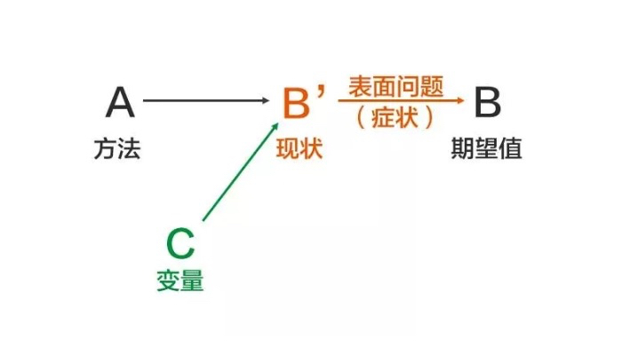
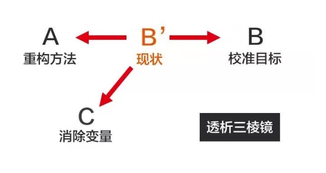

+++
title="问题本质"
tags=["阅读","问题本质"]
categories=["阅读"]
date="2020-03-13T04:46:00+08:00"
summary = '问题本质'
toc=false
+++

### 问题定义

问题就是期望和现状的落差部分

### 如何描述问题

通过问题的定义我们可以分为以下三个部分精准描述问题

1.	明确期望值B
2.	精准定位现状B’
3.	通过B和B'定位问题

问题并不会平白无故出现，它是由「目标、方法、变量」这三个因素共同影响产生

#### 问题产生图解

### 问题解决

1.	校准目标B 目标要符合SMART原则，同时要避免把手段当成目标；

2.	重构方法A 现状是由原来的方法导致的，因此，想要改变现状，不是从现状出发，添加一个新的解决方案，而是回过头，重构原来的方法系统。

3.	消除变量C 如果AB都没有问题，问题依然存在，一定存在着变量，你可以通过「象、数、理」这个基本框架来寻找它，并通过5Why的提问方法，挖掘真正的原因。

#### 问题解决图解

### 附录

1.	[知乎 10 万赞回答：真正厉害的人，是怎么分析问题的？](https://mp.weixin.qq.com/s/WAh158D6DMDbiOGCYfBQ8A)

