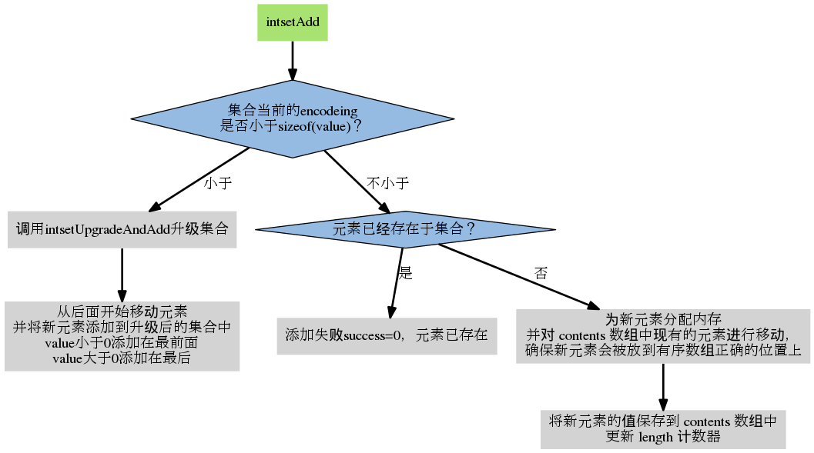

+++
title="redis|intset"
date="2020-03-14T10:47:00+08:00"
categories=["Redis"]
toc=false
+++

INTSET
------

intset是集合键的底层实现之一， 保存的元素是有序的。可作为集合键底层实现， 如果一个集合满足以下两个条件：

1.	保存可转化为long long类型的元素
2.	元素数量不多

结构定义
--------

```c
typedef struct intset {
    //保存元素所使用类型的长度
    uint32_t encoding;
    //保存元素的个数
    uint32_t length;
    //保存元素的数组
    int8_t contents[];
} intset;
/* Note that these encodings are ordered, so:
* INTSET_ENC_INT16 < INTSET_ENC_INT32 < INTSET_ENC_INT64. */
#define INTSET_ENC_INT16 (sizeof(int16_t))
#define INTSET_ENC_INT32 (sizeof(int32_t))
#define INTSET_ENC_INT64 (sizeof(int64_t))
```

intset搜索流程
--------------

```
static uint8_t intsetSearch(intset *is, int64_t value, uint32_t *pos) {
   int min = 0, max = intrev32ifbe(is->length)-1, mid = -1;
   int64_t cur = -1;
   /* The value can never be found when the set is empty */
   // 集合为空
      if (intrev32ifbe(is->length) == 0) {
      if (pos) *pos = 0;
         return 0;
      } else {
      /* Check for the case where we know we cannot find the value,
      * but do know the insert position. */
      // value 比最大元素还大
      if (value > _intsetGet(is,intrev32ifbe(is->length)-1)) {
      if (pos) *pos = intrev32ifbe(is->length);
      return 0;
      // value 比最小元素还小
      } else if (value < _intsetGet(is,0)) {
      if (pos) *pos = 0;
      return 0;
      }
   }
   // 熟悉的二分查找
   while(max >= min) {
      mid = (min+max)/2;
      cur = _intsetGet(is,mid);
   if (value > cur) {
      min = mid+1;
   } else if (value < cur) {
      max = mid-1;
   } else {
      break;
      }
   }
   if (value == cur) {
   if (pos) *pos = mid;
      return 1;
   } else {
   if (pos) *pos = min;
      return 0;
   }
}
```

intset添加流程
--------------

```c
/* Insert an integer in the intset */
intset *intsetAdd(intset *is, int64_t value, uint8_t *success) {
uint8_t valenc = _intsetValueEncoding(value);
uint32_t pos;
if (success) *success = 1;
    /* Upgrade encoding if necessary. If we need to upgrade, we know that
    * this value should be either appended (if > 0) or prepended (if < 0),
    * because it lies outside the range of existing values. */
    // 需要插入整数的所需内存超出了原有集合整数的范围，即内存类型不同，
    // 则升级整数类型
    if (valenc > intrev32ifbe(is->encoding)) {
    /* This always succeeds, so we don't need to curry *success. */
        return intsetUpgradeAndAdd(is,value);
    // 正常，分配内存，插入
    } else {
    // intset 内部不允许重复
    /* Abort if the value is already present in the set.
    * This call will populate "pos" with the right position to insert
    * the value when it cannot be found. */
    if (intsetSearch(is,value,&pos)) {
    if (success) *success = 0;
        return is;
    }
    // realloc
    is = intsetResize(is,intrev32ifbe(is->length)+1);
    // 迁移内存，腾出空间给新的数据。intsetMoveTail() 完成内存迁移工作
    if (pos < intrev32ifbe(is->length)) intsetMoveTail(is,pos,pos+1);
    }
    // 在腾出的空间中设置新的数据
        _intsetSet(is,pos,value);
    // 更新intset size
        is->length = intrev32ifbe(intrev32ifbe(is->length)+1);
    return is;
}
/*整数数组有可能遇到需要升级的时候，譬如往 int32_t 数组插入一个 ing64_t 整数的时候。*/
/*当插入数据的内存占用比原有数据大的时候，intsetUpgradeAndAdd() 会被调用。*/

static intset *intsetUpgradeAndAdd(intset *is, int64_t value) {
    
    // 当前的编码方式
    uint8_t curenc = intrev32ifbe(is->encoding);

    // 新值所需的编码方式
    uint8_t newenc = _intsetValueEncoding(value);

    // 当前集合的元素数量
    int length = intrev32ifbe(is->length);

    // 根据 value 的值，决定是将它添加到底层数组的最前端还是最后端
    // 注意，因为 value 的编码比集合原有的其他元素的编码都要大
    // 所以 value 要么大于集合中的所有元素，要么小于集合中的所有元素
    // 因此，value 只能添加到底层数组的最前端或最后端
    int prepend = value < 0 ? 1 : 0;

    /* First set new encoding and resize */
    // 更新集合的编码方式
    is->encoding = intrev32ifbe(newenc);
    // 根据新编码对集合（的底层数组）进行空间调整
    // T = O(N)
    is = intsetResize(is,intrev32ifbe(is->length)+1);

    /* Upgrade back-to-front so we don't overwrite values.
     * Note that the "prepend" variable is used to make sure we have an empty
     * space at either the beginning or the end of the intset. */
    // 根据集合原来的编码方式，从底层数组中取出集合元素
    // 然后再将元素以新编码的方式添加到集合中
    // 当完成了这个步骤之后，集合中所有原有的元素就完成了从旧编码到新编码的转换
    // 因为新分配的空间都放在数组的后端，所以程序先从后端向前端移动元素
    // 举个例子，假设原来有 curenc 编码的三个元素，它们在数组中排列如下：
    // | x | y | z | 
    // 当程序对数组进行重分配之后，数组就被扩容了（符号 ？ 表示未使用的内存）：
    // | x | y | z | ? |   ?   |   ?   |
    // 这时程序从数组后端开始，重新插入元素：
    // | x | y | z | ? |   z   |   ?   |
    // | x | y |   y   |   z   |   ?   |
    // |   x   |   y   |   z   |   ?   |
    // 最后，程序可以将新元素添加到最后 ？ 号标示的位置中：
    // |   x   |   y   |   z   |  new  |
    // 上面演示的是新元素比原来的所有元素都大的情况，也即是 prepend == 0
    // 当新元素比原来的所有元素都小时（prepend == 1），调整的过程如下：
    // | x | y | z | ? |   ?   |   ?   |
    // | x | y | z | ? |   ?   |   z   |
    // | x | y | z | ? |   y   |   z   |
    // | x | y |   x   |   y   |   z   |
    // 当添加新值时，原本的 | x | y | 的数据将被新值代替
    // |  new  |   x   |   y   |   z   |
    // T = O(N)
    while(length--)
        _intsetSet(is,length+prepend,_intsetGetEncoded(is,length,curenc));

    /* Set the value at the beginning or the end. */
    // 设置新值，根据 prepend 的值来决定是添加到数组头还是数组尾
    if (prepend)
        _intsetSet(is,0,value);
    else
        _intsetSet(is,intrev32ifbe(is->length),value);

    // 更新整数集合的元素数量
    is->length = intrev32ifbe(intrev32ifbe(is->length)+1);

    return is;
}
```



参考
----

-	[Redis 源码--省内存大法--intset和ziplist](https://www.jianshu.com/p/41e39eed1578)
-	[Redis 数据结构 intset](https://wiki.jikexueyuan.com/project/redis/intset.html)

