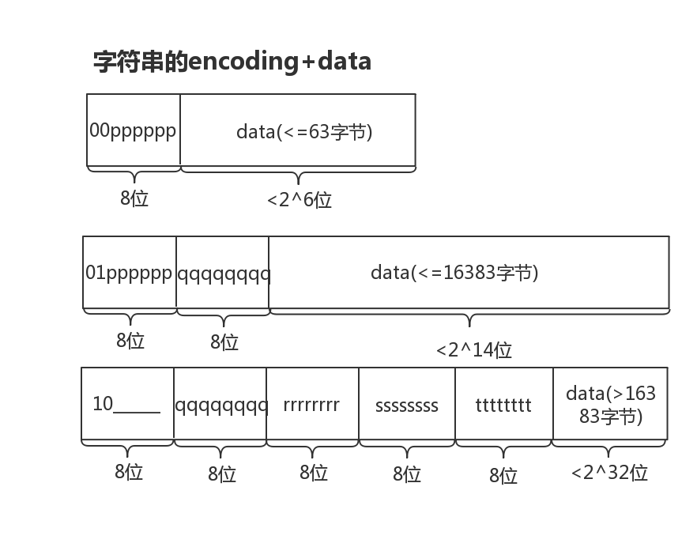

+++
title="redis|ziplist"
date="2020-03-14T10:45:00+08:00"
categories=["Redis"]
toc=false
+++

ZIPLIST作用
-----------

当list键、hash键、zset键包含元素较少时，并且每个元素是小整数或者长度较小的字符串，则redis将会使用ziplist作为底层键的存储实现。其作用当然是节省内存空间

链表整体结构
------------


-	zlbytes:整个ziplist的长度，无符号32位整数
-	zltail:记录最后一个节点的偏移量
-	zllen:链表中节点的个数，超过16位最大值，就记录不下了，只有遍历了
-	entry:节点，存储数据
-	zlend:值为OxFF，用于标记ziplist的结尾

链表中节点结构
--------------


链表中节点的具体格式，其中分为以下三部分

-	prevlengh:前一个节点的长度，由此构成了双向链表的核心功能，该部分字节开销为1或5，如果前一个节点的长度超过254，则会使用1个字节标记254，然后用4个字节记录长度
-	encoding:编码部分，决定存储的是字符串还是整数，以及存储的字节大小
-	data:数据部分

节点定义
--------

节点的encoding部分，决定了数据的如何存储，具体分为了9个类型，其中整数有6个类型，字符串有3个类型

### 整数


如上图所示，整数可以分为8、16、24、32、64以及1-13的特殊记录，前8位记录了类型，接着是数据部分。如果整数是1-13则会和encoding一起编入一个字节里存储，节省空间。

### 字符串



如上图所示，字符串分为了2^6、2^14、2^32三类。

节点遍历结构
------------

```c
typedef struct zlentry {
    // prevrawlen ：前置节点的长度
    // prevrawlensize ：编码 prevrawlen 所需的字节大小
    unsigned int prevrawlensize, prevrawlen;
    // len ：当前节点值的长度
    // lensize ：编码 len 所需的字节大小
    unsigned int lensize, len;
    // 当前节点 header 的大小
    // 等于 prevrawlensize + lensize
    unsigned int headersize;
    // 当前节点值所使用的编码类型
    unsigned char encoding;
    // 指向当前节点的指针
    unsigned char *p;
} zlentry;
```

源码中会有一个zlentry结构，该结构不是ziplist里面存储的节点结构，而是为了方便取出节点进行操作的中间结构，即把节点取出后整理成zlentry结构，方便传入其他函数中操作。

源码解读相关问题
----------------

1.	链表中的节点记录了前一个节点的大小，而节点的变动会影响后一个节点的头部大小，因此存在连级的修改可能，这个是很耗性能的。
2.	待定

