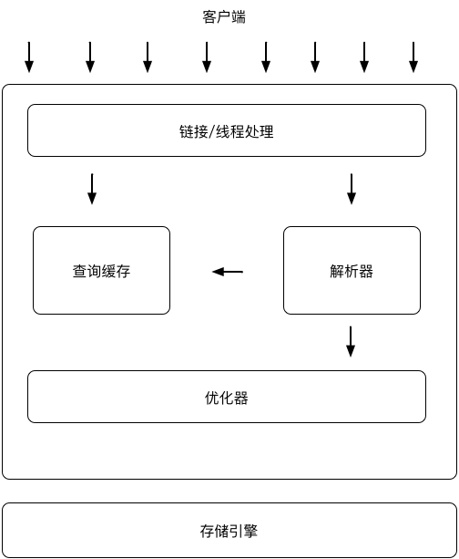

+++
title="基础认知"
tags=["mysql"]
categories=["mysql"]
date="2020-03-14T02:45:00+08:00"
summary = '基础认知'
toc=false
+++

### 基本概念

1.	DBMS(数据库管理系统):由一个相互关联的数据的集合和一组用以访问这些数据的程序组成。
2.	数据库:数据集合的通称
3.	文件存储系统和数据库管理系统比较的弊端
	-	数据的冗余和不一致
	-	数据访问困难
	-	数据孤立:数据分散在不同文件中，这些文件综合检索困难
	-	完整性问题:对数据的特定一致性约束，文件系统很难实现
	-	原子性问题:并发读写的数据一致性问题
	-	并发访问异常:并发读写的幻读问题
	-	安全性问题
4.	数据抽象
	-	物理层:最低层次的抽象，描述复杂的底层数据结构
	-	逻辑层:更高层次的抽象，实现物理数据独立性，隔离复杂的底层物理结构
	-	视图层:最高层次抽象，描述数据库的某个部分
5.	实例:数据库特定时刻存储在数据库中的信息的集合，即给定时刻数据库中数据的一个快照
6.	模式:数据库的总体设计称之为数据库模式，数据库的逻辑设计
7.	数据模式:数据模式是一个描述数据、数据联系、数据语义以及一致性约束的概念工具的集合
	-	关系模型
	-	实体-联系模型
	-	基于对象的数据模型
	-	半结构化数据模型
8.	数据库系统功能部件
	-	存储管理器:负责与文件管理器进行交互，将各种DML语句翻译为底层文件系统命令
		-	权限及完整性管理器
		-	事务管理器
		-	文件管理器
		-	缓冲区管理器
		-	数据文件
		-	数据字典
		-	索引
	-	查询处理部件
		-	DDL解释器
		-	DML编译器
		-	查询执行引擎

### Mysql服务器架构图

### 基本命令行

1.	连接 `mysql -h 127.0.0.1 -P 3306 -u root -p`
2.	选择数据库 `use SomeDataBaseName;`
3.	显示数据库列表 `show databases;`
4.	显示表列表 `show tables;`
5.	显示表项 `show columns from TableName;`
6.	显示表项 `desc TableName;`
7.	显示建表语句 `show create TableName;`
8.	显示建库语句 `show create DataBaseName;`
9.	显示错误 `show errors;`
10.	显示警告 `show warnings;`
11.	显示授权用户 `show grants;`
12.	给用户赋权 `grant select,insert on database.table to user_name@"ip_addr" Identified by "password";`
13.	导出数据库 `mysqldump -u user_name -p123456 database_name > outfile_name.sql`
14.	导出数据表 `mysqldump -u user_name -p database_name table_name > outfile_name.sql`

### SQL

1.	SQL语言构成
	1.	数据定义语言DDL:提供定义关系模式、删除关系以及修改关系模式的命令
	2.	数据操纵语言DML:提供查询信息，插入、删除、修改元组的能力
	3.	完整性:DDL包括定义完整性约束的命令，保存在数据库中的数据必须满足所定义的完整性约束
	4.	试图定义:试图相关命令
	5.	事务控制:事务开始和结束的命令
	6.	嵌入式SQL和动态SQL:定义SQL如何嵌入通用编程语言
	7.	授权:对关系和试图的访问权限和命令
2.	定义内容
	1.	每个关系的模式
	2.	每个属性的取值类型
	3.	完整性约束
	4.	每个关系维护的索引集合
	5.	每个关系的安全性和权限信息
	6.	每个关系在磁盘上的物理存储结构
3.	基本命令
4.	[mysql命令](http://www.runoob.com/mysql/mysql-select-database.html)

