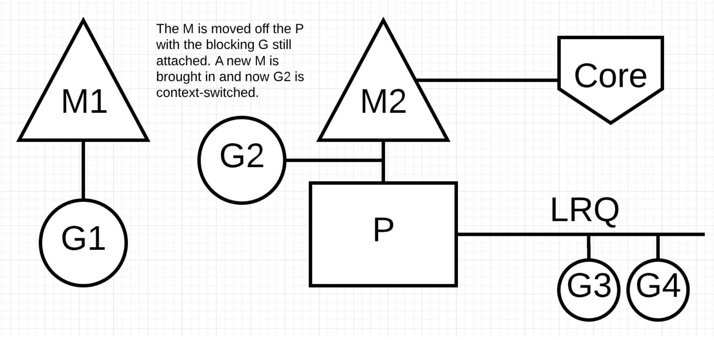
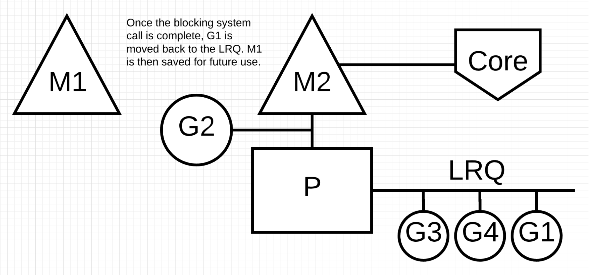
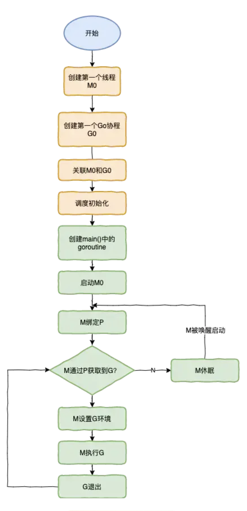

+++
title="MPG分析"
tags=["golang","mpg"]
categories=["golang"]
date="2020-03-15T05:57:00+08:00"
summary = 'MPG分析'
toc=false
+++

并行和并发
----------

### 并发(concurrency)

两个或两个以上的任务在一段时间内被执行。例如跑步的时候，停下来系鞋带

### 并行(parallelism)

两个或两个以上的任务在同一时刻被同时执行。例如跑步的时候，边跑边听歌

线程模型
--------

从线程讲起，无论语言层面何种并发模型，到了操作系统层面，一定是以线程的形态存在的。而操作系统根据资源访问权限的不同，体系架构可分为用户空间和内核空间；内核空间主要操作访问CPU资源、I/O资源、内存资源等硬件资源，为上层应用程序提供最基本的基础资源，用户空间呢就是上层应用程序的固定活动空间，用户空间不可以直接访问资源，必须通过系统调用、库函数或Shell脚本,来调用内核空间提供的资源。

现在的计算机语言，可以狭义的认为是一种“软件”，它们中所谓的“线程”，往往是用户态的线程，和操作系统本身内核态的线程（简称KSE），还是有区别的。可以分为以下几种模型

### 用户级线程模型

多个用户态的线程对应着一个内核线程，程序线程的创建、终止、切换或者同步等线程工作必须自身来完成。

### 内核级线程模型

直接调用操作系统的内核线程，所有线程的创建、终止、切换、同步等操作，都由内核来完成。

### 两级线程模型

这种模型是介于用户级线程模型和内核级线程模型之间的一种线程模型。这种模型的实现非常复杂，和内核级线程模型类似，一个进程中可以对应多个内核级线程，但是进程中的线程不和内核线程一一对应；这种线程模型会先创建多个内核级线程，然后用自身的用户级线程去对应创建的多个内核级线程，自身的用户级线程需要本身程序去调度，内核级的线程交给操作系统内核去调度。

Go语言的线程模型就是一种特殊的两极线程模型。我们称之为"MPG"模型

MPG模型
-------

### G

G是Goroutine的缩写，其实本质上也是一种轻量级的线程，相当于操作系统中的进程控制块，在这里就是Goroutine的控制结构，是对Goroutine的抽象。其中包括执行的函数指令及参数；G保存的任务对象；线程上下文切换，现场保护和现场恢复需要的寄存器(SP、IP)等信息。

### M

M是称为Machine，一个M直接关联了一个内核线程。M是有线程栈的。如果不对该线程栈提供内存的话，系统会给该线程栈提供内存。M的PC寄存器指向G提供的函数，然后去执行。

### P

P是一个抽象的概念，并不是真正的物理CPU。所以当P有任务时需要创建或者唤醒一个系统线程来执行它队列里的任务。所以P/M需要进行绑定，构成一个执行单元。

本地队列:当前P的队列，本地队列是Lock-Free，没有数据竞争问题，无需加锁处理，可以提升处理速度。

全局队列:全局队列为了保证多个P之间任务的平衡。所有M共享P全局队列，为保证数据竞争问题，需要加锁处理。相比本地队列处理速度要低于全局队列。

### 调度过程

首先创建一个G对象，G对象保存到P本地队列或者是全局队列。P此时去唤醒一个M。P继续执行它的执行序。M寻找是否有空闲的P，如果有则将该G对象移动到它本身。接下来M执行一个调度循环(调用G对象->执行->清理线程->继续找新的Goroutine执行)。

M执行过程中，随时会发生上下文切换。当发生上线文切换时，需要对执行现场进行保护，以便下次被调度执行时进行现场恢复。Go调度器M的栈保存在G对象上，只需要将M所需要的寄存器(SP、PC等)保存到G对象上就可以实现现场保护。当这些寄存器数据被保护起来，就随时可以做上下文切换了，在中断之前把现场保存起来。如果此时G任务还没有执行完，M可以将任务重新丢到P的任务队列，等待下一次被调度执行。当再次被调度执行时，M通过访问G的vdsoSP、vdsoPC寄存器进行现场恢复(从上次中断位置继续执行)。

### 系统调用

### NetPoller

Go 将 epoll 进行了包装，会单独创建一个名为 NetPoller 的 M 异步处理网络IO，它不需要和 P 进行绑定。

当 G 执行网络 IO 的时候，G 会和当前 M 、P 解绑，进入到 NetPoller 的 M 中，等待网络 IO 完成，这样即使执行网络 IO 的系统调用，也不会产生阻塞的 M.

当网络 IO 完成后，M 的 Schedule 函数，会通过`findrunable`函数 取到这个 G，继续运行它。

### 均衡任务

### G的创建流程

1.	创建一个G对象，优选加入本地队列，本地队列满了则会将本地队列前一半和新建的G一起打乱顺序加入全局队列
2.	G会尝试唤醒其他空闲的P和M组合去执行
3.	M会启动一个底层线程，循环执行能找到的G任务
4.	G任务的执行顺序是，先从本地队列找，然后去全局队列找(一次拿全局G/P个数个任务)，再之后去其他P中找(偷一半的任务)

### M的创建过程

1.	先找到一个空闲的P，如果没有则直接返回(保证了进程不会占用超过自己设定的cpu个数)
2.	调用系统api创建线程，不同的操作系统，调用不一样
3.	然后创建的这个线程里面才是真正做事的，循环执行G任务

### 如何终止长任务

1.	启动的时候，专门创建一个线程sysmon，监控和管理任务
2.	该线程记录所有P的G任务计数schedtick，该数值每执行一个G任务后递增
3.	检测到某个schedtick一直没有递增，则说明这个P一直执行同一个G任务，则超过一段时间，就在这个G任务的栈信息中增加一个标记
4.	G任务在执行的时候，如果遇到非内联函数调用，则会检测一次上述标记，然后中断自己，把自己放到队列末尾，P就可以执行下一个G

### G任务中断恢复

1.	中断的时候将寄存器里的栈信息，保存到自己的G对象里面
2.	当再次轮到自己执行时，将自己保存的栈信息复制到寄存器里面，这样就接着上次之后运行了

go启动流程
----------

-	runtime创建最初的线程m0和goroutine g0，并把2者关联
-	调度器初始化：初始化m0、栈、垃圾回收，以及创建和初始化由GOMAXPROCS个P构成的P列表
-	示例代码中的main函数是`main.main`，runtime中也有1个main函数`runtime.main`，代码经过编译后，`runtime.main`会调用`main.main`，程序启动时会为`runtime.main`创建goroutine，称它为`main goroutine`，然后把`main goroutine`加入到P的本地队列
-	启动m0，m0已经绑定了P，会从P的本地队列获取G，获取到`main goroutine`
-	G拥有栈，M根据G中的栈信息和调度信息设置运行环境
-	M运行G
-	G退出，再次回到M获取可运行的G，这样重复下去，直到`main.main`退出，`runtime.main`执行`defer`和`panic`处理，或调用`runtime.exit`退出程序

G的寻找流程
-----------

### 调度

go程序初始化完毕后，调度器会进行调度(位于runtime中的schedule函数)，以让main函数中的G有机会开始运行。

-	调度器会先查找全局（调度器的）可运行G队列以及本地P的可运行G队列
-	找不到则进入==强力查找模式==：从任何可以获得G的地方查找G
-	还是找不到，则该子流程暂停，直到有可运行的G出现才会继续下去
-	子流程结束，意味着当前M抢到了一个可运行的G

调度器找到G后的流程：

-	如果调度器在调度之初发现当前M已经与某个G锁定，会立即停止调度并阻塞当前M，如果G到了可运行状态，M会被唤醒并继续运行G。
-	如果当前M找到了可运行G，却发现该G与另外的M锁定，它会唤醒绑定的M来运行该G，并重新为当前M寻找可运行G
-	如果当前M未与任何G锁定(gcwaiting值不为0)，那么停止Go调度器，即STW(Stop the world)并等待运行时串行任务正在执行
-	当锁定和运行时串行任务都为假，执行寻找G

### 强力查找模式 ==调度==开启强力找子流程时，会多次尝试从任何可以获得G的地方查找G，使用的函数是`runtime.findrunnabel`，返回一个处于Grunnable状态的G。

#### ==阶段一== 步骤一：获取终结函数的G。对象在未被任何其他对象引用时（不可达）就会被垃圾回收器回收，回收前会调用函数`runtime.SetFinalizer`将该对象与一个中终结函数绑定。所有的终结函数由一个专用的G负责。调度器如果发现该G完成任务，会将其状态设置为Grunnable并放入本地P的可运行G队列。 步骤二：从本地P的可运行G队列获取一个G 步骤三：找不到则从调度器的可运行队列获取G 步骤四：找不到则从网络I/O轮询器（netpoller）获取G 步骤五：找不到则从其他P的可运行G队列获取G 如果上述步骤还是无法搜索到可用G，那么搜索进入==阶段二==

#### ==阶段二==

步骤一：调度器判断是否处于GC标记节点，如果是，则把本地P持有的GC标记的G状态改为Grunnable并返回结果 步骤二：再次从调度器可运行G队列获取G，找不到则解除本地P与当前M关联，并把P放入调度器的空闲P列表 步骤三：遍历全局P列表中的P，检查可运行G队列，如果发现某个P的可运行G队列不为空，则取出一个P，关联到当前M，进入阶段一重新执行 步骤四：全局P列表也没有可运行G队列，则判断是否正处于GC标记节点，以及相关资源是否可用，如果都是true，调度器会从空闲P列表拿出一个P，如果该P持有一个GC标记专用G，就关联P与M，执行阶段二的步骤一 步骤五：继续从I/O轮询器获取G 上述2个阶段都查找不到G，则调度器就会停止当前M。

G0和M0
------

M中拥有两个特殊的元素

-	g0：M初始化时运行时生成的线程，所在的栈称为调度栈/系统栈/调度栈/OS线程栈，用于执行调度、垃圾回收、栈管理
-	gsignal：处理信号的G，所在的栈称为信号栈
-	`runtime.g0`：用于执行引导程序，位于Go程序第一个内核线程中，该内核线程是`runtime.m0`

	### 注意

-	g0不会被阻塞，也不会包含在任何G队列或者列表中，其栈也不会再垃圾回收期被扫描

-	`runtime.m0`和`runtime.g0`都是静态分配的，无需分配内容

-	`runtime.m0`的g0级`runtime.g0`

参考
----

1.	[深入Golang调度器之GMP模型](https://www.cnblogs.com/sunsky303/p/9705727.html)
2.	[Scheduling In Go](https://www.ardanlabs.com/blog/2018/08/scheduling-in-go-part1.html)
3.	[Go并发原理](https://i6448038.github.io/2017/12/04/golang-concurrency-principle/)
4.	[golang的goroutine调度机制](https://blog.csdn.net/liangzhiyang/article/details/52669851)
5.	[30+张图讲解：Golang调度器GMP原理与调度全分析](https://mp.weixin.qq.com/s/SEPP56sr16bep4C_S0TLgA)
6.	[并发编程-Go协程调度模型（下）](https://www.cnblogs.com/cool2feel/articles/13115829.html)

