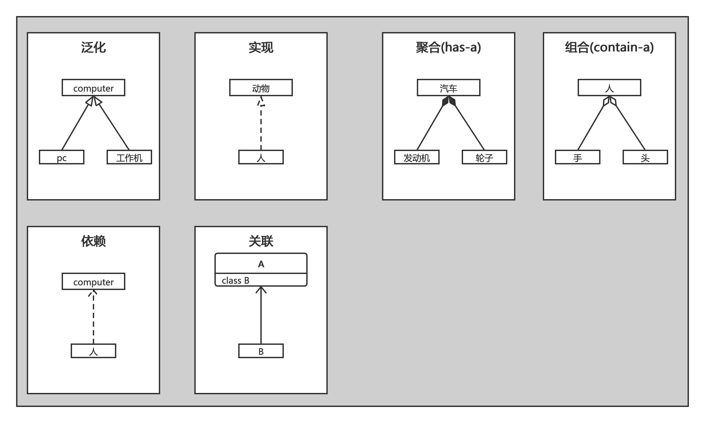

+++
title="画图工具StartUML"
tags=["uml"]
categories=["uml"]
date="2020-03-15T06:01:00+08:00"
summary = '画图工具StartUML'
toc=false
+++

UML
---

统一建模语言，是一个支持模型化和软件系统开发的图形化语言，为软件开发的所有阶段提供模型化和可视化支持，包括由需求分析到规格，到构造和配置。常见的几种UML图有

-	用例图：从用户角度描述系统功能，并指各功能的操作者。
-	类图：描述系统中类的静态结构。
-	顺序图：对象之间的动态合作关系，强调对象发送消息的顺序，同时显示对象之间的交互。
-	协作图：描述对象之间的协助关系。
-	状态图：是描述状态到状态控制流，常用于动态特性建模。
-	活动图：描述了业务实现用例的工作流程等。

UML从考虑系统的不同角度出发，定义了不同类型的图，这些图从不同的侧面对系统进行描述。为的就是让人更加了解系统。

类之间关系
----------

### 泛化

1.	含义:是类与类间或者接口与接口间最常见的的关系，指的是一个类（子类、子接口）继承另一个类（父类、父接口）的属性与方法，并且可以扩展它自己的新属性与方法。二者是is-a的关系，通俗地讲就是“这个东西是那个东西的一种”，比如PC机是计算机，工作站也是计算机。

2.	表示:空心三角箭头的实线

### 实现

1.	含义:指的是一个类实现接口的功能。

2.	表示:空心三角箭头的虚线

### 聚合

1.	含义:指的是整体和部分的弱关系，是has-a的关系，此时整体与部分之间是可分离的，即没有了整体，局部也可单独存在。比如公司和员工的关系，公司包含员工，但如果公司倒闭，员工依然可以换公司。处于聚合关系的两个类生命周期不同步，即他们可以具有各自的生命周期——当A创建的时候，B不一定创建；当A消亡时，B不一定消亡。

2.	表示:空心菱形的实线

### 组合

1.	含义:指的是整体和部分的强关系，是一种contains-a的关系，部分不能脱离整体存在。整体的生命周期结束也就意味着部分的生命周期结束，比如“国破家亡”。

2.	表示:实心菱形的实线

### 依赖

1.	含义:类A要完成某个功能必须引用类B，但这种使用关系是具有偶然性的、临时性的、非常弱的，而B类的变化会影响到A，则A与B存在依赖关系，依赖关系是弱的关联关系。比如本来人与电脑没有关系的，但由于偶然的机会，人需要用电脑写程序，这时候人就依赖于电脑。

2.	表示:箭头虚线

### 关联

1.	含义:关联是指一个类用到了另外的一个类，但不依赖。一般是长期性的，而且双方的关系一般是平等的。关联可以是自身关联、单向关联、双向关联。

2.	表示:带箭头的实线表示，箭头指向被拥有者。

### 关联和依赖的区别

1.	从类的属性是否增加的角度看：发生依赖关系的两个类都不会增加属性。发生关联关系的两个类，其中的一个类成为另一个类的属性，而属性是一种更为紧密的耦合，更为长久的持有关系。

2.	从关系的生命周期来看：依赖关系是仅当类的方法被调用时而产生，伴随着方法的结束而结束了。关联关系是当类实例化的时候即产生，当类销毁的时候，关系结束。相比依赖讲，关联关系的生存期更长。

用例图
------

参考
----

1.	[不会用StarUML画类图的程序媛不是优秀的程序媛（一）](https://www.jianshu.com/p/f7ad7f833fe1)
2.	[StarUML for Mac的安装与破解](https://www.cnblogs.com/gujiande/p/9412027.html)

