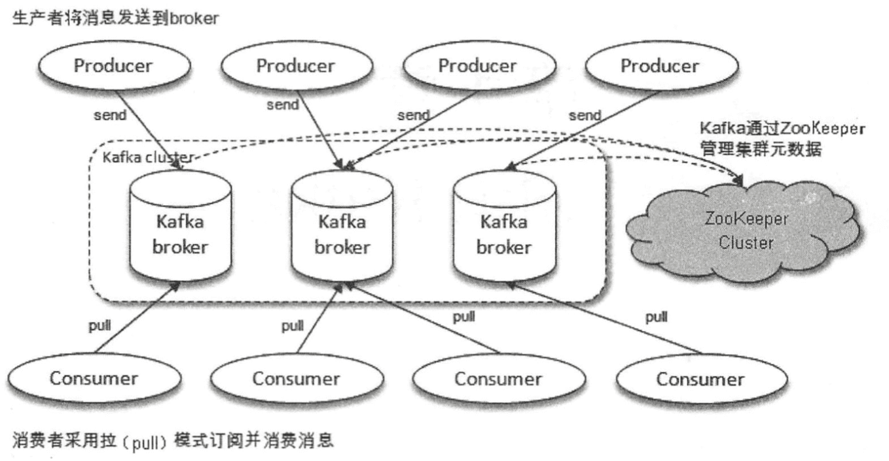

+++
title="mq|kafka基础知识"
date="2020-04-12T07:42:00+08:00"
categories=["MQ"]
toc=true
+++

**kafka**最初由Linkedin公司开发，是一个分布式、支持分区的、多副本的，基于zookeeper协调的分布式消息系统，用scala语言编写，Linkedin于2010年贡献给了Apache基金会并成为顶级开源项目。

### 特点

1.	高吞吐量、低延迟：kafka每秒可以处理几十万条消息，它的延迟最低只有几毫秒，每个topic可以分多个partition, consumer group 对partition进行consume操作。
2.	可扩展性：kafka集群支持热扩展
3.	持久性、可靠性：消息被持久化到本地磁盘，并且支持数据备份防止数据丢失
4.	容错性：允许集群中节点失败（若副本数量为n,则允许n-1个节点失败）
5.	高并发：支持数千个客户端同时读写

> 为什么要使用 Kafka 或消息队列？
- 解耦：降低系统组件之间的耦合，使得系统更加灵活和易扩展。
- 削峰填谷：通过缓冲瞬时高峰流量，避免系统因瞬时流量过大而崩溃。
- 异步处理：提升系统响应速度，避免长时间阻塞。
- 容错与持久化：确保消息不会因系统故障丢失，增强系统的容错能力。
- 实时数据处理：对大量数据流进行实时处理，适用于大数据和数据分析场景。
- 多订阅与广播：支持一个生产者对应多个消费者的模式，实现消息的多路传播。
- 提升性能与并发：通过分布式并发消费提升系统处理能力。

Kafka 作为一种高吞吐、可扩展、分布式的消息队列系统，特别适合处理大规模的数据流，保证消息传递的可靠性和性能。

### 使用场景

1.	日志收集：一个公司可以用Kafka可以收集各种服务的log，通过kafka以统一接口服务的方式开放给各种consumer，例如hadoop、Hbase、Solr等。
2.	消息系统：解耦和生产者和消费者、缓存消息等。
3.	用户活动跟踪：Kafka经常被用来记录web用户或者app用户的各种活动，如浏览网页、搜索、点击等活动，这些活动信息被各个服务器发布到kafka的topic中，然后订阅者通过订阅这些topic来做实时的监控分析，或者装载到hadoop、数据仓库中做离线分析和挖掘。
4.	运营指标：Kafka也经常用来记录运营监控数据。包括收集各种分布式应用的数据，生产各种操作的集中反馈，比如报警和报告。
5.	流式处理：比如spark streaming和storm
6.	事件源

## 基本名词

- Broker : Kafka节点，一个Kafka节点就是一个broker，多个broker可以组成一个Kafka集群。
- Producer : 是消息的发送者，负责将数据发布到 Kafka 中的 Topic。
- Consumer : 订阅topic消费message, consumer作为一个线程来消费。
- Consumer Group : 一个Consumer Group包含多个consumer, 这个是预先在配置文件中配置好的。
- Topic : Kafka 中消息的分类单位，类似于数据库中的表。每个 Topic 可以有多个 Partition，而 Partition 是 Kafka 的并行处理单位。
- Partition : topic物理上的分组，一个topic可以分为多个partition，每个partition是一个有序的队列
- Segment : partition物理上由多个segment组成，每个Segment存着message信息
- Zookeeper/Raft(控制器) : Kafka 用来管理集群元数据、协调 Broker 和维护 Partition 的 Leader 选举过程。
- Leader和Follower : 每个 Partition 都有一个 Leader，负责处理所有的读写请求。其他副本称为 Follower，它们从 Leader 同步数据。

## 生产

#### 消息写入流程

Producer 将消息发送到 Leader 所在的 Broker，Leader 会将消息追加到本地日志文件，并更新 LEO（Log End Offset），即当前日志的最后一条消息的下一个偏移量。此时，消息处于 **未提交状态**，消费者无法读取。

Leader 维护一个 ISR 列表，包含所有与自己保持同步的 Follower。Follower 需要满足两个条件才能留在 ISR 中：

- replica.lag.time.max.ms：Follower 必须在指定时间内（默认 10 秒）向 Leader 发送 Fetch 请求。
- replica.lag.max.messages：Follower 落后 Leader 的消息数不超过指定阈值（默认 4000 条）。

如果 Follower 不满足上述条件，会被移出 ISR，进入 OSR（Out-of-Sync Replicas）。当 Follower 重新追上 Leader 后，会被重新加入 ISR。

当 Leader 收到 所有 ISR 中的 Follower 的确认（通过 acks 参数控制），会更新 HW（High Watermark）。

HW 是 ISR 中所有副本 LEO 的最小值，表示消费者可以读取到的消息偏移量。此时消息才被视为 **已提交**，消费者可以消费。

> 例如，若 ISR 中有三个副本，LEO 分别为 10、9、8，则 HW 为 8。消费者只能读取到偏移量小于 8 的消息，确保即使 Leader 宕机，新 Leader 也能提供已提交的数据。

Follower 主动拉取数据,通过 `ReplicaFetcherThread` 线程定期向 Leader 发送 FetchRequest，请求拉取从当前 HW 之后 的消息。

> 例如，假设 Follower 的当前 HW 是 5，Leader 的 LEO 是 10，Follower 会请求拉取偏移量 5 到 10 的消息。

Follower 接收到消息后，将其追加到本地日志，更新自身的 LEO。然后，Follower 将自己的 LEO 发送给 Leader，并更新自己的 HW 为 `min (Leader 的 HW, 自身 LEO)`。这确保 Follower 的 HW 不会超过 Leader 的 HW，从而保证数据一致性。

当 Leader 宕机时，Kafka 从 ISR 中选举新的 Leader。新 Leader 必须拥有所有已提交的消息（即 HW 之前的数据）。如果 ISR 为空，可能需要启用 Unclean Leader Election（不推荐，可能导致数据丢失）。

新加入的 Follower：新副本加入时，会从 Leader 拉取全部历史数据，直到追上 Leader 的 LEO 并加入 ISR。

滞后的 Follower：如果 Follower 落后太多，会被移出 ISR。恢复后，它会从 Leader 拉取缺失的数据，重新加入 ISR。

#### 批量拉取与性能优化

- 零拷贝（Zero Copy）：Leader 使用 sendfile 系统调用直接将数据从磁盘发送到网络，避免用户态和内核态的数据拷贝，提升吞吐量。
- 批量传输：Follower 批量拉取消息，减少网络交互次数。Leader 将数据封装成 ByteBuffer 批量返回，Follower 批量写入本地日志。

#### producer acks 参数

- acks=0：Producer 不等待确认，性能最高但可靠性最低。
- acks=1：Leader 写入成功即确认，可能丢失数据。
- acks=all（或 -1）：等待所有 ISR 副本确认，可靠性最高但延迟增加。

#### HW 更新的触发条件

Leader 在以下场景尝试更新 HW：
- 处理 Producer 的 Produce 请求后。
- 处理 Follower 的 Fetch 请求后。
- Leader 选举完成后。

#### ISR 动态调整

- replica.lag.time.max.ms : 控制 Follower 的心跳间隔，避免频繁移出 ISR。
- min.insync.replicas : 设置最小 ISR 副本数，若 ISR 低于此值，停止写入服务，保障数据可靠性。

#### Kakfa Broker Leader的选举

Kakfa Broker集群受Zookeeper管理。所有的Kafka Broker节点一起去Zookeeper上注册一个临时节点，因为只有一个Kafka Broker会注册成功，其他的都会失败，所以这个成功在Zookeeper上注册临时节点的这个Kafka Broker会成为Kafka Broker Controller，其他的Kafka broker叫Kafka Broker follower。

这个Controller会监听其他的Kafka Broker的所有信息，如果这个kafka broker controller宕机了，在zookeeper上面的那个临时节点就会消失，此时所有的kafka broker又会一起去Zookeeper上注册一个临时节点，因为只有一个Kafka Broker会注册成功，其他的都会失败，所以这个成功在Zookeeper上注册临时节点的这个Kafka Broker会成为Kafka Broker Controller，其他的Kafka broker叫Kafka Broker follower。

一旦有一个broker宕机了后的处理流程

1.	这个kafka broker controller会读取该宕机broker上所有的partition在zookeeper上的状态，并选取ISR(in-sync replica已同步的副本)列表中的一个replica作为partition leader。
2.	如果ISR列表中的replica全挂，选一个幸存的replica作为leader;
3.	如果该partition的所有的replica都宕机了，则将新的leader设置为-1，等待恢复，等待ISR中的任一个Replica“活”过来，并且选它作为Leader；
4.	或选择第一个“活”过来的Replica（不一定是ISR中的）作为Leader
5.	这个broker宕机的事情，kafka controller也会通知zookeeper，zookeeper就会通知其他的kafka broker。

#### Topic & Partition

Topic相当于传统消息系统MQ中的一个队列queue，producer端发送的message必须指定是发送到哪个topic，但是不需要指定topic下的哪个partition，因为kafka会把收到的message进行load balance，均匀的分布在这个topic下的不同的partition上`(hash(message) % (broker数量))`。

物理上存储上，这个topic会分成一个或多个partition，每个partition相当于是一个子queue。

在物理结构上，每个partition对应一个物理的目录（文件夹），文件夹命名是topic name/partition/序号，一个topic可以有无数多的partition，根据业务需求和数据量来设置。

在kafka配置文件中可随时更高num.partitions参数来配置更改topic的partition数量，在创建Topic时通过参数指定partition数量。Topic创建之后通过Kafka提供的工具也可以修改partiton数量。

一般来说，一个Topic的Partition数量大于等于Broker的数量，可以提高吞吐率。同一个Partition的Replica尽量分散到不同的机器，高可用。

当add a new partition的时候，partition里面的message不会重新进行分配，原来的partition里面的message数据不会变，新加的这个partition刚开始是空的，随后进入这个topic的message就会重新参与所有partition的load balance

#### Partition Replica

每个partition可以在其他的kafka broker节点上存副本，以便某个kafka broker节点宕机不会影响这个kafka集群。

存replica副本的方式是按照kafka broker的顺序存。例如有5个kafka broker节点，某个topic有3个partition，每个partition存2个副本，那么partition1存broker1,broker2，partition2存broker2,broker3。。。以此类推（replica副本数目不能大于kafka broker节点的数目，否则报错。这里的replica数其实就是partition的副本总数，其中包括一个leader，其他的就是copy副本）。

这样如果某个broker宕机，其实整个kafka内数据依然是完整的。但是，replica副本数越高，系统虽然越稳定，但是回来带资源和性能上的下降；replica副本少的话，也会造成系统丢数据的风险。

## 消费

#### ConsumerGroup

各个consumer线程可以组成一个组ConsumerGroup，partition中的每个message只能被ConsumerGroup中的一个consumer线程消费，如果一个message可以被多个consumer线程消费的话，那么这些consumer必须在不同的组。

Kafka不支持一个partition中的message由两个或两个以上的同一个consumer group下的consumer thread来处理，除非再启动一个新的consumer group。所以如果想同时对一个topic做消费的话，启动多个consumer group就可以了，但是要注意的是，这里的多个consumer的消费都必须是顺序读取partition里面的message，新启动的consumer默认从partition队列最头端最新的地方开始阻塞的读message。

它不能像AMQ那样可以多个BET作为consumer去互斥的（for update悲观锁）并发处理message，这是因为多个BET去消费一个Queue中的数据的时候，由于要保证不能多个线程拿同一条message，所以就需要行级别悲观锁（for update）,这就导致了consume的性能下降，吞吐量不够。而kafka为了保证吞吐量，只允许同一个consumer group下的一个consumer线程去访问一个partition。如果觉得效率不高的时候，可以加partition的数量来横向扩展，那么再加新的consumer thread去消费。如果想多个不同的业务都需要这个topic的数据，起多个consumer group就好了，大家都是顺序的读取message，offsite的值互不影响。这样没有锁竞争，充分发挥了横向的扩展性，吞吐量极高。这也就形成了分布式消费的概念。

当启动一个consumer group去消费一个topic的时候，无论topic里面有多个少个partition，无论我们consumer group里面配置了多少个consumer thread，这个consumer group下面的所有consumer thread一定会消费全部的partition；即便这个consumer group下只有一个consumer thread，那么这个consumer thread也会去消费所有的partition。因此，最优的设计就是，consumer group下的consumer thread的数量等于partition数量，这样效率是最高的。

一个consumer group下，无论有多少个consumer，这个consumer group一定回去把这个topic下所有的partition都消费了。

1.	当consumer group里面的consumer数量小于这个topic下的partition数量的时候，就会出现一个consumer thread消费多个partition的情况。
2.	如果consumer group里面的consumer数量等于这个topic下的partition数量的时候，此时效率是最高的，每个partition都有一个consumer thread去消费。
3.	当consumer group里面的consumer数量大于这个topic下的partition数量的时候，就会有consumer thread空闲。

因此，我们在设定consumer group的时候，只需要指明里面有几个consumer数量即可，无需指定对应的消费partition序号，consumer会自动进行rebalance。

#### Consumer Rebalance的触发条件：

1.	Consumer增加或删除会触发Rebalance
2.	Broker的增加或者减少都会触发Rebalance

#### 消息传输一致

Kafka提供3种消息传输一致性语义：最多1次，最少1次，恰好1次。

1.	最少1次：可能会重传数据，有可能出现数据被重复处理的情况;
2.	最多1次：可能会出现数据丢失情况;
3.	恰好1次：并不是指真正只传输1次，只不过有一个机制。确保不会出现“数据被重复处理”和“数据丢失”的情况。

at most once: 消费者fetch消息,然后保存offset,然后处理消息;当client保存offset之后,但是在消息处理过程中consumer进程失效(crash),导致部分消息未能继续处理.那么此后可能其他consumer会接管,但是因为offset已经提前保存,那么新的consumer将不能fetch到offset之前的消息(尽管它们尚没有被处理),这就是"at most once".

at least once: 消费者fetch消息,然后处理消息,然后保存offset.如果消息处理成功之后,但是在保存offset阶段zookeeper异常或者consumer失效,导致保存offset操作未能执行成功,这就导致接下来再次fetch时可能获得上次已经处理过的消息,这就是"at least once".

"Kafka Cluster"到消费者的场景中可以采取以下方案来得到“恰好1次”的一致性语义：最少1次＋消费者的输出中额外增加已处理消息最大编号：由于已处理消息最大编号的存在，不会出现重复处理消息的情况。

## 原理

#### 持久化

kafka使用文件存储消息(append only log),这就直接决定kafka在性能上严重依赖文件系统的本身特性.且无论任何OS下,对文件系统本身的优化是非常艰难的.文件缓存/直接内存映射等是常用的手段.因为kafka是对日志文件进行append操作,因此磁盘检索的开支是较小的;同时为了减少磁盘写入的次数,broker会将消息暂时buffer起来,当消息的个数(或尺寸)达到一定阀值时,再flush到磁盘,这样减少了磁盘IO调用的次数.对于kafka而言,较高性能的磁盘,将会带来更加直接的性能提升.

#### 性能

除磁盘IO之外,我们还需要考虑网络IO,这直接关系到kafka的吞吐量问题.kafka并没有提供太多高超的技巧;对于producer端,可以将消息buffer起来,当消息的条数达到一定阀值时,批量发送给broker;对于consumer端也是一样,批量fetch多条消息.不过消息量的大小可以通过配置文件来指定.对于kafka broker端,似乎有个sendfile系统调用可以潜在的提升网络IO的性能:将文件的数据映射到系统内存中,socket直接读取相应的内存区域即可,而无需进程再次copy和交换(这里涉及到"磁盘IO数据"/"内核内存"/"进程内存"/"网络缓冲区",多者之间的数据copy).

其实对于producer/consumer/broker三者而言,CPU的开支应该都不大,因此启用消息压缩机制是一个良好的策略;压缩需要消耗少量的CPU资源,不过对于kafka而言,网络IO更应该需要考虑.可以将任何在网络上传输的消息都经过压缩.kafka支持gzip/snappy等多种压缩方式.

#### 负载均衡

kafka集群中的任何一个broker,都可以向producer提供metadata信息,这些metadata中包含"集群中存活的servers列表"/"partitions leader列表"等信息(请参看zookeeper中的节点信息). 当producer获取到metadata信息之后, producer将会和Topic下所有partition leader保持socket连接;消息由producer直接通过socket发送到broker,中间不会经过任何"路由层".

异步发送，将多条消息暂且在客户端buffer起来,并将他们批量发送到broker;小数据IO太多,会拖慢整体的网络延迟,批量延迟发送事实上提升了网络效率;不过这也有一定的隐患,比如当producer失效时,那些尚未发送的消息将会丢失。

## 参考

1.	[Kafka史上最详细原理总结上](https://www.jianshu.com/p/734cf729d77b)
2.	[Kafka史上最详细原理总结下](https://www.jianshu.com/p/acf010e67a19)
3.	[震惊了！原来这才是kafka！](https://www.jianshu.com/p/d3e963ff8b70)
4.  [深入理解Kafka核心设计与实践原理](https://pegasuswang.readthedocs.io/zh/latest/%E5%88%86%E5%B8%83%E5%BC%8F/%E6%B7%B1%E5%85%A5%E7%90%86%E8%A7%A3Kafka%E6%A0%B8%E5%BF%83%E8%AE%BE%E8%AE%A1%E4%B8%8E%E5%AE%9E%E8%B7%B5%E5%8E%9F%E7%90%86/%E6%B7%B1%E5%85%A5%E7%90%86%E8%A7%A3Kafka%E6%A0%B8%E5%BF%83%E8%AE%BE%E8%AE%A1%E4%B8%8E%E5%AE%9E%E8%B7%B5%E5%8E%9F%E7%90%86/)
5.  [Kafka 进阶学习（一）—— 初识 Kafka](https://juejin.cn/post/7125446822633406472)