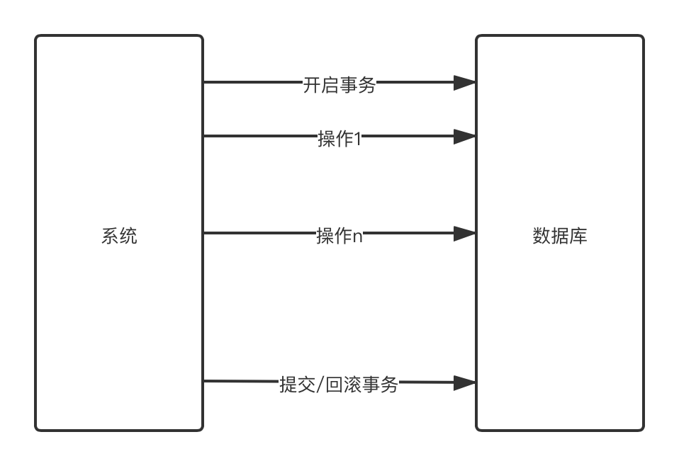
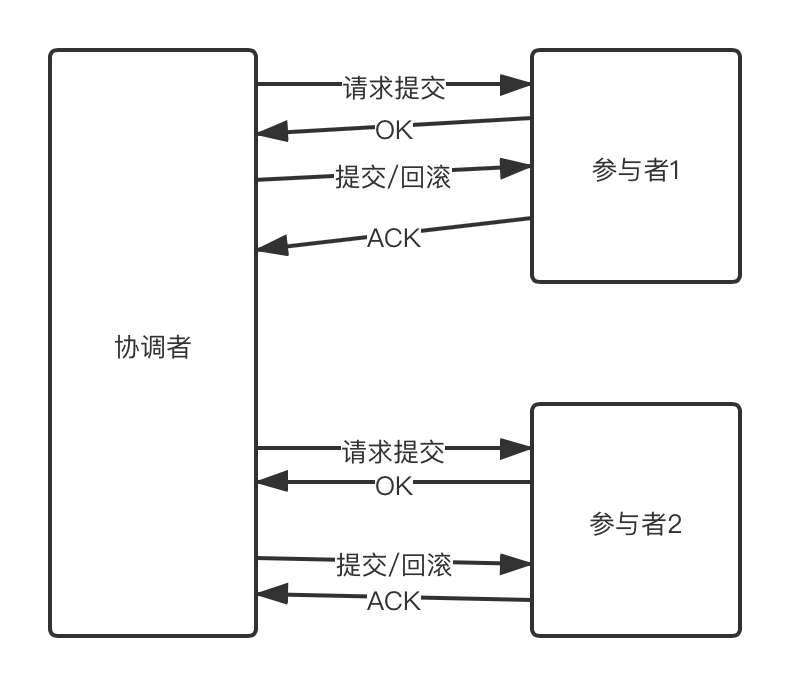
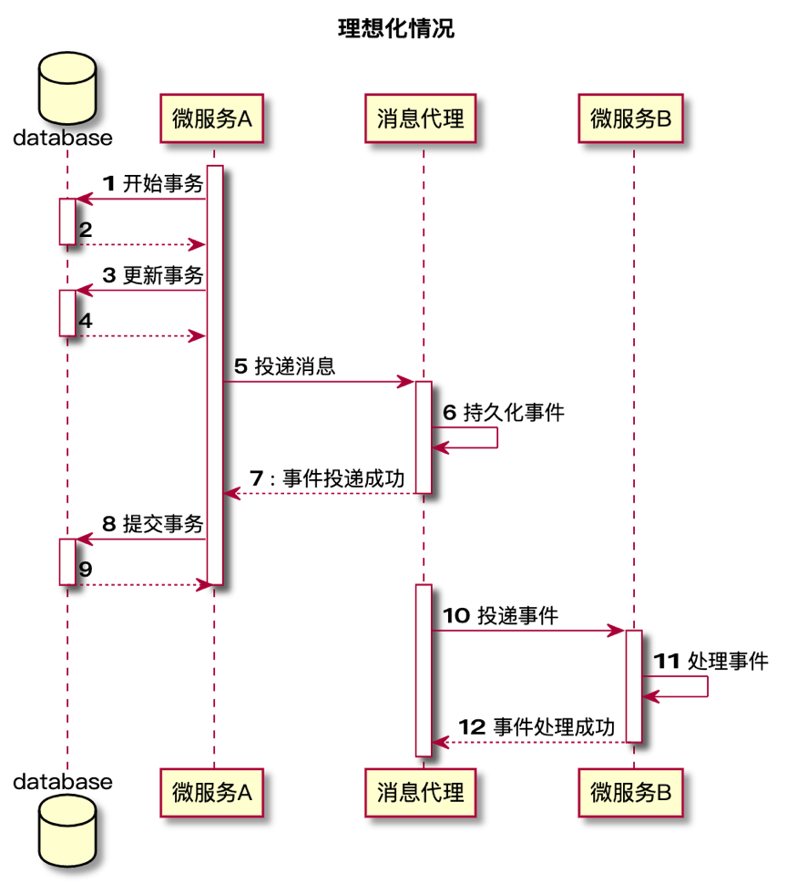
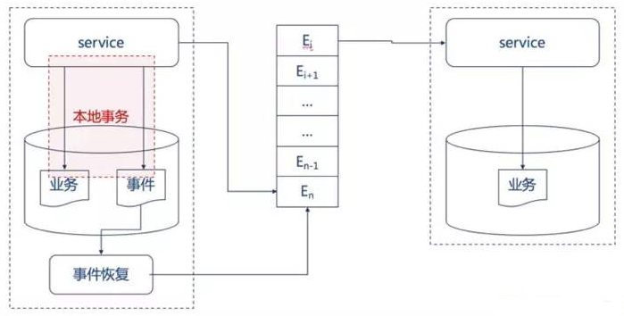
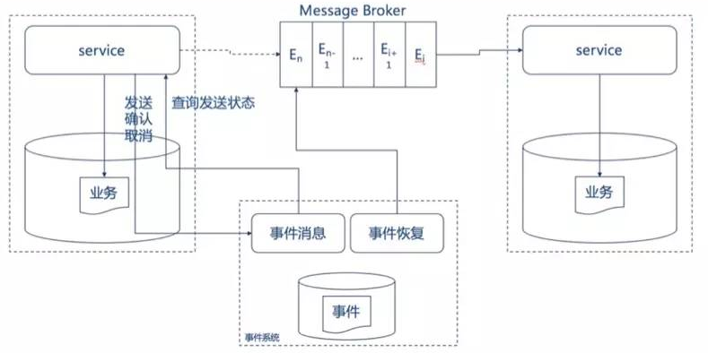

+++
title="微服务数据一致性基础认知"
categories=["微服务"]
date="2020-06-13T05:43:00+08:00"
summary = '微服务数据一致性基础认知'
toc=false
+++

事务与分布式事务
================

事务CAID
--------

**原子性（Atomicity）**

原子性是指事务是一个不可分割的工作单位，事务中的操作要么都发生，要么都不发生。

**一致性（Consistency）**

事务前后数据的完整性必须保持一致。

**隔离性（Isolation）**

事务的隔离性是多个用户并发访问数据库时，数据库为每一个用户开启的事务，不能被其他事务的操作数据所干扰，多个并发事务之间要相互隔离。

**持久性（Durability）**

持久性是指一个事务一旦被提交，它对数据库中数据的改变就是永久性的，接下来即使数据库发生故障也不应该对其有任何影响

分布式
------

### CAP理论

CAP定律说的是在一个分布式计算机系统中，一致性，可用性和分区容错性这三种保证无法同时得到满足，最多满足两个。

### 分布式事务基础BASE

BASE 是基本可用（Basically Available）、软状态（ Soft State）、最终一致性（ Eventual Consistency）三个短语的简写。

BASE理论是对CAP中一致性和可用性权衡的结果，是基于CAP定力逐步演化而来的，是源于大规模互联网系统分布式实践的总结。

其核心思想：无法做到强一致性，但是每一个应用都可以根据自身的业务特点，采用适当的方式来使系统达到最终一致性。

实现微服务下数据一致性的方式
============================

可靠事件通知模式
----------------

可靠事件通知模式的设计理念比较容易理解，即是主服务完成后将结果通过事件（常常是消息队列）传递给从服务，从服务在接受到消息后进行消费，完成业务，从而达到主服务与从服务间的消息一致性。

### 同步事件

#### 问题

1.	在微服务的架构下，有可能出现网络IO问题或者服务器宕机的问题，如果这些问题出现在时序图的第7步，使得消息投递后无法正常通知主服务（网络问题），或无法继续提交事务（宕机），那么主服务将会认为消息投递失败，会滚主服务业务，然而实际上消息已经被从服务消费，那么就会造成主服务和从服务的数据不一致。
2.	事件服务（在这里就是消息服务）与业务过于耦合，如果消息服务不可用，会导致业务不可用。

### 异步事件

业务服务和事件服务解耦，事件异步进行，由单独的事件服务保证事件的可靠投递。

#### 本地事件服务

当业务执行时，在同一个本地事务中将事件写入本地事件表，同时投递该事件，如果事件投递成功，则将该事件从事件表中删除。如果投递失败，则使用事件服务定时地异步统一处理投递失败的事件，进行重新投递，直到事件被正确投递，并将事件从事件表中删除。这种方式最大可能地保证了事件投递的实效性，并且当第一次投递失败后，也能使用异步事件服务保证事件至少被投递一次。

#### 外部事件服务

业务服务在提交前，向事件服务发送事件，事件服务只记录事件，并不发送。业务服务在提交或回滚后通知事件服务，事件服务发送事件或者删除事件。不用担心业务系统在提交或者会滚后宕机而无法发送确认事件给事件服务，因为事件服务会定时获取所有仍未发送的事件并且向业务系统查询，根据业务系统的返回来决定发送或者删除该事件。

### 可靠事件通知模式总结

可靠事件模式需要注意的有两点

-	事件的正确发送
-	事件的重复消费

通过异步消息服务可以确保事件的正确发送，然而事件是有可能重复发送的，那么就需要消费端保证同一条事件不会重复被消费，简而言之就是保证事件消费的幂等性。

如果事件本身是具备幂等性的状态型事件，如订单状态的通知（已下单、已支付、已发货等），则需要判断事件的顺序。一般通过时间戳来判断，既消费过了新的消息后，当接受到老的消息直接丢弃不予消费。如果无法提供全局时间戳，则应考虑使用全局统一的序列号。

对于不具备幂等性的事件，一般是动作行为事件，如扣款100，存款200，则应该将事件id及事件结果持久化，在消费事件前查询事件id，若已经消费则直接返回执行结果；若是新消息，则执行，并存储执行结果。

最大努力通知模式
----------------

相比可靠事件通知模式，最大努力通知模式就容易理解多了。最大努力通知型的特点是，业务服务在提交事务后，进行有限次数（设置最大次数限制）的消息发送，比如发送三次消息，若三次消息发送都失败，则不予继续发送。所以有可能导致消息的丢失。同时，主业务方需要提供查询接口给从业务服务，用来恢复丢失消息。最大努力通知型对于时效性保证比较差（既可能会出现较长时间的软状态），所以对于数据一致性的时效性要求比较高的系统无法使用。这种模式通常使用在不同业务平台服务或者对于第三方业务服务的通知，如银行通知、商户通知等。

补偿模式
--------

补偿模式比起事件通知模式最大的不同是，补偿模式的上游服务依赖于下游服务的运行结果，而事件通知模式上游服务不依赖于下游服务的运行结果。

### 业务补偿模式

业务补偿模式是一种纯补偿模式，其设计理念为，业务在调用的时候正常提交，当一个服务失败的时候，所有其依赖的上游服务都进行业务补偿操作。举个例子，小明从杭州出发，去往美国纽约出差，现在他需要定从杭州去往上海的火车票，以及从上海飞往纽约的飞机票。如果小明成功购买了火车票之后发现那天的飞机票已经售空了，那么与其在上海再多待一天，小明还不如取消去上海的火车票，选择飞往北京再转机纽约，所以小明就取消了去上海的火车票。

补偿模式要求每个服务都提供补偿借口，且这种补偿一般来说是不完全补偿，既即使进行了补偿操作，那条取消的火车票记录还是一直存在数据库中可以被追踪（一般是有相信的状态字段“已取消”作为标记），毕竟已经提交的线上数据一般是不能进行物理删除的。

业务补偿模式最大的缺点是软状态的时间比较长，既数据一致性的时效性很低，多个服务常常可能处于数据不一致的情况。

### TCC/Try Confirm Cancel模式

TCC模式是一种优化了的业务补偿模式，它可以做到完全补偿，既进行补偿后不留下补偿的纪录，就好像什么事情都没有发生过一样。同时，TCC的软状态时间很短，原因是因为TCC是一种两阶段型模式（已经忘了两阶段概念的可以回顾一下1.2.1），只有在所有的服务的第一阶段（try）都成功的时候才进行第二阶段确认（Confirm）操作，否则进行补偿(Cancel)操作，而在try阶段是不会进行真正的业务处理的。

TCC模式的具体流程为两个阶段：

-	Try，业务服务完成所有的业务检查，预留必需的业务资源
-	如果Try在所有服务中都成功，那么执行Confirm操作，Confirm操作不做任何的业务检查（因为try中已经做过），只是用Try阶段预留的业务资源进行业务处理；否则进行Cancel操作，Cancel操作释放Try阶段预留的业务资源。

参考
====

1.	[分布式系统之CAP理论](https://www.cnblogs.com/hxsyl/p/4381980.html)
2.	[分布式cap和base](https://www.jianshu.com/p/46b90dfc7c90)
3.	[微服务下的数据一致性的几种实现方式之概述](https://www.jianshu.com/p/b264a196b177#comments)
4.	[分布式事务](https://juejin.im/post/5aa3c7736fb9a028bb189bca)

