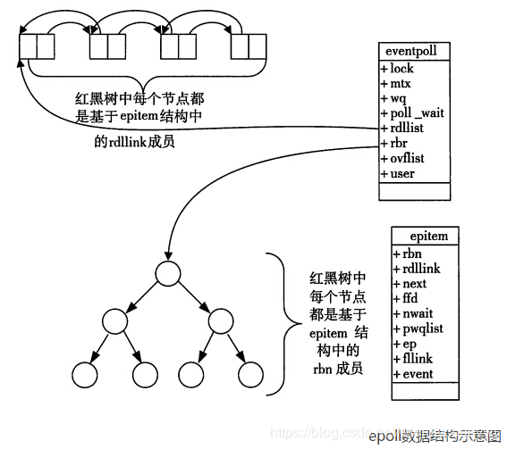

+++
title="Select、Poll、Epoll"
tags=["linux","poll","select"]
categories=["linux"]
date="2020-07-25T11:18:00+08:00"
summary = 'Select、Poll、Epoll'
toc=false
+++

Select、Poll、Epoll
-------------------

介绍select、poll、epoll之前，首先介绍一下Linux操作系统中基础的概念：

-	**用户空间 / 内核空间** 现在操作系统都是采用虚拟存储器，那么对32位操作系统而言，它的寻址空间（虚拟存储空间）为4G（2的32次方） 操作系统的核心是内核，独立于普通的应用程序，可以访问受保护的内存空间，也有访问底层硬件设备的所有权限。为了保证用户进程不能直接操作内核（kernel），保证内核的安全，操作系统将虚拟空间划分为两部分，一部分为内核空间，一部分为用户空间
-	**进程切换** 为了控制进程的执行，内核必须有能力挂起正在CPU上运行的进程，并恢复以前挂起的某个进程的执行。这种行为被称为进程切换。因此可以说，任何进程都是在操作系统内核的支持下运行的，是与内核紧密相关的，并且进程切换是非常耗费资源的
-	**进程阻塞** 正在执行的进程，由于期待的某些事件未发生，如请求系统资源失败、等待某种操作的完成、新数据尚未到达或无新工作做等，则由系统自动执行阻塞原语(Block)，使自己由运行状态变为阻塞状态。可见，进程的阻塞是进程自身的一种主动行为，也因此只有处于运行态的进程（获得了CPU资源），才可能将其转为阻塞状态。当进程进入阻塞状态，是不占用CPU资源的
-	**文件描述符** 文件描述符（File descriptor）是计算机科学中的一个术语，是一个用于表述指向文件的引用的抽象化概念 文件描述符在形式上是一个非负整数。实际上，它是一个索引值，指向内核为每一个进程所维护的该进程打开文件的记录表。当程序打开一个现有文件或者创建一个新文件时，内核向进程返回一个文件描述符。在程序设计中，一些涉及底层的程序编写往往会围绕着文件描述符展开。但是文件描述符这一概念往往只适用于UNIX、Linux这样的操作系统
-	**缓存I/O** 缓存I/O又称为标准I/O，大多数文件系统的默认I/O操作都是缓存I/O。在Linux的缓存I/O机制中，操作系统会将I/O的数据缓存在文件系统的页缓存中，即数据会先被拷贝到操作系统内核的缓冲区中，然后才会从操作系统内核的缓冲区拷贝到应用程序的地址空间

select
------

### 流程

select()的机制中提供一种fd_set的数据结构，实际上是一个long类型的数组，每一个数组元素都能与一打开的文件句柄（不管是Socket句柄,还是其他文件或命名管道或设备句柄）建立联系，建立联系的工作由程序员完成，当调用select()时，由内核根据IO状态修改fd_set的内容，由此来通知执行了select()的进程哪一Socket或文件可读。

从流程上来看，使用select函数进行IO请求和同步阻塞模型没有太大的区别，甚至还多了添加监视socket，以及调用select函数的额外操作，效率更差。但是，使用select以后最大的优势是用户可以在一个线程内同时处理多个socket的IO请求。用户可以注册多个socket，然后不断地调用select读取被激活的socket，即可达到在同一个线程内同时处理多个IO请求的目的。而在同步阻塞模型中，必须通过多线程的方式才能达到这个目的。

### 问题

-	**问题1**：每次调用select，都需要把fd_set集合从用户态拷贝到内核态，如果fd_set集合很大时，那这个开销也很大
-	**问题2**：同时每次调用select都需要在内核遍历传递进来的所有fd_set，如果fd_set集合很大时，那这个开销也很大
-	**问题3**：为了减少数据拷贝带来的性能损坏，内核对被监控的fd_set集合大小做了限制，并且这个是通过宏控制的，大小不可改变(限制为1024)

poll
----

poll的机制与select类似，与select在本质上没有多大差别，管理多个描述符也是进行轮询，根据描述符的状态进行处理，但是poll没有最大文件描述符数量的限制。也就是说，poll只解决了上面的问题3，并没有解决问题1，2的性能开销问题。

epoll
-----

epoll在Linux2.6内核正式提出，是基于事件驱动的I/O方式，相对于select来说，epoll没有描述符个数限制，使用一个文件描述符管理多个描述符，将用户关心的文件描述符的事件存放到内核的一个事件表中，这样在用户空间和内核空间的copy只需一次。

epoll能显著提高程序在大量并发连接中只有少量活跃的情况下的系统CPU利用率。原因就是获取事件的时候，它无须遍历整个被侦听的描述符集，只要遍历那些被内核IO事件异步唤醒而加入Ready队列的描述符集合就行了。

epoll除了提供select/poll那种IO事件的水平触发（Level Triggered）外，还提供了边缘触发（Edge Triggered），这就使得用户空间程序有可能缓存IO状态，减少epoll_wait/epoll_pwait的调用，提高应用程序效率。

-	**水平触发（LT）**：默认工作模式，即当epoll_wait检测到某描述符事件就绪并通知应用程序时，应用程序可以不立即处理该事件；下次调用epoll_wait时，会再次通知此事件
-	**边缘触发（ET）**： 当epoll_wait检测到某描述符事件就绪并通知应用程序时，应用程序必须立即处理该事件。如果不处理，下次调用epoll_wait时，不会再次通知此事件

LT和ET原本应该是用于脉冲信号的，可能用它来解释更加形象。Level和Edge指的就是触发点，Level为只要处于水平，那么就一直触发，而Edge则为上升沿和下降沿的时候触发

ET模式很大程度上减少了epoll事件的触发次数，因此效率比LT模式下高。

### 相关实现

#### 使用流程

epoll的设计和实现与select完全不同，调用分成了3个部分：

1.	调用epoll_create()建立一个epoll对象(在epoll文件系统中为这个句柄对象分配资源)
2.	调用epoll_ctl向epoll对象中添加、删除更改连接的套接字
3.	调用epoll_wait收集发生的事件的连接

#### 实现原理

当某一进程调用epoll_create方法时，Linux内核会创建一个eventpoll结构体，这个结构体中有两个成员与epoll的使用方式密切相关。eventpoll结构体如下所示

```c

struct eventpoll{
    ....
    /*红黑树的根节点，这颗树中存储着所有添加到epoll中的需要监控的事件*/
    struct rb_root  rbr;
    /*双链表中则存放着将要通过epoll_wait返回给用户的满足条件的事件*/
    struct list_head rdlist;
    ....
};
```

每一个epoll对象都有一个独立的eventpoll结构体，用于存放通过epoll_ctl方法向epoll对象中添加进来的事件。这些事件都会挂载在红黑树中，如此，重复添加的事件就可以通过红黑树而高效的识别出来(红黑树的插入时间效率是lgn，其中n为树的高度)。

所以为什么使用红黑树？

epoll内核中维护了一个内核事件表，它是将所有的文件描述符全部都存放在内核中，系统去检测有事件发生的时候触发回调，当要添加新的文件描述符的时候也是调用epoll_ctl函数使用EPOLL_CTL_ADD宏来插入，epoll_wait也不是每次调用时都会重新拷贝一遍所有的文件描述符到内核态。现在要在内核中长久的维护一个数据结构来存放文件描述符，并且时常会有插入，查找和删除的操作发生，这对内核的效率会产生不小的影响，因此需要一种插入，查找和删除效率都不错的数据结构来存放这些文件描述符，那么红黑树当然是不二的人选。

而所有添加到epoll中的事件都会与设备(网卡)驱动程序建立回调关系，也就是说，当相应的事件发生时会调用这个回调方法。这个回调方法在内核中叫ep_poll_callback,它会将发生的事件添加到rdlist双链表中。

在epoll中，对于每一个事件，都会建立一个epitem结构体，如下所示：

```c
struct epitem{
    struct rb_node  rbn;//红黑树节点
    struct list_head    rdllink;//双向链表节点
    struct epoll_filefd  ffd;  //事件句柄信息
    struct eventpoll *ep;    //指向其所属的eventpoll对象
    struct epoll_event event; //期待发生的事件类型
}
```

当调用epoll_wait检查是否有事件发生时，只需要检查eventpoll对象中的rdlist双链表中是否有epitem元素即可。如果rdlist不为空，则把发生的事件复制到用户态，同时将事件数量返回给用户。



对比总结
--------

|              | select                                       | poll                                         | epoll                                                                                             |
|:------------:|:--------------------------------------------:|:--------------------------------------------:|:-------------------------------------------------------------------------------------------------:|
|   操作方式   |                     遍历                     |                     遍历                     |                                               回调                                                |
|   底层实现   |                     数组                     |                     链表                     |                                              红黑树                                               |
|    IO效率    |   每次调用都进行线性遍历，时间复杂度为O(n)   |   每次调用都进行线性遍历，时间复杂度为O(n)   | 事件通知方式，每当fd就绪，系统注册的回调函数就会被调用，将就绪fd放到readyList里面，时间复杂度O(1) |
| 最大连接数式 |                     1024                     |                    无上限                    |                                              无上限                                               |
|    fd拷贝    | 每次调用，都需要把fd集合从用户态拷贝到内核态 | 每次调用，都需要把fd集合从用户态拷贝到内核态 |                     调用epoll_ctl时拷贝进内核并保存，之后每次epoll_wait不拷贝                     |

参考
----

-	[IO多路复用的三种机制Select，Poll，Epoll](https://www.jianshu.com/p/397449cadc9a)
-	[深入理解select、poll和epoll及区别](https://blog.csdn.net/wteruiycbqqvwt/article/details/90299610)

