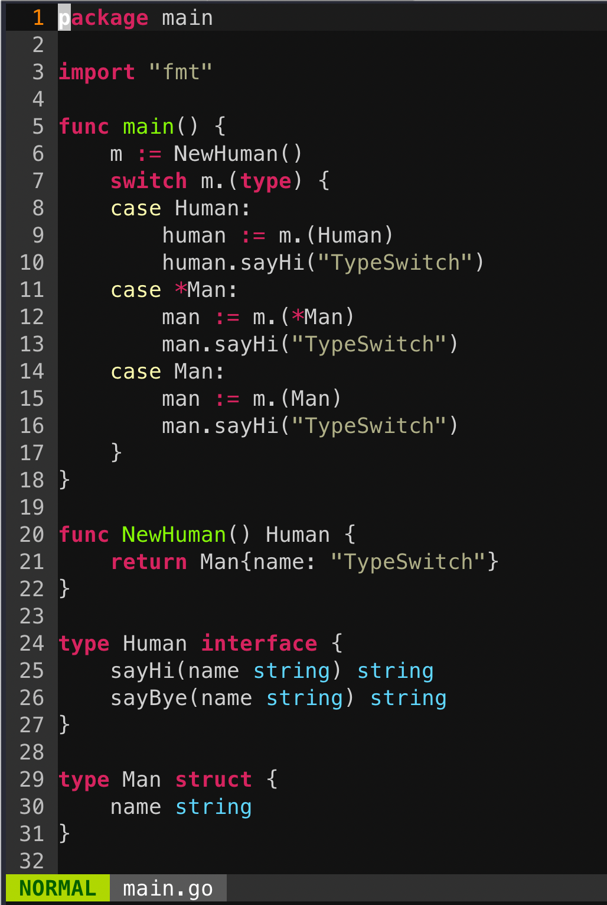
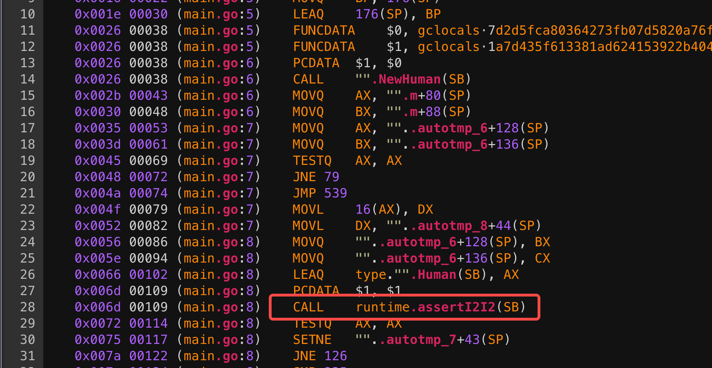

+++
title="Golang|interface"
date="2020-08-31T09:26:00+08:00"
categories=["Golang"]
toc=false
+++

接口是一种抽象类型，它没有暴露所含数据的布局或者内部结构，当然也没有哪些数据的基本操作，所提供的仅仅是一些方法。当你拿到一个接口类型的变量，你无从知道它是什么，但你能知道它能做什么，或者更精确地讲，仅仅是它提供了哪些方法。

## 接口定义

Go 语言提供了 interface 关键字，接口中只能定义需要实现的方法，不能包含任何的变量

Go 语言中的接口类型会根据是否包含一组方法而分成两种不同的实现，分别为包含一组方法的 iface 结构体和不包含任何方法的 eface 结构体

### iface

```go
//runtime/runtime2.go
type iface struct {
  tab  *itab
  data unsafe.Pointer 
  //unsafe.Pointer类型是一种特殊类型的指针，
  //它可以存储任何变量的地址（类似C语言的void*）
}

//runtime/runtime2.go
type itab struct {
  inter *interfacetype 
  // 接口的类型信息，定义接口的类型、路径、方法集合
  _type *_type 
  // 实现接口的具体类型信息
  hash  uint32 
  // copy of _type.hash. Used for type switches.
  _   [4]byte
  fun   [1]uintptr 
  // 具体类型实现的方法地址 variable sized. 
  // fun[0]==0 means _type does not implement inter.
}

//runtime/type.go
type interfacetype struct {
  typ   _type
  pkgpath name
  mhdr  []imethod
}

type _type struct {
  size     uintptr 
  // 类型占用内存大小
  ptrdata  uintptr 
  // 包含所有指针的内存前缀大小
  hash     uint32  
  // 类型 hash
  tflag    tflag   
  // 标记位，主要用于反射
  align    uint8   
  // 对齐字节信息
  fieldAlign uint8   
  // 当前结构字段的对齐字节数
  kind     uint8   
  // 基础类型枚举值
  equal func(unsafe.Pointer, unsafe.Pointer) bool 
  // 比较两个形参对应对象的类型是否相等
  gcdata  *byte  
  // GC 类型的数据
  str     nameOff  
  // 类型名称字符串在二进制文件段中的偏移量
  ptrToThis typeOff  
  // 类型元信息指针在二进制文件段中的偏移量
}
```

itab 用于表示具体类型和接口类型关系

- `inter` 是接口类型定义信息
- `_type` 是具体类型的信息
- `hash`是`_type.hash`的拷贝，在类型转换时，快速判断目标类型和接口中类型是否一致
- `fun`是实现方法地址列表，虽然 fun 固定长度为 1 的数组，但是这其实是一个柔型数组，保存元素的数量是不确定的，如有多个方法，则会按照字典顺序排序

interfacetype 是描述接口定义的信息

- `_type` 接口的类型信息
- `pkgpath` 是定义接口的包名
- `mhdr` 是接口中定义的函数表，按字典序排序

### eface

```go
//runtime/runtime2.go
type eface struct {
  _type *_type // 类型信息
  data  unsafe.Pointer
}
```

## itab缓存

对于itab来说，既然一个非空的接口类型和一个动态类型就可以确定一个itab的内容，那么这个itab结构体自然是可以被接口类型和动态类型均相同的接口变量进行复用的。这就是itabTable

```go
const itabInitSize = 512
// Note: change the formula in the mallocgc 
// call in itabAdd if you change these fields.
type itabTableType struct {
  size  uintptr       
  // 记录数组的大小，总是2的次幂。
  count   uintptr       
  // 记录数组中已使用了多少。
  entries [itabInitSize]*itab 
  // *itab数组，初始大小是512。
}
```

### 初始化和添加

需要一个itab时，会首先去itabTable里查找，计算哈希值时会用到接口类型(itab.inter)和动态类型(itab._type)的类型哈希值，如果能查询到对应的itab指针，就直接拿来使用。若没有就要再创建，然后添加到itabTable中。

go的启动时，schedinit里面调用的itabsinit

```go
func itabsinit() {
  lock(&itabLock)
  for _, md := range activeModules() {
    for _, i := range md.itablinks {
      itabAdd(i)
    }
  }
  unlock(&itabLock)
}

func itabAdd(m *itab) {
  // Bugs can lead to calling this while mallocing is set,
  // typically because this is called while panicing.
  // Crash reliably, rather than only when we need to grow
  // the hash table.
  if getg().m.mallocing != 0 {
    throw("malloc deadlock")
  }

  t := itabTable
  if t.count >= 3*(t.size/4) { // 75% load factor
    // Grow hash table.
    // t2 = new(itabTableType) + some additional entries
    // We lie and tell malloc we want pointer-free memory because
    // all the pointed-to values are not in the heap.
    t2 := (*itabTableType)(mallocgc((2+2*t.size)*sys.PtrSize, nil, true))
    t2.size = t.size * 2

    // Copy over entries.
    // Note: while copying, other threads may look for an itab and
    // fail to find it. That's ok, they will then try to get the itab lock
    // and as a consequence wait until this copying is complete.
    iterate_itabs(t2.add)
    if t2.count != t.count {
      throw("mismatched count during itab table copy")
    }
    // Publish new hash table. Use an atomic write: see comment in getitab.
    atomicstorep(unsafe.Pointer(&itabTable), unsafe.Pointer(t2))
    // Adopt the new table as our own.
    t = itabTable
    // Note: the old table can be GC'ed here.
  }
  t.add(m)
}
```

itabAdd函数代码中可以看到，当hash表使用达到75%或以上时，就会进行扩容，容量是原来的2倍，申请完空间，就会把老表中的数据插入到新的hash表中。然后使itabTable指向新的表，最后把新的itab插入到新表中。

### 获取itab

```go
func getitab(inter *interfacetype, typ *_type, canfail bool) *itab {
  if len(inter.mhdr) == 0 {
    throw("internal error - misuse of itab")
  }

  // easy case
  if typ.tflag&tflagUncommon == 0 {
    if canfail {
      return nil
    }
    name := inter.typ.nameOff(inter.mhdr[0].name)
    panic(&TypeAssertionError{nil, typ, &inter.typ, name.name()})
  }

  var m *itab

  //先用t保存全局itabTable的地址，然后使用t.find去查找，这样是
  //为了防止查找过程中，itabTable被替换导致查找错误
  t := (*itabTableType)(atomic.Loadp(unsafe.Pointer(&itabTable)))
  if m = t.find(inter, typ); m != nil {
    goto finish
  }

  //如果没找到，那么就会上锁，然后使用itabTable.find去查找，
  //这样是因为在第一步查找的同时，另外一个协程写入，
  //可能导致实际存在却查找不到，这时上锁避免itabTable被替换
  //然后直接在itabTable中查找。
  lock(&itabLock)
  if m = itabTable.find(inter, typ); m != nil {
    unlock(&itabLock)
    goto finish
  }

  // Entry doesn't exist yet. Make a new entry & add it.
  //再没找到，说明确实没有，那么就根据接口类型、数据类型，去生成一个新的itab
  //然后插入到itabTable中，这里可能会导致hash表扩容，
  m = (*itab)(persistentalloc(unsafe.Sizeof(itab{})+ \
  uintptr(len(inter.mhdr)-1)*sys.PtrSize, 0, &memstats.other_sys))
  m.inter = inter
  m._type = typ
  // The hash is used in type switches. However, compiler statically generates itab's
  // for all interface/type pairs used in switches (which are added to itabTable
  // in itabsinit). The dynamically-generated itab's never participate in type switches,
  // and thus the hash is irrelevant.
  // Note: m.hash is _not_ the hash used for the runtime itabTable hash table.
  m.hash = 0
  m.init()
    //这里可能存在hash扩容
  itabAdd(m)
  unlock(&itabLock)
finish:
  if m.fun[0] != 0 {
    return m
  }
  if canfail {
    return nil
  }
  //如果数据类型并没有实现接口,那么根据调用方式，该报错报错，该panic panic。
  panic(&TypeAssertionError{concrete: typ, asserted: &inter.typ, missingMethod: m.init()})
}

//哈希值时会用到接口类型(itab.inter)和动态类型(itab._type)的类型哈希值：
func itabHashFunc(inter *interfacetype, typ *_type) uintptr {
  // compiler has provided some good hash codes for us.
  return uintptr(inter.typ.hash ^ typ.hash)
}

// find finds the given interface/type pair in t.
// Returns nil if the given interface/type pair isn't present.
func (t *itabTableType) find(inter *interfacetype, typ *_type) *itab {
  //开放地址探测法，用的是公式h(i) = h0 + i*(i+1)/2 mod 2^k，
  //h0是根据接口类型和数据类型的hash字段算出来的
  mask := t.size - 1
  h := itabHashFunc(inter, typ) & mask
  for i := uintptr(1); ; i++ {
    p := (**itab)(add(unsafe.Pointer(&t.entries), h*sys.PtrSize))
    // Use atomic read here so if we see m != nil, we also see
    // the initializations of the fields of m.
    // m := *p
    m := (*itab)(atomic.Loadp(unsafe.Pointer(p)))
    if m == nil {
      return nil
    }
    if m.inter == inter && m._type == typ {
      return m
    }
    h += I
    h &= mask
  }
}

//这个方法会检查interface和type的方法是否匹配
//即type有没有实现interface。interface、type的方法都按字典序排
//所以O(n+m)的时间复杂度可以匹配完。在检测的过程中，匹配上了
//依次往fun字段写入type中对应方法的地址。如果有一个方法没有匹配上
//那么就设置fun[0]为0，在外层调用会检查fun[0]==0，即type并没有实现interface。

func (m *itab) init() string {
  inter := m.inter
  typ := m._type
  x := typ.uncommon()

  // 在 interfacetype 的结构体中，mhdr 存着所有需要实现的方法的
  // 结构体切片 []imethod，都是按照方法名的字典序排列的，其中：
  // ni 是全量的方法（所有要实现的方法）的个数
  // nt 是已实现的方法的个数
  ni := len(inter.mhdr)
  nt := int(x.mcount)
  xmhdr := (*[1 << 16]method)(add(unsafe.Pointer(x), uintptr(x.moff)))[:nt:nt]
  j := 0
imethods:
  for k := 0; k < ni; k++ {
    i := &inter.mhdr[k]
    itype := inter.typ.typeOff(i.ityp)
    name := inter.typ.nameOff(i.name)
    iname := name.name()
    ipkg := name.pkgPath()
    if ipkg == "" {
      ipkg = inter.pkgpath.name()
    }
    for ; j < nt; j++ {
      t := &xmhdr[j]
      tname := typ.nameOff(t.name)
      // 比较已实现方法的 type 和 name 是否一致
      if typ.typeOff(t.mtyp) == itype && tname.name() == iname {
        pkgPath := tname.pkgPath()
        if pkgPath == "" {
          pkgPath = typ.nameOff(x.pkgpath).name()
        }
        if tname.isExported() || pkgPath == ipkg {
          if m != nil {
            // 计算每个 method 对应代码块的内存地址
            ifn := typ.textOff(t.ifn)
            *(*unsafe.Pointer)(add(unsafe.Pointer(&m.fun[0]), uintptr(k)*sys.PtrSize)) = ifn
          }
          continue imethods
        }
      }
    }
    //如果没有找到，将 func[0] 设置为0，返回该实现的 method 的 name
    m.fun[0] = 0
    return iname
  }
  m.hash = typ.hash
  return ""
}
```

get的时候，不仅仅会从itabTalbe中查找，还可能会创建插入，itabTable使用容量超过75%还会扩容。

## 接口使用

首先学习一下查看底层runtime调用的函数的方法，我们先写一个接口断言



执行命令`go tool compile -S -N -l main.go >main.s1 2>&1`查看汇编



这样就可以知道runtime底层调用的函数了

### 类型断言

对于空接口的类型断言，获取空接口的_type的地址位置和需要断言的类型的_type位置进行比较，如果相同则代表类型一致。

对于非空接口的类型断言，还需要校验接口函数的实现，上一个小节介绍了itab的缓存，其中有接口实现的判断，因此非空接口的断言如下

```go
func assertI2I2(inter *interfacetype, i iface) (r iface, b bool) {
  tab := i.tab //获取itab
  if tab == nil {
    return
  }
  //先判断itab的inter是否等于要断言的接口类型
  if tab.inter != inter {
        //获取itab 
    tab = getitab(inter, tab._type, true)
    if tab == nil {
            //断言失败 返回nil和false
      return
    }
  }
    //断言成功 赋值
  r.tab = tab
  r.data = i.data
  b = true
  return
}
```

### 类型查询

对于空接口的查询，具体代码

```go
// runtime/iface.go
func assertE2I2(inter *interfacetype, e eface) (r iface, b bool) {
  //获取eface的类型元数据
  t := e._type
  if t == nil {
    return
  }
  tab := getitab(inter, t, true)
  if tab == nil {
    return
  }
  r.tab = tab
  r.data = e.data
  b = true
  return
}
```

从空接口的eface的_type里取出类型元数据，再根据传入的interfacetype 去判断是否有对应的接口实现，成功则断言成功，否则返回nil和false

对于非空接口的查询，代码如下

```go
// runtime/iface.go
func assertI2I2(inter *interfacetype, i iface) (r iface) {
  tab := i.tab
  if tab == nil {
    return
  }
  if tab.inter != inter {
    tab = getitab(inter, tab._type, true)
    if tab == nil {
      return
    }
  }
  r.tab = tab
  r.data = i.data
  return
}
```

可以看到和空接口查询类似，都是基于itab的查询实现校验。

## 参考

- [理解Go interface的两种底层实现:iface和eface](https://blog.frognew.com/2018/11/go-interface-iface-eface.html)
- [Interface 实现原理分析](https://blog.csdn.net/ITqingliang/article/details/104647565/)
- [Go interface的底层实现研究(1)](https://zhuanlan.zhihu.com/p/425443573)
- [Go interface的底层实现研究(2)](https://zhuanlan.zhihu.com/p/427814919)
- [Go interface的底层实现研究(3)](https://zhuanlan.zhihu.com/p/427838620)
- [Go interface的底层实现研究(4)](https://zhuanlan.zhihu.com/p/432045985)
