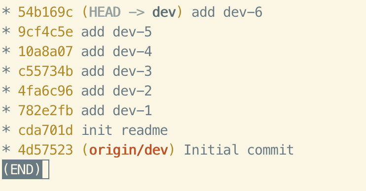
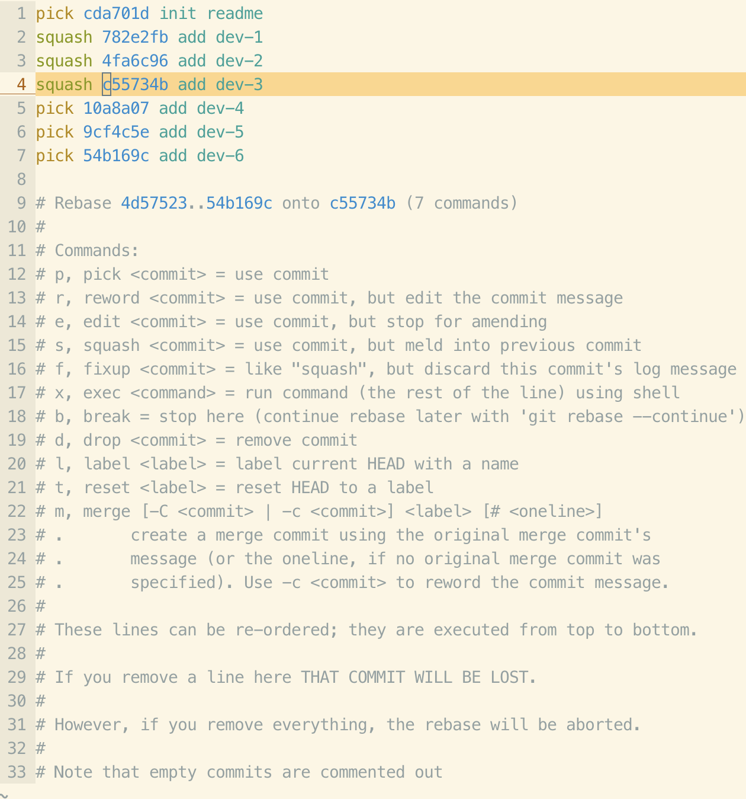
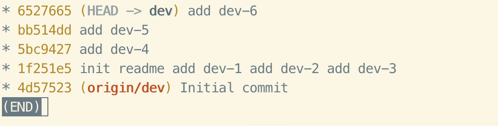
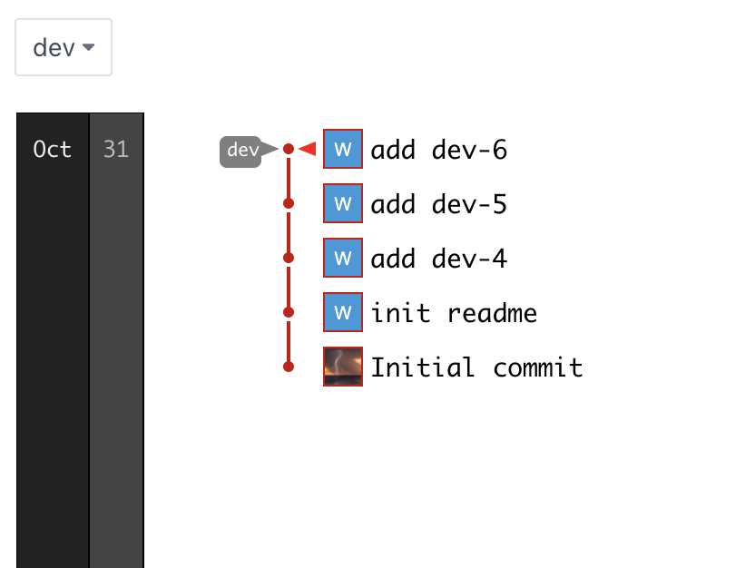
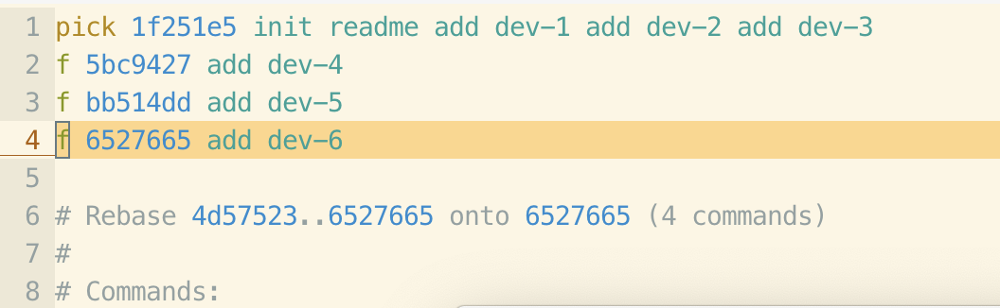
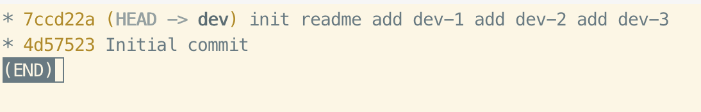
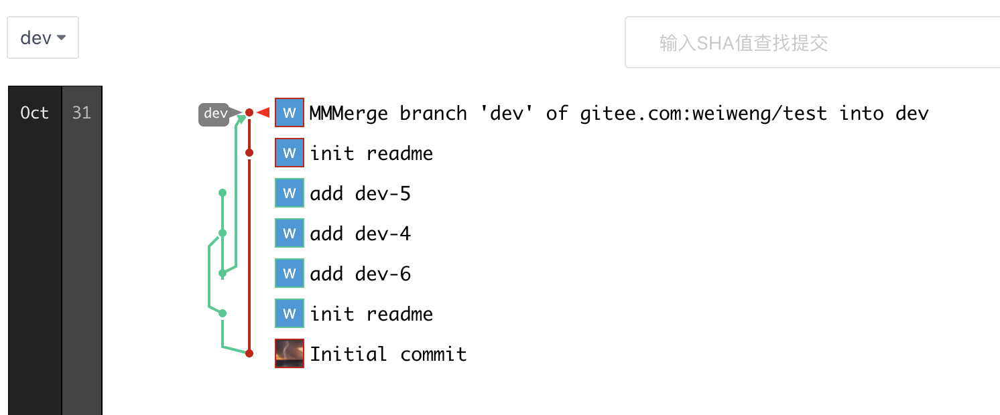
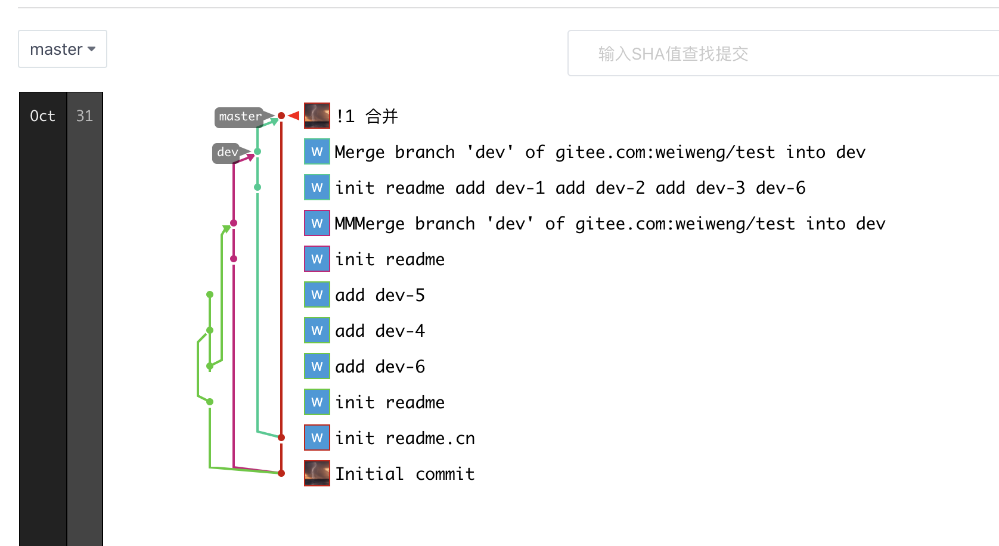

+++
title="git|rebase"
tags=["git","rebase"]
categories=["git"]
date="2020-10-31T03:04:00+08:00"
summary = 'git|rebase'
toc=false
+++

rebase
======

git rebase，字面意思就是从新奠定基础，能够将分叉的分支重新合并

使用
====

整理分支的本地多个提交
----------------------

### 如图 dev分支6个本地的commit

### 当前分支，使用命令**`git rebase -i`**

### 如图所示，将dev-1、dev-2、dev-3合并到init的commit

### 编辑后会进入commit comment重新编辑页面，编辑合并的comment信息

整理分支的远程多个提交
----------------------

### 如图dev push到远程

### 想要合并已经push到远程的commit

### 在dev分支，执行**`git rebase -i dev~4`**，这里的4是含义是当前HEAD到前4个commit的重新编辑

### 重新提交，因为这里把之前的comment丢弃，所以提示拉取远程后再次合并，结果如下

合并代码，log线性化
-------------------

### dev分支开发完成，想要合并master

### 一般操作是先把master代码拉取，合并到dev，然后dev提交

### 这样存在一个分支图分叉的问题，强迫症患者觉得很不雅

### 新方法，本地master拉取最新代码，在dev分支上使用**`git rebase -i master`**

### 具体含义可以理解基于master代码筑基

### 解决冲突后执行**`git push -f`**

### 解决冲突后提交

### 看到master分支是线性的

参考
====

