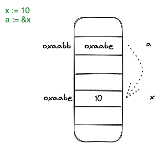

+++
title="Golang|学习教程(三)-结构体"
date="2023-02-02T19:50:00+08:00"
categories=["Golang"]
toc=true
+++

本小节介绍go语言中的结构体，由于go语言没有面向对象的设计，但我们可以通过结构体去实现面向对象的继承、封装、多态特性。

## 指针

在介绍结构体之前，还需要了解一下go语言中指针的相关概念和用法。和c语言一样，如果一个变量是指针，则表示这个变量存储的数据是指向其目标变量的存储地址。



我们通过`*`符号定义指针变量，通过`&`符号获取变量地址，和c语言类似，我们也通过`*`符号去获取目标变量的值。

```go
var p *int

i := 42
p = &i

fmt.Println(*p) // 打印p指向的变量i的数值

*p = 21 // 通过指针修改 i 的值
```

## 结构体

go语言的结构体，可以理解为一些字段的合集。我们通过`type`和`struct`两个关键字定义结构体。

```go
type Vertex struct {
	X int
	Y int
    z int
}

func main() {
	v := Vertex{1, 2}
	v.X = 4
	fmt.Println(v.X)

	z := new(Vertex)
	fmt.Println(z.X)

    w := Vertex{X:4, Y:2}
    w.X = 42

    w.z // 这里会报错，无法导出小写字段
}
```

通过示例可以看到，结构体的初始化方式，通过结构体字段赋值即可，可以指定字段名赋值，如果没有指定字段名，则按照结构体定义从上到下，将初始化给定的数据自动赋值对应字段。

此外，结构体的字段导出和包的变量、函数导出一致，只有大写的字段名才能够导出使用，如果是小写的字段名，则其作用于只局限于结构体的方法，这一部分之后会介绍到。

我们在范围结构体的字段时，可以直接使用`.`符号获取可导出字段使用，在go语言的结构体中还有一个比较另类的特点就是结构体指针也可以直接通过`.`符号获取字段数据，而不用显示的解引用。

```go
type Vertex struct {
	X int
	Y int
}

func main() {
	v := Vertex{1, 2}
	p := &v
    // p是一个结构体指针，这里可以直接通过 . 获取并使用字段
	p.X = 1e9
	fmt.Println(v)
}
```

### 匿名结构体

在定义结构体时，我们可以直接不指定字段名的情况下包含其他的结构体，这时这种被包含的结构体我们称之为匿名结构体。

```go
type innerS struct {
    in1 int
    in2 int
}

type outerS struct {
    b    int
    c    float32
    innerS //anonymous field
}
```

当我们要访问匿名结构体的字段时，可以依旧直接使用`.`进行读取。此外如果匿名结构体的字段名和外部定义的字段名重复的话，我们就需要指定结构体的名称去访问了。

```go
type inner struct {
	a int
	b int
}

type outer struct {
	a int
	inner
}

func read() {
	o := outer{}
	fmt.Println(o.a)
	fmt.Println(o.inner.a)
}
```

## 参考

- [A Tour of Go](https://go.dev/tour/moretypes/1)