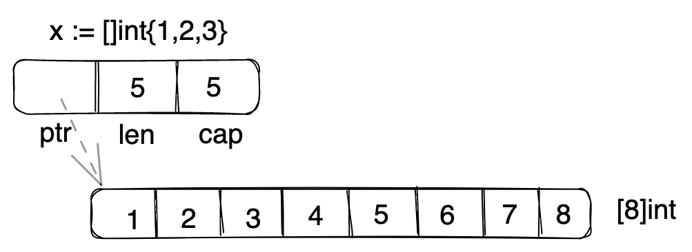

+++
title="Golang|学习教程(四)-数组和切片"
date="2023-02-05T09:50:00+08:00"
categories=["Golang"]
toc=true
+++

本小节学习go语言的数组和切片，一门编程语言肯定少不了基本数据结构数组，go语言中还有另外的类型切片，和数组的区别是数组的大小是固定的，是不可改动的，而切片是可以动态扩展的。

## 数组

首先说一说数组，go语言中使用`[n]T`来定义数组，例如`var p [5]int`，这里我们定义了一个整数数组，数组大小是5。

数组如何初始化？go语言提供了以下方法：

```go
var p [5]int = [5]int{1,2,3,4,5}
q := [5]int{1,2,3,4,5}

// 可以使用... go会自动计算数组大小
var t = [...]int{1,2,3}
```

获取数组的内部指，我们可以使用下标，下标从0开始计数，最大的下标`len(数组)-1`，如果下标超过了最大值，则会发出下标越界的panic。

```go
p := [3]int{1,2,3}
fmt.Println("%d%d",p[0],p[1])
```
除了使用指定下标获取指定数值，我们还可以使用`p[low:high]`的形式，获取范围内的数据，这里返回的就是一个切片了，后续介绍切片。需要注意的是，这种范围取值是**左闭右开**的，即包括左边值，但不包括右边值，此外如果`low==high`则返回的就是空切片了。

```go
s := [6]int{2, 3, 5, 7, 11, 13}
fmt.Println(s[0:3])

fmt.Println(s[0:0])
```
数组的遍历可以使用`for`循环基于下标的遍历，也可以配合`range`来遍历。

```go
s := [6]int{2, 3, 5, 7, 11, 13}
for i:=0;i<len(s);i++{
    fmt.Println(s[i])
}
for idx,val := range s{
    fmt.Println(idx,val)
}
```

学习了基础的一维数组，自然而然还需要知道多维数组，多维数组的定义和其他语言类似，通过多个`[]`制定大小即可。

```go
var p [2][3]int // 定义了2x3的二维数组
```

## 切片

切片是一种可以动态扩展的数组，它可以动态扩展，但也正因为可以动态扩展，也存在一些奇怪的特性需要注意。

首先来了解切片的定义，切片使用`[]T`格式来定义，和数组定义的区别就是不需要指定大小。定了切片后我们学习如何初始化，方法有以下几种：

```go
// 定义切片p，定义后p位nil
var p []int
p = []int{1,2,3}
// 使用make初始化，后面只有一个参数是，是指定大小
// 元素默认值是类型默认值
p = make([]int,3)
// 使用make初始化，后续2个参数，则一个是指定大小，一个是指定容量
p = make([]int,2,5)

// pp是数组，切片可以使用数组来初始化
pp := [3]int{1,2,3}
p = pp[:]
```

上面的例子可以看到，切片利用数组进行初始化，这里我们需要对切片的内部进行详细的了解，其实切片可以理解为数组的一种特殊引用，和c语言中字符串的定义类似，切片包含三个元素，即指向底层数组的指针，切片的大小以及切片的容量



了解切片的构造，我们可以知道，如果多个切片底层使用的是同一个数组，则数组有改动，对应的切片也都会变动。

```go
num := [5]int{1,2,3,4,5}

p := num[1:3]
q := num[1:4]

num[1] = 10

fmt.Printf("%v",p)
fmt.Printf("%v",q)
```

切片是可以动态变动大小的，因此我们如何添加元素？这里使用`append`函数。

```go
p := make([]int,0,4)
p = append(p,1)
p = append(p,2)
p = append(p,[]int{1,2,3}...)

var q []int
q = append(q,1)
```

从用例可以看出，append函数还可以一次性添加多元素，不过需要在后面通过`...`符号来指定。

上面的例子还有一点需要注意，就是刚刚定义的切片是`nil`，但我们可以直接使用`append`函数新增元素。

## 参考

- [A Tour of Go](https://go.dev/tour/moretypes/6)