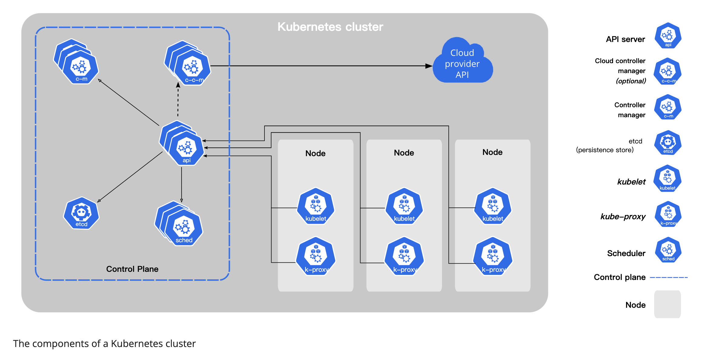

+++
title="k8s|基础概念"
date="2023-03-21T20:00:00+08:00"
categories=["k8s"]
toc=true
draft=false
+++

参考官网，k8s的定义是：Kubernetes 是一个可移植、可扩展的开源平台，用于管理容器化的工作负载和服务，可促进声明式配置和自动化。 Kubernetes 拥有一个庞大且快速增长的生态，其服务、支持和工具的使用范围相当广泛。

简单来说，k8s是用于容器管理的一个完整全面的开源平台工具。它能够为我们提供了一个可弹性运行分布式系统的框架，满足服务的扩展要求、故障转移、提供部署模式等功能。

Kubernetes 可以提供：

- 服务发现和负载均衡

    Kubernetes 可以使用 DNS 名称或自己的 IP 地址来暴露容器。 如果进入容器的流量很大， Kubernetes 可以负载均衡并分配网络流量，从而使部署稳定。

- 存储编排

    Kubernetes 允许你自动挂载你选择的存储系统，例如本地存储、公共云提供商等。

- 自动部署和回滚

    你可以使用 Kubernetes 描述已部署容器的所需状态， 它可以以受控的速率将实际状态更改为期望状态。 例如，你可以自动化 Kubernetes 来为你的部署创建新容器， 删除现有容器并将它们的所有资源用于新容器。

- 自动完成装箱计算

    你为 Kubernetes 提供许多节点组成的集群，在这个集群上运行容器化的任务。 你告诉 Kubernetes 每个容器需要多少 CPU 和内存 (RAM)。 Kubernetes 可以将这些容器按实际情况调度到你的节点上，以最佳方式利用你的资源。

- 自我修复

    Kubernetes 将重新启动失败的容器、替换容器、杀死不响应用户定义的运行状况检查的容器， 并且在准备好服务之前不将其通告给客户端。

- 密钥与配置管理

    Kubernetes 允许你存储和管理敏感信息，例如密码、OAuth 令牌和 ssh 密钥。 你可以在不重建容器镜像的情况下部署和更新密钥和应用程序配置，也无需在堆栈配置中暴露密钥。

# 组件

## Control Plane

控制面板组件是k8s集群的决策中心，负责检测和响应集群事件。其中包括以下几个部分：

- kube-apiserver

    api对外接口，提供外部控制的服务中心

- etcd

    高可用的一致性分布式kv存储系统，用于存储k8s的元数据信息

- kube-scheduler

    调度控制中心，监听新pod的创建，为新pod选择合适的node。

- kube-controller-manager

    控制管理，处理node、job、endpoint等事件。

- cloud-controller-manager

    关联云平台相关接口的控制器。

## node

k8s集群有一些列工作节点组成，每个工作节点包含以下几部分：

- kubelet

    每个node节点内部的控制代理，确保容器运行在pod下面。

- kube-proxy

    网络代理

- container runtime

    运行时容器，实现了k8s CRI接口的都是k8s支持的容器类型。

## DNS

k8s集群中的dns服务，辅助集群的网络调度。

## pod

pod是k8s中管理资源的仔细粒度，是最基础单元。每个Pod都有一个特殊的被称为“根容器”的Pause容器。Pause容器对应的镜像属于Kubernetes平台的一部分，除了Pause容器，每个Pod还包含一个或多个紧密相关的用户业务容器。

# 参考

- [k8s官网](https://kubernetes.io/zh-cn/docs/concepts/overview/)