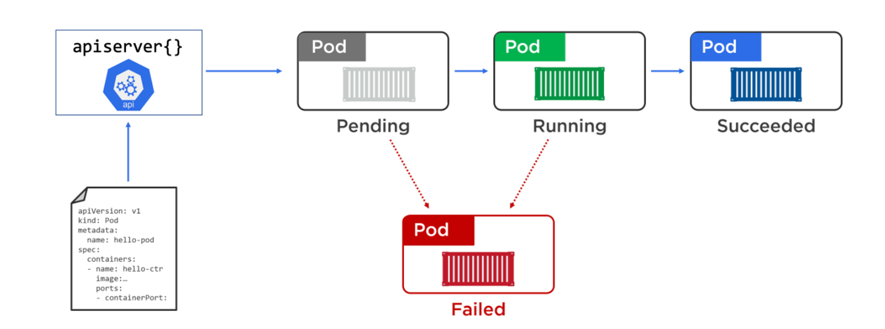
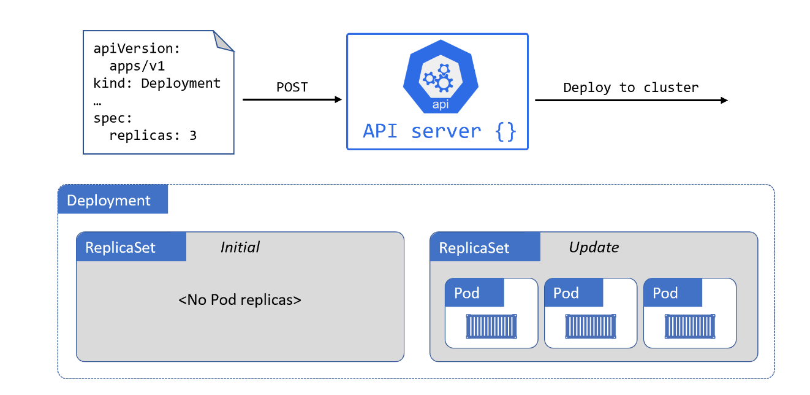
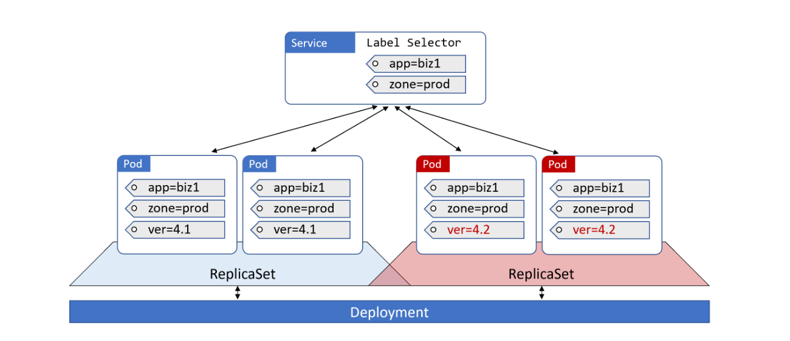
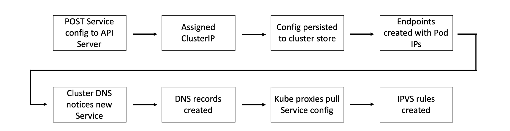
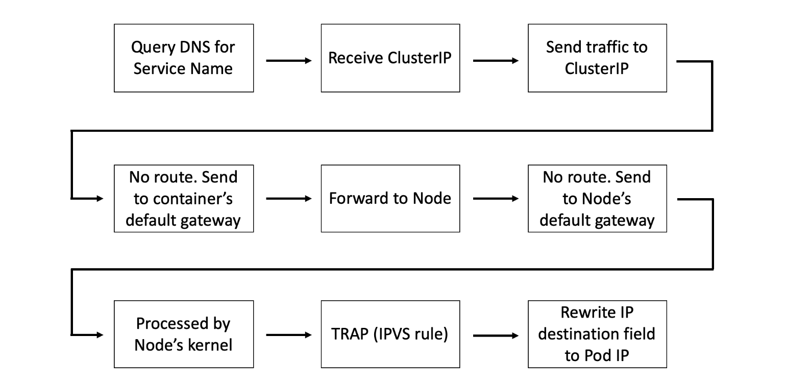

+++
title="k8s|基础进阶"
date="2023-04-22T10:00:00+08:00"
categories=["k8s"]
toc=true
draft=false
+++

最近看了k8s的一本基础英文入门书籍《The Kubernetes Book》，不得不说还是英文教程写的通透，至少是可以一气呵成的从头读到尾，中文书籍可能有些作者自己都不知道写的是啥。当然学习技术相关的知识，主要还是跟踪官网获取最新动态，不过官网的资料大而全而细，因此看一些前人总结的快速入门书籍也是不错的路子，所谓的先总后方，先大后小，简单的从大、总的角度了解一下k8s，然后细致的学习其中的每个小点，这算是我自己这些天的学习总结吧。话不多说，开始记录一些书籍中的学习心得。

## 第一章

首先，本书最开始章节，介绍了什么是k8s，说明了k8s的作用，以及提及的docker，顺带说明了docker的基础功能，以及和k8s的关系。这些我之前的[k8s基础概念](https://weiweng.github.io/blog/post/2023-03-21-k8s%E6%A6%82%E5%BF%B5/)里已经提及过，不再赘述。

## 第二章

开始介绍k8s的组成，首先是作为k8s集群组成的两种节点类型，一个是master节点，一个是node节点，其中master节点我们也称之为control plane，它的组要部件包含API、cluster store(etcd)、controller manager、scheduler、cloud controller manager。而node的组要组件包含kubelet、CRI、kube-proxy这三个部分，关于上面的各个组件的作用，可以看之前的k8s基础概念。

上面的介绍中，API是k8s对外的api接口统一入口，我们通过api接口来操控k8s集群，具体设计操控对象有很多，比如pos、deployments、services、columns、configMaps、statefulSets等，这些对象就是之后章节介绍的主要内容。

## 第三章

这里主要介绍k8s的几种安装方法，当然作为个人学习者，这里推荐官方的一个k8s单机学习部署方法，可以参考官方推荐的[本地搭建环境文档](https://minikube.sigs.k8s.io/docs/start/)。

## 第四章

这一章讲解了pod相关知识，pod是k8s的最基础的调度管理单元，每个pod里面可以包含多个容器，并且单个pod内的所有容器都是协同部署和协同调度的，即理解成”原子性“，这个pod只要部署完成，里面的容器都是可用的。此外，pod内部的容器都是共享内存、网络和volume(存储)的。

pod的部署流程，参见

pod的生命周期图，参见

## 第五章

这一章节简单介绍了deployments，deployments是api中的一个成熟的控制工具，通过相关配置，可以让我们期望部署的应用稳定持续运行起来，支持实现动态扩容、滚动更新、回滚功能。

需要注意的是，deployments通过管理replicaSet来实现自动修复和动态扩容功能，replicaSet底层管理着对应的一系列pod，而pod是k8s里面最基础的调度部署单元。

我们通过deployments申明预期的状态(例如指定的部署应用，副本个数，关联的卷，指定配置等等)，将对应yaml文件传给api实现应用，k8s之后将任务分发到集群，部署好我们需要的应用，满足我们指定的需求，同时也实时监控整个deployments的全部状态，如果出现某个pod运行异常下线了，k8s会分配一个新的pod来部署我们的指定应用服务和配置，从而尽可能的确保符合预期状态。

deployments的相关流程，见

## 第六章

这一章介绍了services，通过deployments的声明，我们选择node节点部署pod，但deployments提供的动态扩容，自主修复以及滚动更新的能力使得pod是变动的，因此这些pod的ip也随着pod的创建和注销而变调。

这就导致了一个问题，我们应该如何监听这种变动的ip，以及如何使用。

因此这里提出了Service这个概念，大概可以理解为在动态变化的ip列表上封装一层稳定的”接口“，通过这个”接口“对外提供一个固定的ip或者一个域名或者一个固定端口来实现客户端的链接使用。

Service通过标签选择器来关联我们需要监听的pod。具体而言，k8s通过不间断的监听健康pod列表，将符合Service指定的标签放入Endpoints里面，如果pod注销了，就会从Endpoints里面移除。

Service提供了不同类型模式，默认的是ClusterIP模式，ClusterIP是集群内部的通信ip，通过内部DNS查询到内部的唯一ip来通信，此外对外部网络的情况，Service提供了NodePort模式，即对外公开的端口。

此外Service提供了其他模式，具体参考官网。

下面这个图展示了Service的使用，通过更新Service的标签，将请求流量打到新版本的集群服务，当然也可以将标签指向老版本实现切流。见

## 第七章

这一章讲了服务发现，之前我们提及因为pod的有限生命周期，我们不能依赖它的ip地址，因此增加了一层Service来保证可用ip通信，随后的问题就是怎么发现这个Service，这里就需要服务发现的功能，说到服务发现，首先需要知道服务注册，只有其他微服务注册了它的地址，才有服务发现一说。

k8s是使用一个内部的dns服务来实现服务注册功能，这个内部dns服务是基于CoreDNS实现的，是k8s的内部原生应用，建立kube-system的Namespace里。由于是内部的原生应用，因此当我们申明Service的时候，k8s会检查到这个object的创建，从而自动的实现服务注册。

服务注册之后就是其他微服务的服务发现逻辑，在申明微服务的时候已经会填写需要通信的服务name，在k8s中通过name去内部dns查询ip，从而实现通信，那怎么知道dns的服务地址呢，这里是k8s统一在服务启动配置里写好的，因此部署服务都是知道dns地址的。

dns的服务注册和服务发现流程，如下：

## 第八章

这一章介绍了数据集volume的概念，在k8s中提出了pv和pvc的设计，其中pv是针对外部数据卷的统一接口封装，pvc是从使用视角提出的需求清单，再pod部署时申明需要的存储需求pvc，由k8s去调度匹配对应的pv实现绑定从而使用。

然后还有一个sc的概念，sc的提成目的是方便管理大量pv和pvc的情况，通过设定不同等级或指定划分的不同类型的sc，再使用时指定所需数据卷的sc类型，就可以方便的关联挂载数据集，实现快速管理。

##  第九章

这一章节介绍了k8s中的配置，在我们部署服务链接mysql等相关服务时需要指定对应账户密码，这种数据不建议明文写在deployments声明中，不安全，所以需要配置，此外不同的环境需要指定的配置也不一样，即生产环境和测试环境的不同需要不同的配置。

在k8s中提供了ConfigMaps这一概念来实现配置。当然链接数据库密码这些需要使用secret来配置，它的设计和用法和ConfigMaps一样，多的只是对配置内容加密。

ConfigMaps可以通过yaml文件配置申明，然后在服务部署配置中关联使用。ConfigMaps的大概实现是通过挂载数据卷的形式，把数据加载到对应pod里。

## 第十章

这一章节介绍了StatefulSets，这是一个类似于deployments的对象，有区别的地方在于以下几点。

第一个是StatefulSets声明部署的pod是比较固定格式的，首先是名字的格式，从0开始，基于`StatefulSets-Name+序列`的格式命名，此外pod的创建也是从0开始依序列部署，删除的话也是从最后一个序列号开始删除，并且在服务运行中，如果某个pod出问题了，k8s会重新部署一个pod，但对应的序列号已经绑定的数据卷关系都是和之前pod是一样的，这样确保保持之前的”状态“。

第二个是StatefulSets对应的Service，它是一个`headless Service`，和普通Service不同的点就是，这个类型的Service会返回所有对应关联的Endpoint的ip地址，此外对于关联的每个pod，其实都有对应的dns可以查询到，其对应dns名称也是有固定格式的。主打的就是一个稳定！

## 其他

剩下章节是安全相关，但感觉写的不是很清晰，也可能是我自己没看懂，不过总的来说，结合本书的大概说明和书里面展示的用例，基本可以入门了。