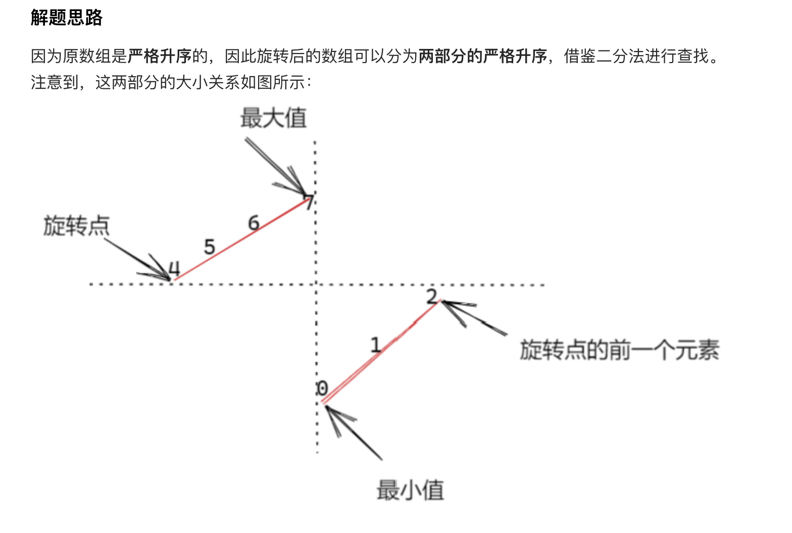
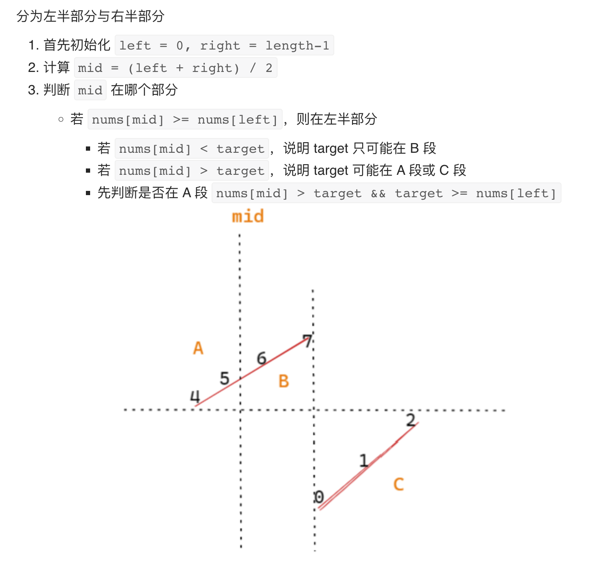
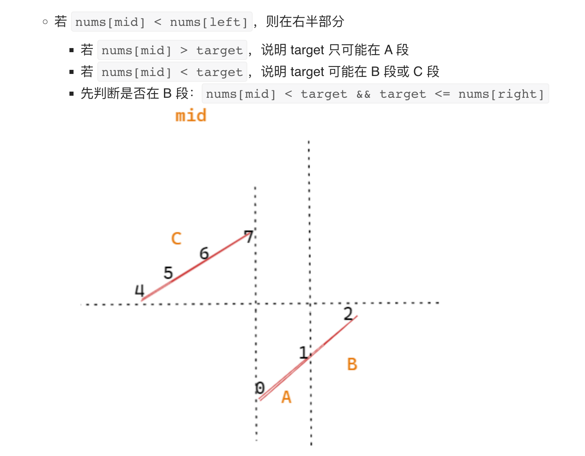

+++
title="算法专题|二分查找"
date="2023-06-11T07:00:00+08:00"
categories=["算法专题"]
toc=false
draft=false
+++

**二分查找** (Binary Search) 也称折半查找，它是一种效率较高的查找方法。但是，折半查找要求线性表必须采用顺序存储结构，而且表中元素按关键字有序排列。

总结有以下特征和解题步骤：

* 寻找有序性
* 寻找判断函数，`func(mid)`
* 使用的二分查找模板

**基础模板**

```go
// 默认a[]int 是递增序列，在a中寻找值等于t的下标，没有返回-1
func binarySearch(a []int, t int) int{
	l,r := 0,len(a)-1 // 这里r的取值是可取的
	for l<=r { // 由于r是可读取的下标，这里l<=r
		mid := l + (r-l)>>1  // 防止越界
		if a[mid] == t {
			return mid
		} else if a[mid] < t {  // 小于目标值，左移l
			l = mid+1
		} else {  // 大于目标值，右移r
			r = mid-1
		}
	}
	return -1 
}

// 默认a[]int 是递增序列，在a中寻找第一个值等于t的下标，没有返回-1
func bs_first(a []int, t int) int {
	l, r := 0, len(a)-1
	for l <= r {
		mid := l + (r-l)>>1
		if a[mid] == t { // 相等时，右边压缩，找到最左值
			r = mid - 1
		} else if a[mid] < t {
			l = mid + 1
		} else {
			r = mid - 1
		}
	}
	if l >= len(a) || a[l] != t {  //这里判断一下，是否等于t
		return -1
	}
	return l
}

// 默认a[]int 是递增序列，在a中寻找最后一个值等于t的下标，没有返回-1
func bs_last(a []int, t int) int {
	l, r := 0, len(a)-1
	for l <= r {
		mid := l + (r-l)>>1
		if a[mid] == t { // 相等时，左边压缩，找到最右边
			l = mid + 1
		} else if a[mid] < t {
			l = mid + 1
		} else {
			r = mid - 1
		}
	}
	if r < 0 || a[r] != t {
		return -1
	}
	return r
}
```

### **题目[leetcode69 x的平方根](https://leetcode.cn/problems/sqrtx/)**

**题解**

很明显，`0-n`的取值是一个递增序列，寻找的值是`x`，经典的二分查找
​

**代码**

```go
func mySqrt(x int) int {
    l,r := 1,x
    for l<=r {
        mid := l+(r-l)>>1
        t := mid*mid
        if t==x {
            return mid
        } else if t > x {
            r = mid - 1
        }else {
            l = mid + 1
        }
    }
    return r
}
```

### **题目[leetcode1539 第k个缺失的正整数](https://leetcode.cn/problems/kth-missing-positive-number/)**

**题解**

有点动态规划的意思，考虑第i个元素的缺失数量，从而定位出第k个缺失值所在的位置，​然后计算其值。

**代码**

```go
func findKthPositive(a []int, k int) int {
	if a[0] > k {
		return k
	}
	l, r := 0, len(a)
	for l < r {
		mid := l + (r-l)>>1
		if a[mid]-mid-1 >= k {
			r = mid
		} else {
			l = mid + 1
		}
	}
	l -= 1
	return a[l] + k - (a[l] - l - 1)
}
```

### **题目[leetcode1608 特殊数组的特征值](https://leetcode.cn/problems/special-array-with-x-elements-greater-than-or-equal-x/)**

**题解**

很明显，找的数要满足的条件就是恰好有x个数大于或等于x，将给定的数组排序后，取值越小，我们得到的大于等于它的数就越多，因此存在有序性，考虑二分查找。

因为结果的取值范围在`0-len(nums)-1`，因此我们取`i`找到`nums`中第一个大于或等于`i`的下标，然后统计`nums`中大于等于`i`的个数，如果和`i`相等，则就是我们要的答案

**代码**

```go
func specialArray(a []int) int {
    sort.Ints(a)
    var bs func(int) int
    bs = func(x int) int{
        l,r := 0,len(a)-1
        for l<=r {
            mid := l + (r-l)>>1
            if a[mid] == x {
                r = mid - 1
            }else if a[mid] < x {
                l = mid + 1
            }else {
                r = mid - 1
            }
        }
        if l == len(a) {
            return -1
        }
        return l
    }
    for i:=1;i<=len(a);i++{
        r := bs(i)
        if r == -1 {
            continue
        }
        if len(a) - r  == i {
            return i
        }
    }
    return -1
}
```


### **题目[leetcode852 山脉数组的峰顶索引](https://leetcode.cn/problems/peak-index-in-a-mountain-array/)**

**题解**

还是基于二分查找的思路，只是这里换一个思考，如果取得的三个数`l,mid,r`，是递增的情况，则峰值在右边，否则峰值在左边，这样就可以找到其中的一个峰值了


**代码**

```go
func peakIndexInMountainArray(arr []int) int {
	l, r := 1, len(arr)-2
	for l <= r {
		mid := l + (r-l)>>1
		if arr[mid-1] < arr[mid] && arr[mid] > arr[mid+1] {
			return mid
		} else if arr[mid-1] < arr[mid] && arr[mid] < arr[mid+1] {
			l = mid + 1
		} else {
			r = mid - 1
		}
	}
	return -1
}
```

### **题目[leetcode287 寻找重复数](https://leetcode.cn/problems/find-the-duplicate-number/)**

**题解**

题目可知，结果范围在`1-n`，通过遍历`x`，可以统计出数组里小于`x`的个数，可以判断出是否是重复的整数，因此可以使用二分查找


**代码**

```go
func findDuplicate(nums []int) int {
    n := len(nums)
    l, r := 1, n - 1
    ans := -1
    for l <= r {
        mid := (l + r) >> 1
        cnt := 0
        for i := 0; i < n; i++ {
            if nums[i] <= mid {
                cnt++
            }
        }
        if cnt <= mid {
            l = mid + 1
        } else {
            r = mid - 1
            ans = mid
        }
    }
    return ans
}
```

### **题目[leetcode378 有序矩阵中的第k小元素](https://leetcode.cn/problems/kth-smallest-element-in-a-sorted-matrix/)**

**题解**

矩阵里面是有序的，因此可以通过二分查找，既然要找到第k小的数，那我们需要知道矩阵里某个数`x`是第几位，因此需要辅助函数，统计小于`x`的个数


**代码**

```go
func kthSmallest(matrix [][]int, k int) int {
    n := len(matrix)
    left, right := matrix[0][0], matrix[n-1][n-1]
    for left < right {
        mid := left + (right - left) / 2
        if check(matrix, mid, k, n) {
            right = mid
        } else {
            left = mid + 1
        }
    }
    return left
}
// 辅助函数，统计mid在matrix里面的排序情况
func check(matrix [][]int, mid, k, n int) bool {
    i, j := n - 1, 0
    num := 0
    for i >= 0 && j < n {
        if matrix[i][j] <= mid {
            num += i + 1
            j++
        } else {
            i--
        }
    }
    return num >= k
} 
```

### **题目[leetcode153 寻找旋转排序数组中的最小值](https://leetcode.cn/problems/find-minimum-in-rotated-sorted-array/)**

**题解**

虽然有旋转操作，但最终情况是在一个准有序的数组里查找，这里的准有序是指一个凹的数组，通过比较左右两端，可以找最低点位置


**代码**

```go
func findMin(nums []int) int {
    low, high := 0, len(nums) - 1
    for low < high {
        pivot := low + (high - low) / 2
        if nums[pivot] < nums[high] {
            high = pivot
        } else {
            low = pivot + 1
        }
    }
    return nums[low]
}
```

### **题目[leetcode1300 转变数组后最接近目标值的数组和](https://leetcode.cn/problems/sum-of-mutated-array-closest-to-target/)**

**题解**

很明显，结果的取值范围在数组的最大值和最小值之间，具有有序性，因此使用二分查找，不过这里还是用了累加和的小技巧


**代码**

```go
func findBestValue(arr []int, target int) int {
    sort.Ints(arr)
    n := len(arr)
    prefix := make([]int, n + 1)
    for i := 1; i <= n; i++ {
        prefix[i] = prefix[i-1] + arr[i-1]
    }
    l, r, ans := 0, arr[n-1], -1
    for l <= r {
        mid := (l + r) / 2
        index := sort.SearchInts(arr, mid)
        cur := prefix[index] + (n - index) * mid
        if cur <= target {
            ans = mid
            l = mid + 1
        } else {
            r = mid - 1
        }
    }
    chooseSmall := check(arr, ans)
    chooseBig := check(arr, ans + 1)
    if abs(chooseSmall - target) > abs(chooseBig - target) {
        ans++
    }
    return ans
}

func check(arr []int, x int) int {
    ret := 0
    for _, num := range arr {
        ret += min(num, x)
    }
    return ret
}

func min(x, y int) int {
    if x < y {
        return x
    }
    return y
}

func abs(x int) int {
    if x < 0 {
        return -1 * x
    }
    return x
}
```

### **[leetcode1901 寻找峰值 II](https://leetcode.cn/problems/find-a-peak-element-ii/)**

**题解**

基于有序的二维数组的搜索，我们也只要找其中一个峰值，因此可以分别基于x和y分别是用二分查找，找到符合要求的x和y


**代码**

```go
func findPeakGrid(mat [][]int) []int {
    m,n := len(mat),len(mat[0])
    r,c := 0,0
    for true {
        if r+1<m&&mat[r][c]<mat[r+1][c] {
            r+=1
        } else if r-1>=0&&mat[r][c]<mat[r-1][c] {
            r-=1
        }else if c+1<n&&mat[r][c]<mat[r][c+1] {
            c+=1
        }else if c-1>=0&&mat[r][c]<mat[r][c-1] {
            c-=1
        }else {
            return []int{r,c}
        }
    }
    return []int{-1,-1}
}
```


### **[leetcode74 搜索二维矩阵](https://leetcode.cn/problems/search-a-2d-matrix/)**

**题解**

在整体有序的二维数组里面搜素，是很经典的问题，我们的一般思路也是二分查找，要点是左下角到右上角的搜索


**代码**

```go
func searchMatrix(matrix [][]int, target int) bool {
    if len(matrix)==0{
        return false
    }
    row:=len(matrix)
    col:=len(matrix[0])
    //1. 规定起始点
    i,j:=row-1,0
    for i>=0 && j<col{
        if matrix[i][j]==target{  //2.找到则返回
            return true
        }else if matrix[i][j]<target{  //3.小于target，向右查找
            j++
        }else{  //4.大于target，向上查找
            i--
        }
    }

    return false
}
```

### **[leetcode240 搜索二维矩阵II](https://leetcode.cn/problems/search-a-2d-matrix-ii/)**

**题解**

思路一: 每一行都有序，因此可以每一行使用二分查找

思路二: 有序的二维数组搜索，经典的考虑左下角到右上角的查找


**代码**

```go
func searchMatrix(matrix [][]int, target int) bool {
    for _, row := range matrix {
        i := sort.SearchInts(row, target)
        if i < len(row) && row[i] == target {
            return true
        }
    }
    return false
}

func searchMatrix(matrix [][]int, target int) bool {
    m, n := len(matrix), len(matrix[0])
    x, y := 0, n-1
    for x < m && y >= 0 {
        if matrix[x][y] == target {
            return true
        }
        if matrix[x][y] > target {
            y--
        } else {
            x++
        }
    }
    return false
}

```

### **题目[leetcode154 寻找旋转排序数组中的最小值II](https://leetcode.cn/problems/find-minimum-in-rotated-sorted-array-ii/)**

**题解**

虽然有旋转操作，但最终情况是在一个准有序的数组里查找，这里的准有序是指一个凹的数组，通过比较左右两端，可以找最低点位置，需要注意的是里面有重复值，因此判断需要注意跳出循环条件


**代码**

```go
func findMin(nums []int) int {
    low, high := 0, len(nums) - 1
    for low < high {
        pivot := low + (high - low) / 2
        if nums[pivot] < nums[high] {
            high = pivot
        } else if nums[pivot] > nums[high] {
            low = pivot + 1
        } else { // 相等则往左边推进
            high--
        }
    }
    return nums[low]
}

```

### **题目[leetcode33 搜索旋转排序数组](https://leetcode.cn/problems/search-in-rotated-sorted-array/)**

**题解**








**代码**

```go
func search(nums []int, target int) int {
    left, right := 0, len(nums)-1
    for left <= right {
        mid := (right - left) / 2 + left
        if nums[mid] == target {
            return mid
        }
        if nums[mid] >= nums[left] {
            if nums[mid] > target && target >= nums[left] {
                right = mid - 1
            } else {
                left = mid + 1
            }
        } else {
            if nums[mid] < target && target <= nums[right] {
                left = mid + 1
            } else {
                right = mid - 1
            }
        }
    }
    return -1
}
```


### **题目[leetcode81 搜索旋转排序数组II](https://leetcode.cn/problems/search-in-rotated-sorted-array-ii/)**

**题解**

参考**搜索旋转排序数组**的解法，只是对重复值的考虑做相关调整，对于存在的重复值，影响的地方便是无法判断target落在哪一段，因此需要做处理


**代码**

```go
func search(nums []int, target int) bool {
    n := len(nums)
    if n == 0 {
        return false
    }
    if n == 1 {
        return nums[0] == target
    }
    l, r := 0, n-1
    for l <= r {
        mid := (l + r) / 2
        if nums[mid] == target {
            return true
        }
        // 与33题的特殊地方，这里的处理就是为了判断target落在那一段上，如果l、r相等则无法判断了，因此这里将相等的情况，两边都剔除
        if nums[l] == nums[mid] && nums[mid] == nums[r] {
            l++
            r--
        } else if nums[mid] >= nums[l] {
            if nums[l] <= target && target < nums[mid] {
                r = mid - 1
            } else {
                l = mid + 1
            }
        } else {
            if nums[mid] < target && target <= nums[n-1] {
                l = mid + 1
            } else {
                r = mid - 1
            }
        }
    }
    return false
}
```