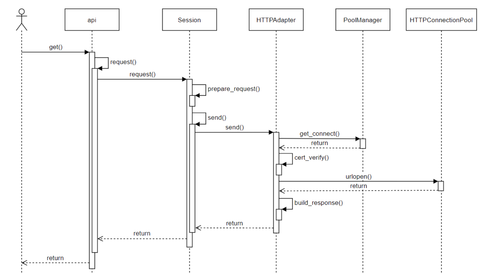

+++
title="python|requests"
date="2024-01-20T10:00:00+08:00"
categories=["Python"]
toc=true
draft=false
+++

最近工作开始转向使用python，因此更加深入的学习一下，通过阅读开源库学习python的使用。这一期学习使用[**requests库**](https://docs.python-requests.org/en/latest/index.html)，这个是一个很漂亮的http包，提供优雅的http client。

    Requests is an elegant and simple HTTP library for Python, built for human beings.

## 基础用法
官网给出了很多用法示例，这里简单罗列一下平常用到的`get`和`post`的请求方法。

```py
>>> payload = {'key1': 'value1', 'key2': 'value2'}
>>> r = requests.get('https://httpbin.org/get', params=payload)
>>> print(r.url)
https://httpbin.org/get?key2=value2&key1=value1
>>> print(r.status_code)
200
>>> print(r.text)
[{'repository': {'open_issues': 0, 'url': 'https://github.com/...
```

```py
>>> payload = {'key1': 'value1', 'key2': 'value2'}
>>> r = requests.post('https://httpbin.org/post', data=payload)
>>> print(r.text)
{
  ...
  "form": {
    "key2": "value2",
    "key1": "value1"
  },
  ...
}
```

## 代码深入

紧接着学习学习源码，看看是不是真的和官网上说的一样优雅简单，首先看代码目录。

```
request
  - __init__.py // 导入库的对外接口和异常类
  - __version__.py // 版本信息，作者信息等
  - _internal_utils.py // 内部使用的函数
  - adapters.py // 适配，针对urllib3的封装，底层是通过urllib3库来通信
  - api.py // 对外的api接口 get post等
  - auth.py // 认证相关
  - certs.py // 证书相关
  - compat.py // py2和py3的相关兼容
  - cookies.py // cookie相关
  - exceptions.py // 异常
  - help.py // 一些info信息
  - hooks.py // 钩子函数
  - models.py // 主要结构 request response
  - packages.py // 
  - sessions.py // 会话管理
  - status_codes.py  // http返回码 1xx 2xx 3xx 4xx 5xx
  - structures.py // 内部使用的一些数据结构
  - utils.py // 公用函数
```



api层，requests库的api模块中封装了 get, post, options, head, put, delete等方法，我们可以直接调用这几个方法发起HTTP请求，这些方法中都调用了request方法，request方法的代码如下，这里实例化了一个Session对象，然后调用了Session对象的request方法发起请求。


Session对象可用于保存请求的状态，比如证书、cookies、proxy等信息，可实现在多个请求之间保持长连接。如果我们是直接使用的api层的方法发起的请求，那么在请求结束之后，所有的状态都会被清理掉。如果我们需要频繁向服务端发起请求，那么使用Session实现长连接可以大大提升处理性能。