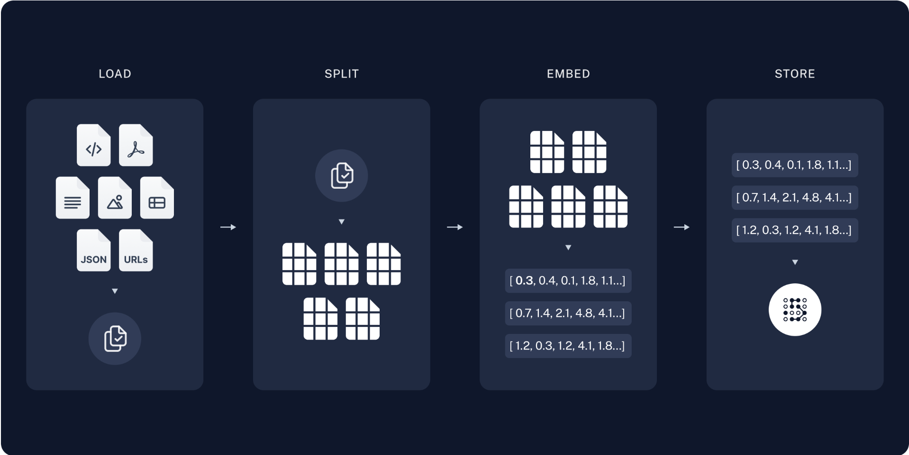
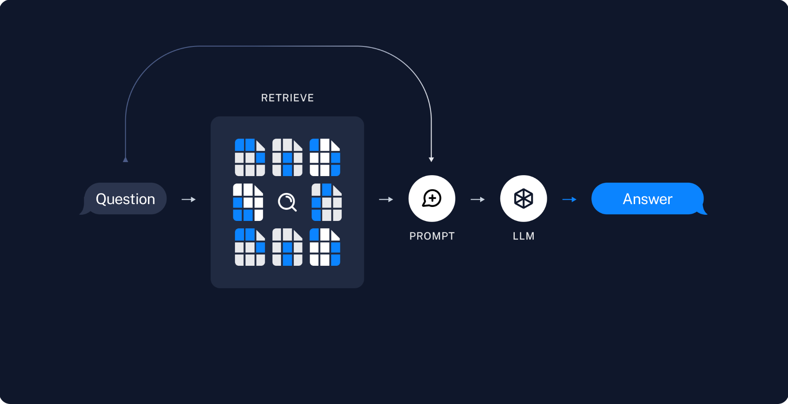

+++
title="大模型专题|LangChain rag实践"
date="2025-02-23T08:00:00+08:00"
categories=["大模型专题"]
toc=true
draft=false
+++

Retrieval-Augmented Generation (RAG) 是一种赋予生成式人工智能模型信息检索能力的技术。它修改了与大型语言模型（LLM）的交互方式，使模型能够根据指定的文档集对用户查询进行响应，利用这些信息来增强从其自身庞大的静态训练数据中提取的信息。这允许LLMs使用特定领域和/或更新的信息。用例包括提供聊天机器人访问公司内部数据或仅从权威来源提供事实信息。简单理解就是通过专业知识库结合LLM的总结生成特性给到高质量的回答。

典型的 RAG 应用有两个主要组件：索引、检索和生成。

### Indexing

加载：导入文档
分割：将文档切割chunk，方便检索，正本数据不方便导入llm上下文
存储：存储索引，通常用向量数据库



### Retrieval and generation

检索：根据输入，从数据库检索出对应chunk数据
生成：将数据导入llm，让大模型总结输出



## 实践

下面是使用LangChain构建的简单rag流程

```py
# 使用LangSmith
import getpass
import os

os.environ["LANGSMITH_TRACING"] = "true"
os.environ["LANGSMITH_API_KEY"] = getpass.getpass()

# 指定大模型
import getpass
import os

if not os.environ.get("OPENAI_API_KEY"):
  os.environ["OPENAI_API_KEY"] = getpass.getpass("Enter API key for OpenAI: ")

from langchain.chat_models import init_chat_model

llm = init_chat_model("gpt-4o-mini", model_provider="openai")

# 指定使用的向量化模型
import getpass
import os

if not os.environ.get("OPENAI_API_KEY"):
  os.environ["OPENAI_API_KEY"] = getpass.getpass("Enter API key for OpenAI: ")

from langchain_openai import OpenAIEmbeddings

embeddings = OpenAIEmbeddings(model="text-embedding-3-large")

# 指定存储
from langchain_core.vectorstores import InMemoryVectorStore

vector_store = InMemoryVectorStore(embeddings)

# 构建rag
import bs4
from langchain import hub
from langchain_community.document_loaders import WebBaseLoader
from langchain_core.documents import Document
from langchain_text_splitters import RecursiveCharacterTextSplitter
from langgraph.graph import START, StateGraph
from typing_extensions import List, TypedDict

# Load and chunk contents of the blog
loader = WebBaseLoader(
    web_paths=("https://lilianweng.github.io/posts/2023-06-23-agent/",),
    bs_kwargs=dict(
        parse_only=bs4.SoupStrainer(
            class_=("post-content", "post-title", "post-header")
        )
    ),
)
docs = loader.load()

text_splitter = RecursiveCharacterTextSplitter(chunk_size=1000, chunk_overlap=200)
all_splits = text_splitter.split_documents(docs)

# Index chunks
_ = vector_store.add_documents(documents=all_splits)

# Define prompt for question-answering
prompt = hub.pull("rlm/rag-prompt")


# Define state for application
class State(TypedDict):
    question: str
    context: List[Document]
    answer: str


# Define application steps
def retrieve(state: State):
    retrieved_docs = vector_store.similarity_search(state["question"])
    return {"context": retrieved_docs}


def generate(state: State):
    docs_content = "\n\n".join(doc.page_content for doc in state["context"])
    messages = prompt.invoke({"question": state["question"], "context": docs_content})
    response = llm.invoke(messages)
    return {"answer": response.content}


# Compile application and test
graph_builder = StateGraph(State).add_sequence([retrieve, generate])
graph_builder.add_edge(START, "retrieve")
graph = graph_builder.compile()

# 使用
response = graph.invoke({"question": "What is Task Decomposition?"})
print(response["answer"])

```

## 细节

整体流程理解起来很简单，核心有四点：
一个是文本的切分，如何切chunk
一个是如何如何向量化
一个是如何存储
一个是如何检索

这其中如何向量化，涉及embedding后续单独写一篇介绍这个，如何存储和检索涉及向量数据库，也计划单独写一篇介绍。

**文本分割** 

首先为什么需要文本分割，优势大概有这些

- 处理非统一长度的文档，现实世界的文件类型多种多样，通过切片统一处理
- 克服模型限制，许多模型的输入大小有限制，切片可以方便控制输入数据大小
- 提高表示质量，冗长文档包含很多信息，切片可以提高每一部分的专注和准确
- 提高检索精度，通过切片粒度控制搜索结果的粒度
- 优化计算资源，准确核心的切片信息导入大模型，更加快速返回优质结论

说到了为什么，就需要研究怎么切片，目前文本切片的方法有下面这些：

- 基于长度：按一定长度统一切分，实现简单
- 基于文本结构：按一段内容或一句等文本结构切分
- 基于文档结构：基于文档类型，如html json结构等分割
- 基于语义：基于语义的不同作为分割点，例如前一句或前一段的emb和后一段不一样，从而分割

## 参考

- [Build a Retrieval Augmented Generation (RAG) App: Part 1](https://python.langchain.com/docs/tutorials/rag/)