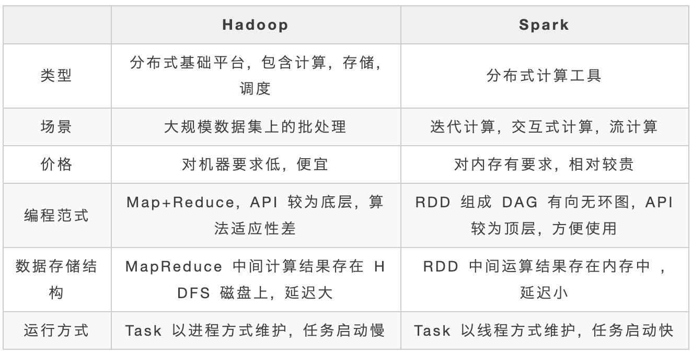
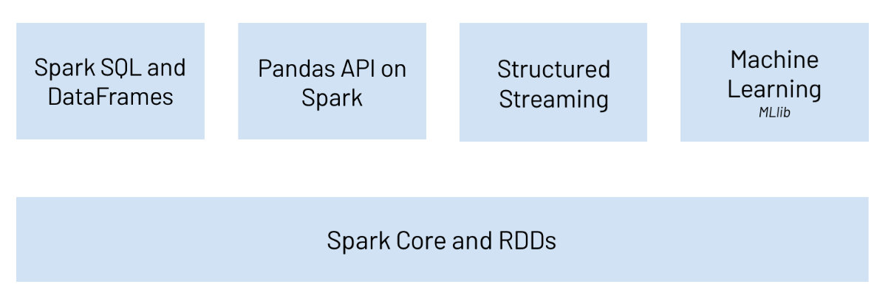
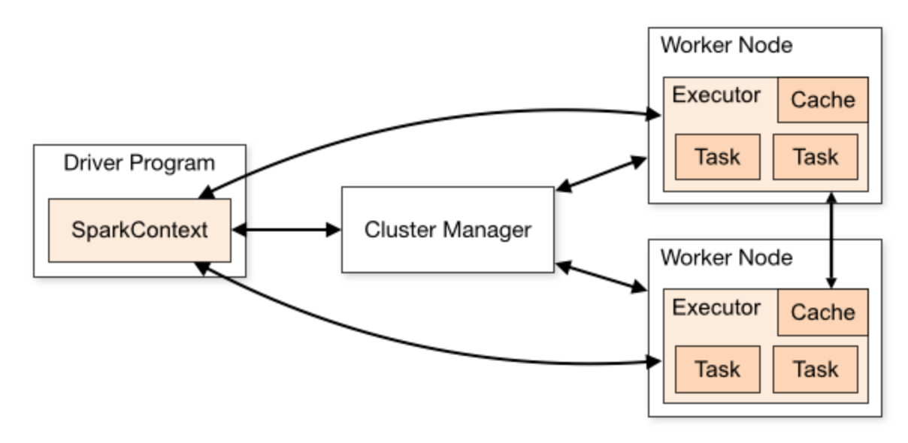
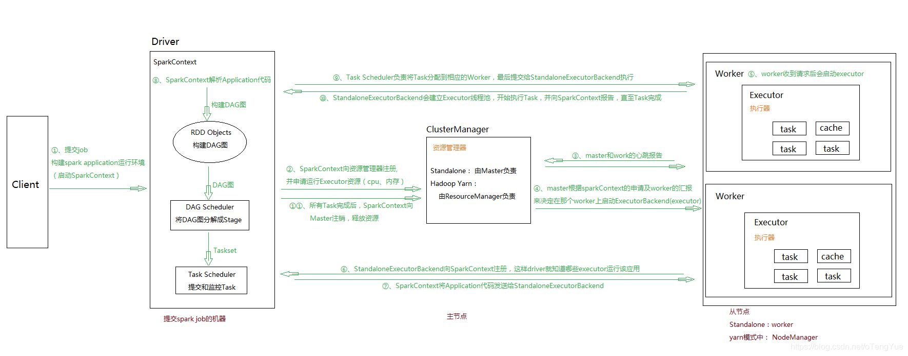
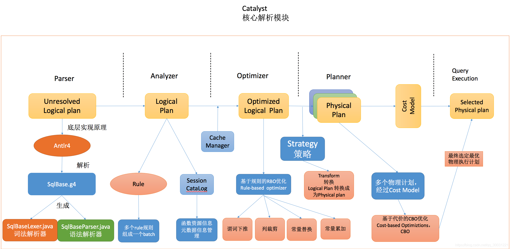

+++
title="spark|基础知识"
date="2025-04-12T15:45:00+08:00"
categories=["spark"]
toc=true
+++

大数据、人工智能( Artificial Intelligence )正以前所未有的广度和深度影响所有的行业， 现在及未来公司的核心壁垒是数据， 核心竞争力来自基于大数据的人工智能的竞争。

Spark 是当今大数据领域最活跃、最热门、最高效的大数据通用计算平台之一，开始学习学习。

Spark 是一个快速、通用、可扩展的分布式计算系统，用于大规模数据处理和分析，提供了丰富的 API 和强大的计算能力，支持多种编程语言，能在内存中高效处理数据，广泛应用于数据挖掘、机器学习、流计算等领域。

## 模块组成

- Spark Core：实现了 Spark 的基本功能，包含 RDD、任务调度、内存管理、错误恢复、与存储系统交互等模块。

- Spark SQL：Spark 用来操作结构化数据的程序包。通过 Spark SQL，我们可以使用 SQL 操作数据。

- Spark Streaming：Spark 提供的对实时数据进行流式计算的组件。提供了用来操作数据流的 API。

- Spark MLlib：提供常见的机器学习(ML)功能的程序库。包括分类、回归、聚类、协同过滤等，还提供了模型评估、数据导入等额外的支持功能。

- GraphX(图计算)：Spark 中用于图计算的 API，性能良好，拥有丰富的功能和运算符，能在海量数据上自如地运行复杂的图算法。

- 集群管理器：Spark 设计为可以高效地在一个计算节点到数千个计算节点之间伸缩计算。

- Structured Streaming：处理结构化流,统一了离线和实时的 API。

> **Spark VS Hadoop？** 尽管 Spark 相对于 Hadoop 而言具有较大优势，但 Spark 并不能完全替代 Hadoop，Spark 主要用于替代 Hadoop 中的 MapReduce 计算模型。存储依然可以使用 HDFS，但是中间结果可以存放在内存中；调度可以使用 Spark 内置的，也可以使用更成熟的调度系统 YARN 等。

## 特点
- 快:与 Hadoop 的 MapReduce 相比，Spark 基于内存的运算要快 100 倍以上，基于硬盘的运算也要快 10 倍以上。

- 易用:Spark 支持 Java、Python、R 和 Scala 的 API，还支持超过 80 种高级算法，使用户可以快速构建不同的应用。

- 通用:Spark 提供了统一的解决方案。Spark 可以用于批处理、交互式查询(Spark SQL)、实时流处理(Spark Streaming)、机器学习(Spark MLlib)和图计算(GraphX)。这些不同类型的处理都可以在同一个应用中无缝使用。

- 兼容性:Spark 可以非常方便地与其他的开源产品进行融合。比如，Spark 可以使用 Hadoop 的 YARN 和 Apache Mesos 作为它的资源管理和调度器，并且可以处理所有 Hadoop 支持的数据，包括 HDFS、HBase 和 Cassandra 等。

## 架构

spark 主要有以下几个组件

- Spark Core：包含Spark的基本功能；尤其是定义RDD的API、操作以及这两者上的动作。其他Spark的库都是构建在RDD和Spark Core之上的
- Spark SQL：提供通过Apache Hive的SQL变体Hive查询语言（HiveQL）与Spark进行交互的API。每个数据库表被当做一个RDD，Spark SQL查询被转换为Spark操作。
- Spark Streaming：对实时数据流进行处理和控制。Spark Streaming允许程序能够像普通RDD一样处理实时数据
- MLlib：一个常用机器学习算法库，算法被实现为对RDD的Spark操作。这个库包含可扩展的学习算法，比如分类、回归等需要对大量数据集进行迭代的操作。
- GraphX：控制图、并行图操作和计算的一组算法和工具的集合。GraphX扩展了RDD API，包含控制图、创建子图、访问路径上所有顶点的操作

上面这个图显示了spark的运行流程，从Driver到Executor再到Cluster Manager。

- Cluster Manager：在standalone模式中即为Master主节点，控制整个集群，监控worker。在YARN模式中为资源管理器
- Worker节点：从节点，负责控制计算节点，启动Executor或者Driver。
- Driver： 运行Application 的main()函数
- Executor：执行器，是为某个Application运行在worker node上的一个进程

1. 通过SparkSubmit提交job后，Client就开始构建 spark context，即 application 的运行环境（使用本地的Client类的main函数来创建spark context并初始化它）
2. yarn client提交任务，Driver在客户端本地运行；yarn cluster提交任务的时候，Driver是运行在集群上
3. SparkContext连接到ClusterManager(Master)，向资源管理器注册并申请运行Executor的资源（内核和内存）
4. Master根据SparkContext提出的申请，根据worker的心跳报告，来决定到底在那个worker上启动executor
5. Worker节点收到请求后会启动executor
6. executor向SparkContext注册，这样driver就知道哪些executor运行该应用
7. SparkContext将Application代码发送给executor（如果是standalone模式就是StandaloneExecutorBackend）
8. 同时SparkContext解析Application代码，构建DAG图，提交给DAGScheduler进行分解成stage，stage被发送到TaskScheduler。
9. TaskScheduler负责将Task分配到相应的worker上，最后提交给executor执行
10. executor会建立Executor线程池，开始执行Task，并向SparkContext汇报,直到所有的task执行完成
11. 所有Task完成后，SparkContext向Master注销
12. SparkContext关闭，Application结束

## 核心概念

**Application**: Application都是指用户编写的Spark应用程序，其中包括一个Driver功能的代码和分布在集群中多个节点上运行的Executor代码

**Driver**:  Spark中的Driver即运行上述Application的main函数并创建SparkContext

**SparkContext**: 目的是为了准备Spark应用程序的运行环境，在Spark中有SparkContext负责与ClusterManager通信，进行资源申请、任务的分配和监控等，当Executor部分运行完毕后，Driver同时负责将SparkContext关闭，通常用SparkContext代表Driver

**Executor**:  某个Application运行在worker节点上的一个进程，  该进程负责运行某些Task， 并且负责将数据存到内存或磁盘上，每个Application都有各自独立的一批Executor， 在Spark on Yarn模式下，其进程名称为CoarseGrainedExecutor Backend。一个CoarseGrainedExecutor Backend有且仅有一个Executor对象， 负责将Task包装成taskRunner,并从线程池中抽取一个空闲线程运行Task， 这个每一个CoarseGrainedExecutor Backend能并行运行Task的数量取决与分配给它的cpu个数

**Cluster Manager**：指的是在集群上获取资源的外部服务。目前有三种类型

- Standalone : spark原生的资源管理，由Master负责资源的分配
- Apache Mesos:与hadoop MR兼容性良好的一种资源调度框架
- Hadoop Yarn: 主要是指Yarn中的ResourceManager

**Worker**: 集群中任何可以运行Application代码的节点，在Standalone模式中指的是通过slave文件配置的Worker节点，在Spark on Yarn模式下就是NoteManager节点

**Task**: 被送到某个Executor上的工作单元，但hadoopMR中的MapTask和ReduceTask概念一样，是运行Application的基本单位，多个Task组成一个Stage，而Task的调度和管理等是由TaskScheduler负责

**Job**: 包含多个Task组成的并行计算，往往由Spark Action触发生成， 一个Application中往往会产生多个Job

**Stage**: 每个Job会被拆分成多组Task， 作为一个TaskSet， 其名称为Stage，Stage的划分和调度是有DAGScheduler来负责的，Stage有非最终的Stage（Shuffle Map Stage）和最终的Stage（Result Stage）两种，Stage的边界就是发生shuffle的地方

**DAGScheduler**: 根据Job构建基于Stage的DAG(Directed Acyclic Graph有向无环图)，并提交Stage给TASkScheduler。 其划分Stage的依据是RDD之间的依赖的关系找出开销最小的调度方法

**TASKScheduler**: 将TaskSet提交给worker运行，每个Executor运行什么Task就是在此处分配的. TaskScheduler维护所有TaskSet，当Executor向Driver发生心跳时，TaskScheduler会根据资源剩余情况分配相应的Task。另外TaskScheduler还维护着所有Task的运行标签，重试失败的Task。

Job=多个stage，Stage=多个同种task, Task分为ShuffleMapTask和ResultTask，Dependency分为ShuffleDependency和NarrowDependency

## 运行模式

- local 本地模式(单机)--学习测试使用 : 分为 local 单线程和 local-cluster 多线程。

- standalone 独立集群模式--学习测试使用 : 典型的 Mater/slave 模式。

- standalone-HA 高可用模式--生产环境使用 : 基于 standalone 模式，使用 zk 搭建高可用，避免 Master 是有单点故障的。

- on yarn 集群模式--生产环境使用 : 运行在 yarn 集群之上，由 yarn 负责资源管理，Spark 负责任务调度和计算。

- on mesos 集群模式--国内使用较少 : 运行在 mesos 资源管理器框架之上，由 mesos 负责资源管理，Spark 负责任务调度和计算。

- on cloud 集群模式--中小公司未来会更多的使用云服务 : 比如 AWS 的 EC2，使用这个模式能很方便的访问 Amazon 的 S3。

## RDD

Spark 的核心是建立在统一的抽象弹性分布式数据集（Resilient Distributed Datasets，RDD）之上的，这使得 Spark 的各个组件可以无缝地进行集成，能够在同一个应用程序中完成大数据处理。

RDD 是 Spark 提供的最重要的抽象概念，它是一种有容错机制的特殊数据集合，可以分布在集群的结点上，以函数式操作集合的方式进行各种并行操作。

通俗点来讲，可以将 RDD 理解为一个分布式对象集合，本质上是一个只读的分区记录集合。每个 RDD 可以分成多个分区，每个分区就是一个数据集片段。一个 RDD 的不同分区可以保存到集群中的不同结点上，从而可以在集群中的不同结点上进行并行计算。

RDD 的操作分为转化（Transformation）操作和行动（Action）操作。转化操作就是从一个 RDD 产生一个新的 RDD，而行动操作就是进行实际的计算。

RDD 的操作是惰性的，当 RDD 执行转化操作的时候，实际计算并没有被执行，只有当 RDD 执行行动操作时才会促发计算任务提交，从而执行相应的计算操作。

参考[官网](https://spark.apache.org/docs/latest/rdd-programming-guide.html)的算子列表，可以发现转化操作和行动操作的算子非常多。

## Spark SQL和DataFrame

一句话理解：DataFrame是RDD+Schema。DataFrame是从Spark 1.3版本开始引入的。

DataFrame和RDD有一些共同点，也是不可变的分布式数据集。但与RDD不一样的是，DataFrame是有schema的，有点类似于关系型数据库中的表，每一行的数据都是一样的，因为。有了schema，这也表明了DataFrame是比RDD提供更高层次的抽象。通过DataFrame可以简化Spark程序的开发，让Spark处理结构化数据变得更简单。DataFrame可以使用SQL的方式来处理数据。

DataFrame支持各种数据格式的读取和写入，例如：CSV、JSON、AVRO、HDFS、Hive表。

DataFrame底层使用Catalyst进行优化。

Spark SQL是一个用于结构化数据处理的Spark模块，与基本的Spark RDD的API不同，Spark SQL的接口还提供了更多关于数据和计算的结构化信息。Spark SQL可以用于执行SQL查询并从Hive表中读取数据。

Spark SQL 的核心是一个叫做 Catalyst 的查询编译器，它将用户程序中的 SQL/DataFrame/Dataset 经过一系列的操作，最终转化为 Spark 系统中执行的 RDD。

1. Parser: 将sql语句利用Antlr4进行词法和语法的解析

2. Analyzer：主要利用 Catalog 信息将 Unresolved Logical Plan 解析成 Analyzed logical plan；

3. Optimizer：利用一些 Rule （规则）将 Analyzed logical plan 解析成 Optimized Logical Plan；

4. Planner：前面的 logical plan 不能被 Spark 执行，而这个过程是把 logical plan 转换成多个 physical plans，然后利用代价模型（cost model）选择最佳的 physical plan；

5. Code Generation：这个过程会把 SQL 查询生成 Java 字 节码。

## 参考

- [5W字总结Spark(建议收藏)](https://mp.weixin.qq.com/s/caCk3mM5iXy0FaXCLkDwYQ)
- [一文弄懂Spark基本架构和原理](https://blog.csdn.net/oTengYue/article/details/88405479)
- [详解Spark SQL 底层实现原理](https://blog.csdn.net/qq_30031221/article/details/109222355)
- [spark core入门系列](https://cloud.tencent.com/developer/article/1733718)