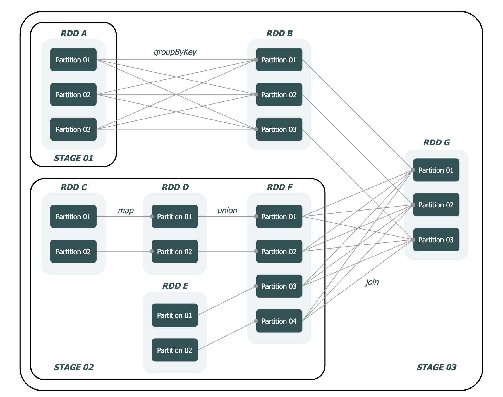

+++
title="spark|任务调度"
date="2025-07-20T11:00:00+08:00"
categories=["spark"]
toc=true
+++

掌握任务调度的原理对于提升开发人员在 Spark 应用程序上的故障排查和性能调优的能力大有裨益。

当然，掌握任务调度原理绝非易事，这篇文档主要是对 Spark 任务调度原理的一个简单的介绍，更多的还需要依靠自身去阅读源码。

## 相关名词

- Application：指用户提交的 Spark 应用程序
- Job：指 Spark 作业，是 Application 的子集，由行动算子（action）触发
- Stage：指 Spark 阶段，是 Job 的子集，以 RDD 的宽依赖为界
- Task：指 Spark 任务，是 Stage 的子集，Spark 中最基本的任务执行单元，对应单个线程，会被封装成 TaskDescription 对象提交到 Executor 的线程池中执行
- Driver：是运行用户程序 main() 函数并创建 SparkContext 的实例，是任务调度中最为关键的部分。
- Executor：是 Spark 中负责执行任务的进程，是 Spark 中最基本的计算单元。

在一个完整的任务调度中，用户提交的程序会经历 Application → Job → Stage → Task 的转化过程，而这整个转化过程，由 Driver 的 3 大核心模块共同完成：

- DAGScheduler：DAG 调度器，负责阶段（Stage）的划分并生成 TaskSet 传递给 TaskScheduler
- TaskScheduler：Task 调度器，决定任务池调度策略，负责 Task 的管理（包括 Task 的提交与销毁）
- SchedulerBackend：调度后端，维持与 Executor 的通信，并负责将 Task 提交到 Executor

Executor 包含以下核心模块：

- ThreadPool：任务执行线程池，用于执行 Driver 提交过来的 Task
- BlockManager：存储管理器，为 RDD 提供缓存服务，可提高计算速率
- ExecutorBackend：Executor 调度后端，维持与 Driver 的通信，并负责将任务执行结果反馈给 Driver

## 调度流程

Spark 任务调度基本上会经历 `提交 → Stage 划分 → Task 调度 → Task 执行` 这个过程，这个过程大致可以描述为：

- 用户提交一个计算应用（Application）
- Driver 执行用户程序中的 main() 方法，根据行动算子提取作业（Job）
- DAGScheduler 解析各个作业的 DAG 进行阶段（Stage）划分和任务集（TaskSet）组装
- TaskScheduler 将任务集发送至任务队列 rootPool
- SchedulerBackend 通过 Cluster Manager 获取 Executor 资源，并将任务（Task）发送给 Executor
- Executor 执行计算并管理存储块（Block）
- Driver 最终从 Executor 获得计算结果，汇总后返回给用户

Spark的任务调度总体来说分两路进行，一路是Stage级的调度，一路是Task级的调度。

Spark RDD通过其Transactions操作，形成了RDD血缘关系图，即DAG，最后通过Action的调用，触发Job并调度执行。DAGScheduler负责Stage级的调度，主要是将DAG切分成若干Stages，并将每个Stage打包成TaskSet交给TaskScheduler调度。TaskScheduler负责Task级的调度，将DAGScheduler给过来的TaskSet按照指定的调度策略分发到Executor上执行，调度过程中SchedulerBackend负责提供可用资源，其中SchedulerBackend有多种实现，分别对接不同的资源管理系统。

Driver初始化SparkContext过程中，会分别初始化DAGScheduler TaskScheduler SchedulerBackend以及HeartbeatReceiver。SchedulerBackend会启动一个RPC服务与外界打交道，SchedulerBackend通过ApplicationMaster申请资源，并不断从TaskScheduler中拿到合适的Task分发到Executor执行。HeartbeatReceiver也会启动RPC服务负责接收Executor的心跳信息，监控Executor的存活状况，并通知到TaskScheduler。

## stage调度

Stage 划分是任务调度的第一步，由 DAGScheduler 完成，它决定了 一个 Job 将被划分为多少个 TaskSet。

Stage 的划分方式可以简述为：在 DAG 中进行反向解析，遇到宽依赖就断开，遇到窄依赖就把当前的 RDD 加入到当前的阶段中。之所以这样划分，是因为宽依赖的位置意味着 Shuffle 的发生，表示这个位置后的 RDD 需要等待前序 RDD 计算完成后才可以开始计算。

在这个示例中，`DAGScheduler` 反向解析，在 `RDD B → RDD A 和 RDD G → RDD F` 间发现 `ShuffleDependency`，于是在这两个位置进行阶段划分，分别得到 `Stage 01`、`Stage 02` 和 `Stage 03`。其中，`Stage 01` 和 `Stage 02` 的类型为 `ShuffleMapStage`，而 `Stage 03` 的类型为 `ResultStage`。

## task调度

Task 调度大致分为 5 个阶段：

- 初始化阶段：初始化 TaskScheduler 和 SchedulerBackend 的阶段
- 提交阶段：任务提交到任务池 rootPool 的阶段
- 启动阶段：从任务池 rootPool 取出任务并发布到 Executor 的阶段
- 执行阶段：Executor 执行计算任务并存储计算结果的阶段
- 回收阶段：任务回收、状态更新与资源释放的阶段

## 参考

- [spark任务调度](https://magicpenta.github.io/docs/spark/Spark%20%E4%BB%BB%E5%8A%A1%E8%B0%83%E5%BA%A6#%E4%BB%BB%E5%8A%A1%E8%B0%83%E5%BA%A6%E6%A6%82%E8%BF%B0)

- [Spark Scheduler 内部原理剖析](https://cloud.tencent.com/developer/article/1004904)