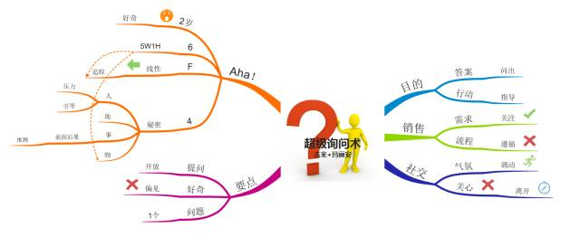

+++
title="超级询问术"
date="2020-03-13T04:52:00+08:00"
summary = '超级询问术'
toc=false
+++

关键技巧
--------

### 提问越简单越直接越好，同一时间内只关注一个问题

### 确保你的问题始终围绕一个关键性主题展开

-	像孩子一样去思考，然后提问

-	以答案的形式提问

-	对于不熟悉的主题，通过5W2H来提问

	-	5W: where, when, who, what, why
	-	2H: how ,how much

### 多询问那些可以获得叙述性回答的问题，而不是对方只能简单回答是或否的问题

### 恰当的节点上，懂得询问-还有其他的吗？

### 思维导图

