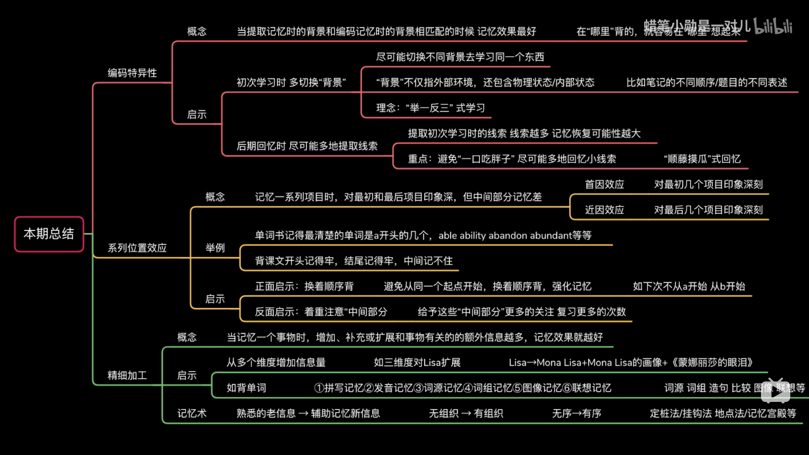

+++
title="学习和记忆"
tags=["学习"]
date="2022-12-11T20:11:00+08:00"
summary = '学习和记忆相关读书笔记'
toc=false
+++

## 基本概念

### 记忆类型

瞬时记忆：外界输入信息，见到1-2s后就消失
短时记忆：
长时记忆：重复才能进入长时记忆
永久记忆：重复使用

### 记忆本质

**记忆的本质是神经元建立连接**

- 神经连接：突触髓鞘化的形成，补充药物(卵磷脂、多巴胺等)可以增加突触形成的效率，最主要的还是心理活动促成联结生成
- 海马体：睡眠过程中有特殊放电模式，把神经细胞同时唤醒——睡眠有助记忆

**学习本质，真正的学会是记忆的长期保持和迁移**

## 高效学习

### 原则

1. 适度难度——激发大脑
2. 知识网络——连接神经元

### 方法

**针对原则一**

分散学习——艾斯浩宾学习曲线
以测代练——全面测试，刻意练习，及时反馈，加深理解和记忆
反复回想——加强连接
加强应用——加强连接
深度学习——加强连接

**针对原则二**

记忆术

- 编码表
- 记忆宫殿

构建知识网络

- 思维导图
- 知识联想

费曼学习法
