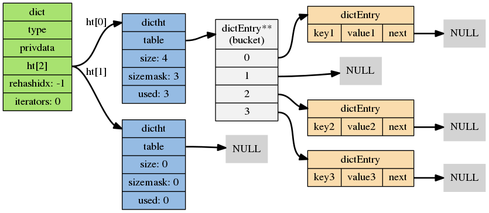
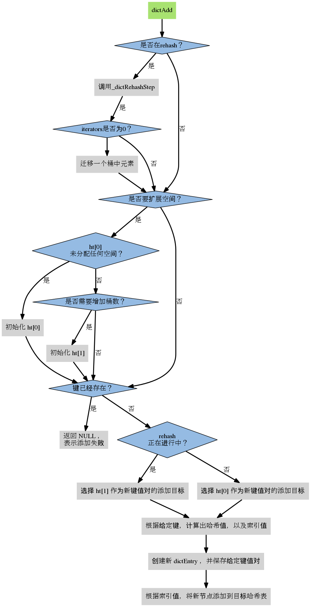

+++
title="redis|dict"
tags=["redis","dict"]
categories=["redis"]
date="2020-03-14T10:49:00+08:00"
summary = 'redis基础结构-DICT'
toc=false
+++

DICT
----

Redis字典具dd有以下特点：

-	Redis字典的底层实现为哈希表，
-	每个字典使用两个哈希表， 一般情况下只使用 0 号哈希表， 只有在 rehash 进行时， 才会同时使用 0 号和 1 号哈希表。
-	哈希表使用链地址法来解决键冲突的问题。
-	自动 Rehash 扩展或收缩哈希表。
-	对哈希表的 rehash 是分多次、渐进式地进行的。

结构定义
--------



```c
/*
 * 字典
 *
 * 每个字典使用两个哈希表，用于实现渐进式 rehash
 */
typedef struct dict {

    // 特定于类型的处理函数
    dictType *type;

    // 类型处理函数的私有数据
    void *privdata;

    // 哈希表（2 个）
    dictht ht[2];

    // 记录 rehash 进度的标志，值为 -1 表示 rehash 未进行
    int rehashidx;

    // 当前正在运作的安全迭代器数量
    int iterators;

} dict;

/*
 * 哈希表
 */
typedef struct dictht {

    // 哈希表节点指针数组（俗称桶，bucket）
    dictEntry **table;

    // 指针数组的大小
    unsigned long size;

    // 指针数组的长度掩码，用于计算索引值
    unsigned long sizemask;

    // 哈希表现有的节点数量
    unsigned long used;

} dictht;

/*
 * 哈希表节点
 */
typedef struct dictEntry {

    // 键
    void *key;

    // 值
    union {
        void *val;
        uint64_t u64;
        int64_t s64;
    } v;

    // 链往后继节点
    struct dictEntry *next;

} dictEntry;
```

dict添加流程
------------



rehash
------

### 具体流程

1.	创建一个比 ht[0]->table 更大的 ht[1]->table ， size为大于used*2的2的指数, 开始值为4
2.	将 ht[0]->table 中的所有键值对迁移到 ht[1]->table
3.	将原有 ht[0] 的数据清空，并将 ht[1] 替换为新的 ht[0]

### 开始时机

-	自然 rehash:ratio >= 1 ，且变量 dict_can_resize 为真
-	强制 rehash:ratio 大于变量 dict_force_resize_ratio
-	渐进式rehash:
	-	主动方式:databaseCron中调用dictRehashMilliseconds执行一毫秒
	-	被动方式:调用dictAdd，dicFind，dictDelete，dictGetRandomKey时，调用_dictRehashStep，迁移一个非空桶

