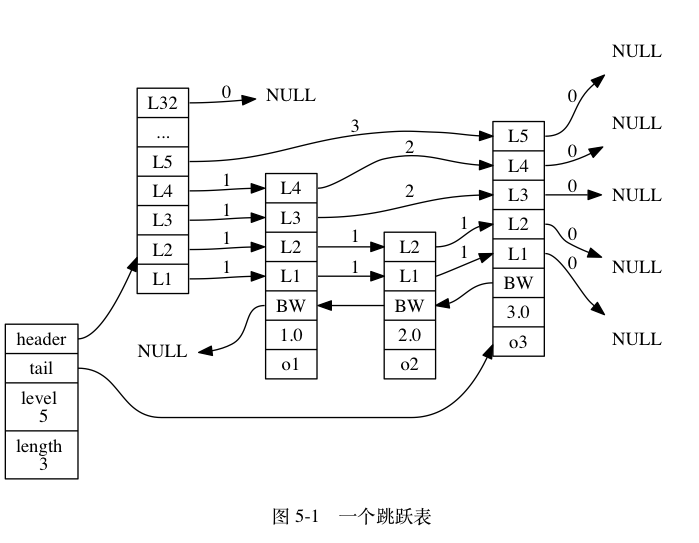
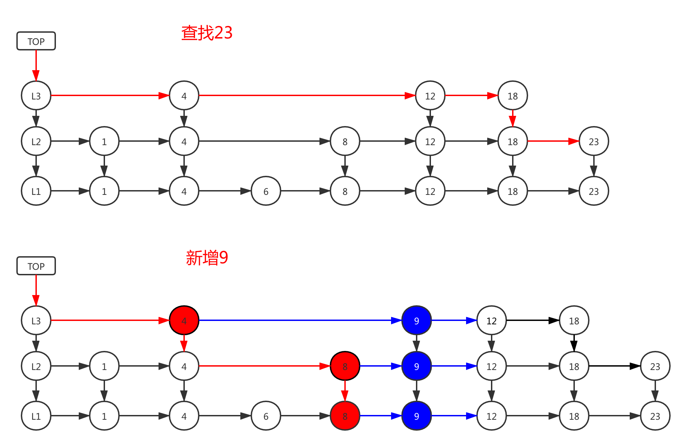

+++
title="redis|skiplist"
date="2020-03-14T10:51:00+08:00"
summary = 'redis基础结构-skiplist'
toc=false
+++

ZIPLIST
-------

跳跃表（skiplist）是一种有序数据结构， 它通过在每个节点中维持多个指向其他节点的指针， 从而达到快速访问节点的目的。

结构定义
--------



```c
typedef struct zskiplistNode {
    // 后退指针
    struct zskiplistNode *backward;
    // 分值
    double score;
    // 成员对象
    robj *obj;
    // 层
    struct zskiplistLevel {
        // 前进指针
        struct zskiplistNode *forward;
        // 跨度
        unsigned int span;
    } level[];
} zskiplistNode;

/*
 * 跳跃表
 */
typedef struct zskiplist {
    // 表头节点和表尾节点
    struct zskiplistNode *header, *tail;
    // 表中节点的数量
    unsigned long length;
    // 表中层数最大的节点的层数
    int level;
} zskiplist;
```



查找
----

### 流程

头结点的高层开始查询，看右边下一个是否是需要查找的值v，比值v大的则往下一层找，比v小的，则继续向后查找

增加
----

1.	按照查找的逻辑遍历
2.	使用数组记录节点t，t的节点值小于新插入节点的值，但t的next的值大于新插入节点的值
3.	循环到最底层结束
4.	将数组内的节点，都新建相关节点，以及重建连接

删除
----

1.	按照查找的逻辑遍历
2.	使用数组记录节点t，t的节点next的值等于删除节点的值v
3.	循环到最底层结束
4.	将数组内的节点，都删除相关节点，以及重建连接

总结
----

-	跳跃表是有序集合的底层实现之一， 除此之外它在 Redis 中没有其他应用。
-	Redis 的跳跃表实现由 zskiplist 和 zskiplistNode 两个结构组成， 其中 zskiplist 用于保存跳跃表信息（比如表头节点、表尾节点、长度）， 而 zskiplistNode 则用于表示跳跃表节点。
-	每个跳跃表节点的层高都是 1 至 32 之间的随机数。
-	在同一个跳跃表中， 多个节点可以包含相同的分值， 但每个节点的成员对象必须是唯一的。
-	跳跃表中的节点按照分值大小进行排序， 当分值相同时， 节点按照成员对象的大小进行排序。

